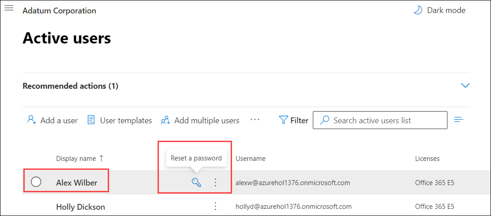

# Learning Path 1 - Lab 1 - Exercise 1 - Set up your Microsoft 365 Tenant

In the labs for this course, you are taking on the role of Holly Dickson, Adatum Corporation's Enterprise Administrator. Adatum Corporation is a subsidiary of Contoso Electronics. Adatum does NOT have legacy, on-premises servers; therefore, you will be implementing Microsoft 365 in a cloud-only deployment. You have deployed Microsoft 365 in a virtualized lab environment, and you have been tasked with completing a pilot project that tests the security, compliance, and device management features in Microsoft 365 as they relate to Adatum's business requirements.

You have just started the pilot project; therefore, in this first lab you will set up a personalized Microsoft 365 user account for Holly that will be used throughout all the labs in this course. This first exercise also requires that you perform several setup tasks that will initialize your trial tenant for the remaining labs in this course. You must configure your trial tenant, create a personalized Global Admin user account in Microsoft 365 for Holly, configure several test users and groups that will be used throughout the remaining labs, and turn on Information Rights Management (IRM) in SharePoint Online as well as audit logging.

### Task 1 - Obtain Your Office 365 Credentials

Once you launch the lab, you can obtain your **Office 365 credentials** from the **Environment details** tab. Copy the username and password.
   
    
   
### Task 2: Install and Activate Office 365 Apps

1. Once the environment is provisioned, select the **Microsoft Edge** icon. Maximize your browser window when it opens.

    

2. In your browser go to the **Microsoft Office Home** page by entering the following URL in the address bar: 
   ```
   https://portal.office.com/
   ``` 

3. In the **Sign in** dialog box, copy and paste in the **Username** provided in the environment details page (**odl_user_DID@xxxxx.onmicrosoft.com**) and then select **Next**.

    

4. In the **Enter password** dialog box, copy and paste in the **Password** and then select **Sign in**.

    

5. On the **Help us protect your account** dialog box, Select **Skip for now (14 days until this is required)**.

    

6. On the **Stay signed in?** dialog box, select the **Don’t show this again** check box and then select **No.** 

    

7. If a **Get your work done with Office 365** window appears, then close it now. 

8. On your **Office 365 homepage** select **install Office** followed by **Office 365 apps**

    

9. On the new dialog box that pops up, select **close**.

    

9. An **OfficeSetup.exe** file will start downloading. Once the file is downloaded select the **OfficeSetup.exe** to install the apps.

    
 
10. The **Office 365 apps** will begin installing on your VM.

    

11. Once the installation is complete you will see a dialog box, select **close**.

    

12. From the search bar, search for **Word** and select the **Word Desktop app**.

    

13. On the dialog box that pops up, Select **Continue**

    

14. Copy the **Office 365 credentials** from the **environment details page**.

    
   
15. Enter the **username** you copied in previous step and select **Next**.
   
    

16. Enter the **password** and select **Sign in**.

   
   
17. Uncheck the **Allow my organization to manage my device** and select **"No, sign in to this app only"**.

   

18. On the dialog box, select **Accept**.

   

19. Finally select **Close**. Now, your **Word desktop app** has been activated. Please **close and reopen** the app before using it.

   

### Task 3: Set up the Organization Profile

In your role as Holly Dickson, Adatum's Enterprise Administrator, you have been tasked with setting up the company's profile for its Microsoft 365 trial tenant. In this task, you will configure the required options for Adatum's tenant. Holly will initially sign into Microsoft 365 as the default Microsoft 365 ODL_user Administrator account using the **username** and **password** that you copied in **Task 1**.

1. If not already open from your browser go to the **Microsoft Office Home** page by entering the following URL in the address bar: 
	```
	https://portal.office.com/
	``` 

3. On the **Microsoft Office Home** tab, in the column of **Microsoft 365 app** icons that appear on the left side of the screen, scroll down and select the **Admin** icon; this opens the **Microsoft 365 admin center** in a new browser tab.

   

3. In the **Microsoft 365 admin center**, in the left-hand navigation pane, select **Show all** and then select **Settings**. In the Settings group, select **Org settings**. 

   

4. On the **Org settings** page, the **Services** tab is displayed by default. Select the **Organization profile** tab and then select **Organization information** from the list of profile data.

   

5. In the **Organization information** pane that appears, enter the following information:

    - Name: **Adatum Corporation**

    - Street Address: **555 Main Street**

    - City: **Redmond**

    - State or province: **Washington**

    - ZIP or postal code: **98052**

    - Phone: do not change

    - Technical contact: do not change

    - Preferred language: **English**

6. Select **Save**.

7. Scroll to the top of the **Organization information** pane. Note the message indicating the changes have been saved. Select the **X** in the upper right-hand corner to close the pane.

8. Back on the **Organization profile** tab, in the list of organization profile data, select **Release preferences**.

9. In the **Release preferences** pane that appears, select the **Targeted release for select users** option and then select **Save**.<br/>

   

    **Note:** One of the benefits of Microsoft 365 is the ability to have the latest features and updates automatically applied to your environment, which can reduce maintenance costs and overhead for an organization and allow early-adopter users to test new features. By setting up your Release preferences, you can control how and when your Microsoft 365 tenant receives these updates. <br/>

    **Note:** This **Targeted release for select users** option enables you to create a control group of users who will preview updates so that you can prepare the updates for your entire organization. The **Targeted release for everyone** option is more commonly used in development environments, where you can get updates early for your entire organization. In non-development environments, such as Adatum, targeted release to a select group of users is the more typical preference as it enables an organization to control when it wants to make updates available to everyone once they've been reviewed by the control group.

10. In the **Release preferences** pane, below the list of release options, select **Select users**.

11. In the **Choose users for targeted release** pane that appears, select inside the **Who should receive targeted releases?** field. This displays the list of active users (these are the ten Microsoft 365 user accounts created for your tenant by your lab hosting provider). In this list, select each of the following users (Note: You have to select each user, one at a time; after selecting a user, you will have to select inside the field again to re-display the list so that you can display the next user): 

	- **Alex Wilber**
	- **Joni Sherman**
	- **Lynne Robbins**
	- **ODL_User** <br/>

    **Note:** Alex, Joni, and Lynne are administrators who are part of Holly's pilot team. Their accounts will be used throughout the labs for this course.
    
12. Select **Save**.

13. After selecting the users, scroll to the bottom of the **Release preferences** pane to verify you selected the required users. Close the **Release preferences** pane once you verified these four users were selected. 

14. In the list of organization profile data, select **Custom themes**.

15. In the **Custom themes** pane, Select **+ Add Theme** and on the **General** pane and select the **Show the user's display name** check box. <br/>

	As you scroll through the pane, review the various theme and branding options that are available for you to update. For the purpose of this lab, you can change any of the options or leave the default values as is. For example, you can add the logo of your company and set the background image as the default for all your users. Along with these options you can change the colors for your navigation pane, text color, icon color, and accent color. Go ahead and explore the different options for your tenant and make any changes that you wish. <br/>

	**Tip:** Some color patterns aesthetically distract users. If you do change any of the colors, it is recommended that you avoid using high contrasting colors together, such as neon colors and high-resolution colors like bright pink and white.

16. Select **Save** when you are done and then close the **Custom themes** pane.

17. Remain logged into the LabVm with Microsoft Edge open to the **Microsoft 365 admin center** for the next task.

### Task 4 - Assign Roles to the Microsoft 365 Global Admin account

Holly Dickson is Adatum’s Enterprise Administrator. We have already set up the Microsoft 365 user account for her, she initially signed into Microsoft 365 as the ODL_User Administrator account (the default Global admin) in the previous lab (you did this when you began your role as Holly and signed in using the tenant admin account). In this task, you will **continue** in your role as Holly Dickson where you should still be logged into Microsoft 365 as the **ODL_User Administrator**. In this lab, Holly will reset her password, and she will assign her user account the **Microsoft 365 Global Administrator role**, which gives her the ability to perform all administrative functions within Microsoft 365. Following this task, you will perform all remaining labs using Holly's persona. 

**Important:** As a best practice in your real-world deployment, you should always write down the first Global admin account’s credentials (in this lab, the ODL_User Administrator account, whose username is odl_user_XXXXXX@xxxxxZZZZZZ.onmicrosoft.com, where xxxxxZZZZZZ is the tenant prefix assigned by your lab hosting provider) and store it away for security reasons. **This account should be a non-personalized identity** that owns the highest privileges possible in a tenant. It should **not** be MFA activated (because it is not personalized). Because the username and password for this account are typically shared among several users, this first Global admin is a perfect target for attacks; therefore, it is always recommended that organizations create personalized service admin accounts and keep as few Global admins as possible. For those Global admins that you do create in your real-world deployment, they should each be mapped to a single identity (such as Holly Dickson), and they should each have Multi-Factor Authentication (MFA) enforced. That being said, you will not turn on MFA for Holly's account because time is limited in this training course and we do not want to take up lab time by making you log in using a second authentication method every time Holly logs in.

1. On the LabVM, the **Microsoft 365 admin center** should still be open in your Microsoft Edge browser from the prior lab, and you should be signed into Microsoft 365 as the **ODL_User**. 

2. You will begin by verifying which domain is listed as the default domain for Adatum. In the **Microsoft 365 admin center**, in the left-hand navigation pane, under the **Settings** group select **Domains**.

   

3. On the **Domains** page, you should see the a domain created with the **xxxxxZZZZZZ.onmicrosoft.com** domain. <br/> The **xxxxxZZZZZZ.onmicrosoft.com*** domain displays **(Default)** next to the domain name.

   

4. You will now reset **Holly Dickson's password**. In the **Microsoft 365 admin center**, in the left-hand navigation pane, select **Users** and then select **Active users**. 

   

5. In the **Active users** list, you will see the list of existing user accounts that were created for you by your lab hosting provider. In this task, you are taking on the role of the **ODL_user Administrator**, and as such, you must select the account for **Holly Dickson**, who is Adatum's new Enterprise Administrator. 

6. In the **Active Users** window, select **Holly Dickson** from the list of active users.

   
   
7. In the **Holly Dickson** window, Select **Reset Password**.

   

8. Clear (uncheck) the **Automatically create a password** checkbox which will enable a new box for entering an administrator defined password.

9. In the new Password box that appears, enter: **Pa55w.rd** (Hint: Select the eye icon at the right side of the field to verify the password that you entered)

10. Clear (uncheck) the **Require this user to change their password when they first sign in** check box 

11. Select **Reset Password**.

   

12. You have successfully reset **Holly Dickson's** password. On the **Password has been reset** select **close**.

   
   
13. Now back on the **active users** page select **Holly Dickson** and scroll down to the **Roles** section and select **Manage Roles**

   

14. In the **Roles** section, the **User (no admin center access)** option is selected by default. Select the **Admin center access** option instead. By doing so, the most commonly used Microsoft 365 administrator roles are displayed below this option. 

	**Note:** If you scroll down past this list of the most commonly used admin roles and select **Show all by category**, the complete list of admin roles will be displayed (sorted by category). For Holly, you do not need to view all the admin roles by category, since Holly will be assigned the Global admin role that appears in the list of most commonly used roles.

13. Select the **Global admin**, **Security admin**, and **Attack Simulation Administrator** check box and then select **Save Changes**.

14. Remain logged into LabVM with the Microsoft 365 admin center open in your browser for the next task.

### Task 5 - Assign RBAC to a Microsoft 365 user account in the Security and Compliance center

In the prior task, you successfully added the Global administrator role to Holly Dickson's account. The global administrator role will give you the majority of privileges needed to manage your Microsoft 365 tenant. however, there are some additional privileges that you will need to manage certain services. In the security and compliance center Holly will need to be added to the Organization Management role. By adding Holly to the Organization Management role, Holly's account will have all the necessary privileges to complete all of the future exercises during this course.

1. In your **Edge** browser, you should still have a tab open for the **Microsoft 365 admin center**. If so, then select this tab and proceed to the next step; otherwise, navigate to the **Office 365 home** page, log in as your **ODL_user** admin account, navigate to the **Microsoft 365 admin center**, and then in the left-hand navigation pane, select **Show all**.

2. In the **Microsoft 365 admin center**, in the left-hand navigation pane under **Admin centers**, select **Security**.

3. In the **Microsoft 365 Defender** window, select **Permissions & roles** in the left-hand navigation pane.
    
4. In the **Permissions & roles** page, the roles are displayed under two groups - **Azure AD** and **Email & collaboration roles**. Under the **Email & collaboration roles** group, select **Roles**
    
5. On the **Permissions & roles > Permissions** page, select the **Organization Management** role.

    

6. On the **Organization Management** pane that appears, scroll down to the **Members**section and select **Edit**.

7. On the **Editing Choose members** page, it displays a message indicating **The list is currently empty.** Select **Choose members** that appears below this message.

8. On the **Choose members** page, select the **+Add** button.

9. On the **Choose members** list, select the **Holly Dickson** account and then select the **Add** button.

10. On the **Choose members** page, select the **Done** button.

11. On the **Editing Choose members** page, select the **Save** button.

12. Select **Close**.

13. Remain logged into LabVM with the Microsoft 365 admin center open in your browser for the next task.

### Task 6 – Set up Microsoft 365 User Accounts and Groups

After completing the previous task, you should still be signed into the **Microsoft 365 admin center** as the **ODL_user Administrator** account. In this task, you will begin implementing Adatum’s Microsoft 365 pilot project as Holly Dickson, Adatum’s new Enterprise Administrator. Therefore, you will begin this task by logging out of Microsoft 365 as the ODL_user Administrator and you will log back in as Holly.

In the prior task, you noticed that your Microsoft 365 trial tenant came equipped with a list of active users. As Holly Dickson, Adatum's Enterprise Admin, you have selected the following users to help you with your pilot project: Alex Wilber, Joni Sherman, Lynne Robbins, Patti Fernandez, as well as the system admin, whose user account is the ODL_user Administrator. 

Each user is a key member of your pilot project team. While their user accounts are already present in Microsoft 365, you need to configure their passwords so that they can more easily sign into Microsoft 365 when needed in the upcoming lab exercises. You also need to add a Microsoft 365 group that will be used in a later lab exercise.

1. On the LabVM, the **Microsoft 365 admin center** should still be open in your Microsoft Edge browser from the prior task, and you should be signed into Microsoft 365 as the **ODL_user Administrator**. <br/>

	On the **Microsoft 365 admin center** tab, select the user icon for the **ODL_user Administrator** in the upper right corner of your browser, and in the **ODL_user Administrator** window that appears, select **Sign out.** <br/>
	
	**Important:** When signing out of one user account and signing in as another, you should close all your browser tabs except for your current tab. This is a best practice that helps to avoid any confusion by closing the windows associated with the prior user. Take a moment now and close all other browser tabs except for the **Sign out** tab. 
	
2. In your Microsoft Edge browser, in the **Sign out** tab, enter the following URL in the address bar to sign back into Microsoft 365: ```https://portal.office.com```. 

3. In the **Pick an account** window, only the tenant admin account (the odl_user_XXXXXX@xxxxxZZZZZZ.onmicrosoft.com account) that you just logged out from appears. Select **Use another account**. 

4. In the **Sign in** window, enter **Hollyd@xxxxxZZZZZZ.onmicrosoft.com**. Select **Next**.

5. In the **Enter password** window, enter **Pa55w.rd** and then select **Sign in**.

6. If a **Get your work done with Office 365** window appears, select the **X** to close it. 

7. On the **Microsoft Office Home** tab, in the column of Microsoft 365 app icons that appear on the left side of the screen, scroll down and select the **Admin** icon; this opens the **Microsoft 365 admin center** in a new browser tab.

8. If a survey window appears, select **Cancel**.

9. In the **Microsoft 365 admin center**, in the left-hand navigation pane, select **Users**, and then under it, select **Active users**.

10. In the **Active Users** window, when you hover your mouse over a user's **Display name** (or you select the check mark field to the left of the **Display name**), a **key icon** appears to the right of the user's name. By selecting the key icon, you can reset a user's password. You need to reset **Alex, Joni, Lynne, and Patti's** passwords to **Pa55w.rd**.<br/>

    Select the key icon for **Alex Wilber**.

    

11. In the **Reset password** pane for Alex, select **Let me create the password**, enter **Pa55w.rd** in the **Password** field, select and copy this value so that you can paste it in for Joni and Lynne's accounts, and then unselect the **Require this user to change their password when they first sign in** check box.

12. Select **Reset** and then select **Close**.

13. Repeat steps 10-12 for **Joni Sherman**, **Lynne Robbins**, and **Patti Fernandez**. For these three accounts, paste in the **Pa55w.rd** password that you copied for Alex. You do not need to change the password for the **ODL_user Administrator** because you must continue using the default password provided by your lab hosting provider for this tenant admin account.

14. In the **Microsoft 365 admin center**, in the left-hand navigation pane, select **Groups**, and then under it, select **Active groups**.

    

15. In the **Active groups** window, select **Add a group** that appears on the menu bar.

16. In the **Choose a group type** pane, select **Microsoft 365 (recommended)** and then select **Next**.

17. In the **Set up the basics** pane, enter **Sales Group** in the **Name** field. You must select the **Description** field to enable the **Next** button. Leave the **Description** field blank and select **Next**. 

18. In the **Assign owners** pane, enter **Joni** in the **Owners** field. A list of users whose name starts with Joni will appear; select **Joni Sherman** and then select **Add** and select **Next**.

19. Select **Next** on the members pane.

19. In the **Edit settings** pane, enter **salesgroup** in the **Group email address** field. <br/>

	Under the **Privacy** section, select the **Public – Anyone can see group content** option (even if this option is selected by default, select it again to enable the **Next** button), and leave the **Create a team for this group** check box selected. Select **Next**.

20. In the **Review and finish adding group** pane, review your selections. If anything needs to be corrected, select the corresponding **Edit** option. When everything is correct, select **Create group**.

21. Once the group is created, select the **Close** button on the **New group created** window.

22. This will return you to the **Groups** window. You may need to select the **Refresh** option on the menu bar for the **Sales Group** to appear in the list of groups. In fact, you may have to wait a few minutes for the Sales Group to appear, so you may need to select the **Refresh** option on the menu bar once or twice.

23. Once the **Sales Group** appears in the list of groups, select it.

24. In the **Sales Group** pane that appears, the **General** tab is displayed by default. Select the **Members** tab.

25. In the **Members** tab, under the **Owners** section, Joni Sherman should appear as the only group owner. Under the **Members** section, select **View all and manage members**.

26. In the **View members** window for the Sales Group, select the **+Add members** button.

27. In the list of users that appears, select **Alex Wilber, Joni Sherman**, and **Lynne Robbins**, select the **Save** button, and then select the **Close** button to finish the add process. <br/>

	**Note:** You will not add Patti Fernandez to this group. Patti's key role in the pilot project is to test the Privileged Identity Management functionality in the next lab exercise. 

28. The **Sales Group** window now displays the three members of the group. Select **Close**.

29. Close the **Sales Group** pane by selecting the **X** in the upper right-hand corner.

30. Leave the **Microsoft 365 admin center** tab open in your browser and proceed to the next task.


### ‎Task 7 - Enable IRM for SharePoint Online 

In this task, you will turn on Information Rights Management (IRM) for SharePoint Online. 

**Note:** While you will validate IRM for Exchange and SharePoint in Lab 4, you must enable IRM for SharePoint Online now because it can take up to 60 minutes or more for IRM to show up in SharePoint Online. By the time you get to the validation exercise in Lab 4, IRM should have finished its internal configuration and you won’t have to wait for it to be present in SharePoint Online.

1. You should still be logged into LabVM as the **Admin** account, and you should be logged into Microsoft 365 as **Holly Dickson**. 

2. In the **Microsoft 365 admin center**, select **Show all** (if necessary) in the left-hand navigation pane to see all the navigation options. Under **Admin centers,** select **SharePoint**. This will open the SharePoint admin center.

3. In the **SharePoint admin center**, in the left-hand navigation pane, select **Settings**. 

4. At the bottom of the **Settings** page is a sentence that says **Can’t find the setting you’re looking for? Go to the classic settings page.** In this sentence, select the hyperlinked text: **classic settings page**.

   

5. On the classic **Settings** page, scroll down to the **Information Rights Management (IRM)** section, select the **Use the IRM service specified in your configuration** option, and then select the **Refresh IRM Settings** button.

   

6. This will return you to the top of the **Settings** page. You must scroll to the bottom of the page to select the **OK** button. In doing so, when you get to the **Information Rights Management (IRM)** section, verify the **Use the IRM service specified in your configuration** option is selected and a **We successfully refreshed your settings** message appears below the **Refresh IRM Settings** button. Continue scrolling to the bottom of the page and select **OK**. 

7. This will return you to the top of the **Settings** page. In your browser, close the current tab (the **xxxxxZZZZZZ-admin.sharepoint.com** tab).

8. Do **NOT** close the **SharePoint admin center** tab in your Edge browser. Leave your browser open for the next task.


### Task 8 – Turn on Audit Logging to enable Alert Policies

In Lab 3, you will create Alert Policies using the Security and Compliance Center. However, before you can implement alerts, an admin must first turn on Audit Logging for the organization. Since it can take a couple of hours for audit logging to become fully enabled once you turn it on, you will turn it on in this lab so that it's fully enabled by the time you get to Lab 3.

**Note:** If you see an error message, "Fail to opt in, please refresh", Audit Logging is being enabled in the background and the message can safely be ignored.

1. You should be logged into Microsoft 365 as **Holly Dickson**. <br/>

	Select the **Microsoft 365 admin center** tab in your Edge browser. 

2. In the **Microsoft 365 admin center**, select **Show all** (if necessary) in the left-hand navigation pane to see all the navigation options. Under **Admin centers,** select **Security**. This will open **Microsoft 365 Defender**.

3. In **Microsoft 365 Defender**, in the left-hand navigation pane, select **Audit**.

4. In the **Audit** window, if auditing is not turned on for your organization, a banner is displayed that says: **Start recording user and admin activity**. This banner is your prompt to turn on audit logging. <br/>

	Select this banner now to turn on audit logging. 

5. Leave the LabVM and Compliance Center open and proceed to the next lab.

### Task 9 – Prepare Users for Content Searches

In Module 8, you will perform a Content Search lab that requires that Joni Sherman and Holly Dickson be members of the eDiscovery Manager role. In this exercise, you will add Joni and Holly to this role. The reason you are doing this now is that it can sometimes take up to an hour or more for newly assigned permissions to successfully propagate. If you waited and assigned Holly and Joni to this role group at the time you performed the Content Search lab in Module 8, you would receive error messages involving parameter fields because their permissions would not have finished propagating. By adding them to this role group now, enough time will elapse for the propagation to complete by the time you get to the Module 8 lab. 

1. You should be logged into Microsoft 365 as **Holly Dickson**. 

2. In your **Microsoft Edge** browser, you should still have **Microsoft 365 Defender** open in a tab from the prior task. If you closed that tab, then in the **Microsoft 365 admin center**, under the **Admin centers** group, select **Security**.

3. In **Microsoft 365 Defender**, in the left-hand navigation pane, select **Permissions & roles**.

4. In the **Permissions & roles** page, under the **Email & collaboration roles** section, select **Roles**.

5. On the **Permissions & roles > Permissions** page, you want to select the **eDiscovery Manager** role. To quickly locate the role, enter **edisc** in the **Search** field on the menu bar and then select the **Search** icon. When the **eDiscovery Manager** role appears, select its check box.

6. In the **eDiscovery Manager** pane that appears, scroll down to the **eDiscovery Manager** section and select **Edit**.

7. The **Editing Choose eDiscovery Manager** wizard opens. The list of users who are assigned this role should be empty. Select **Choose eDiscovery Manager**.

8. In the **Choose eDiscovery Manager window**, select **(+) Add**.

9. In the list of users that’s displayed, select **Joni Sherman** and **Holly Dickson**, select **Add**, and then select **Done**. 

10. In the **Editing Choose eDiscovery Manager** window, select **Save**.

11. In the **eDiscovery Manager** window, select **Close**.

12. Leave your browser open and do not close any of the tabs.

# End of Lab 1
