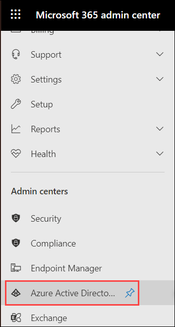
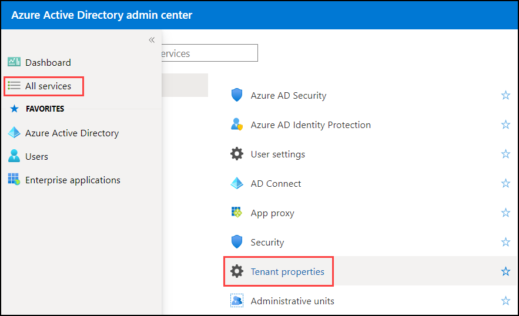
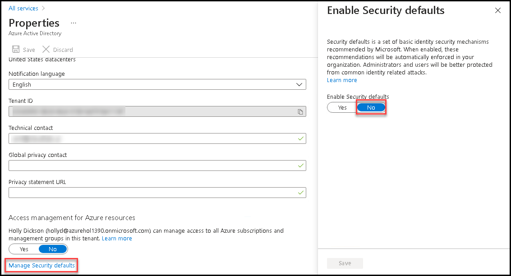
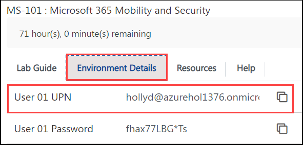
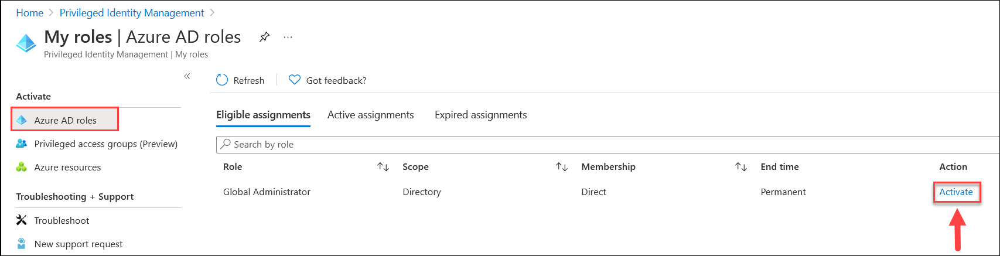
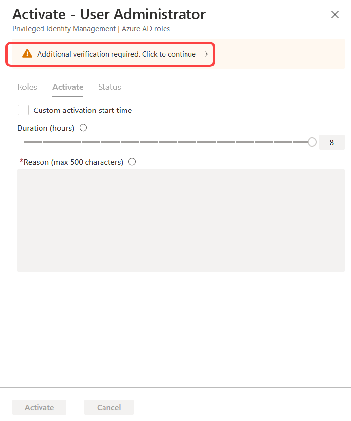
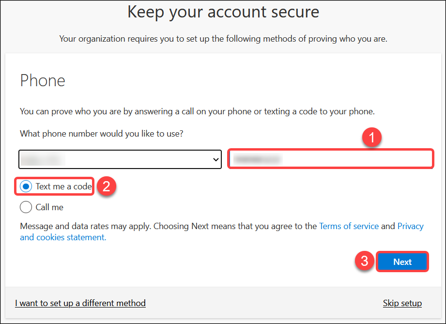
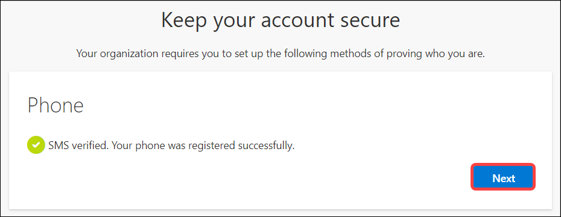
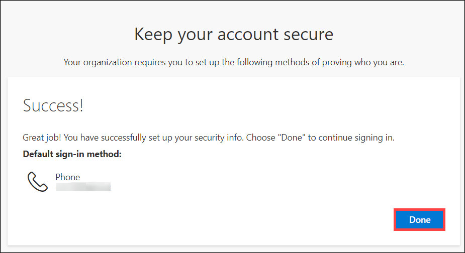

# Learning Path 1 - Lab 1 - Exercise 2 - PIM Resource Workflows

As part of her Microsoft 365 pilot project, Holly Dickson, Adatum's Enterprise Administrator, wants to implement Privileged Identity Management within Azure Active Directory. One of Adatum's pain points in their existing system is they have far too many users who have been assigned administrator roles. This has caused concern among management, who sees this as a threat to Adatum's data security. They feel that too many people were assigned admin roles that shouldn't have been, and as such, they have access to secure information and resources that could potentially compromise the organization. 

Because there is a need to reduce the number of users with permanent administrator roles and yet still provide admin privileges to selected users when business justification warrants it, Holly has been tasked with implementing Azure Active Directory's Privileged Identity Management service. By implementing PIM, Adatum can reduce the number of users with admin roles and yet still be able to assign users with admin rights on an as-needed basis whenever necessary.

In this lab, you will perform the basic steps involved in implementing PIM for a given admin role:

- Configure the role to require approval and assign an approver
- Assign an eligible user to the role
- Submit a request from the eligible user to be assigned the role
- Approve the request for the role

In this exercise, you will perform these tasks for the Global administrator role. Holly will take on the role of the approver, and Patti Fernandez will be the user requesting access to the role.

**IMPORTANT:** In Task 4, Patti Fernandez will submit a request to be assigned the Global administrator role. The activation request process is set up to require Multi-Factor Authentication (MFA). If you do not have a phone to complete this process, notify your instructor. You can still complete Tasks 1 and 2, and you may be able to partner up with another student to watch them complete the remaining tasks.

### Task 1 - Disable Security Defaults

Before moving on to the tasks of this lab we will first **disable security defaults** from **Azure Active Directory**.

1. In your Edge browser go to the **Microsoft Office Home** page by entering the following URL in the address bar: 
   ```
   https://portal.office.com/
   ``` 
2. You should be logged into Microsoft 365 as the **ODL_user Administrator**.
  
3. In your browser, select the **Microsoft 365 admin center** tab. In the left-hand navigation pane under the **Admin centers** section, select **Azure Active Directory**

   

4. In the **Azure Active Directory admin center**, in the left-hand navigation pane, select **All services**.

5. On the **All services** page, scroll down and select **Tenant Properties**. 

   

6. On the **Tenant Properties** scroll down and select **(1) Manage Security defaults**, On the **Enable Security defaults** pane select **(2) No**. Check the **(3) Other** box and enter **(4) NA** as the comment and finally select **(5) Save**.

   

7. You must now sign out of Microsoft 365 as the **ODL_user Administrator**, After signing out close your browser session (to clear cache) for the next task.

### Task 2 - Configure the Global Administrator role to require approval

Since the Microsoft 365 Global Administrator role provides a user with basically unlimited access to all Microsoft 365 resources, the number of users assigned to this role should obviously be kept to a minimum for security purposes. 
Holly Dickson, Adatum's Enterprise Administrator, wants to limit access to this role using Privileged Identity Management. To do so, she must first configure the role to require approval before it can be assigned as an eligible role for a user, and then she wants to assign herself as the approver whenever an eligible user requests activating the role.

1. On your Edge browser go to the **Microsoft Office Home** page by entering the following URL in the address bar: 
   ```
   https://portal.office.com/
   ``` 

2. Sign in as **Holly Dickson**, You can fetch the username from the **environment details tab**.

   

**Note:** Do not copy the password from the environment details page as we have already reset the password to **Pa55w.rd** in exercise 1.

3. In your browser, select the **Microsoft 365 admin center** tab. In the left-hand navigation pane under the **Admin centers** section, select **Azure Active Directory**

4. In the **Azure Active Directory admin center**, in the left-hand navigation pane, select **All services**.

5. In the **All services** window, the services are separated into three sections - General, Identity, and Services. Under the **Identity** section, select **Azure AD Privileged Identity Management**.

   

6. In the **Privileged Identity Management | Quick start** window, note how the window is divided into three parts - the navigation pane on the left, the middle pane (which provides navigation options for this page), and the detail pane on the right. <br/>

    In the middle pane under the **Manage** section, select **Azure AD roles**.

    

7. In the **Adatum Corporation | Quick start** window, in the middle pane under the **Manage** section, select **Settings**. 

8. In the **Adatum Corporation | Settings** window, select the **Global Administrator** role.

   

9. In the **Role setting details -  Global Administrator** window, select **Edit** on the menu bar at the top of the page.

10. In the **Edit role setting - Global Administrator** window, select the **Require Approval to activate** check box. 

      

11. In the **Select approver(s)** section, no specific approver has been selected. Holly wants to assign herself as the approver for this role, so select this section. In the **Select a member** pane that opens on the right, scroll down through the list of users and select **Holly Dickson**, and then select the **Select** button.

12. In the **Edit role setting - Global Administrator** window, select **Update**.

13. Leave all browser tabs open for the next task.


### Task 3 - Assign an eligible user to the Global Admin role

For Adatum's PIM pilot project, Holly has selected Patti Fernandez as the sole user who will be eligible to be assigned the Global admin role. In this task, Holly will enable Patti to be eligible for the Global admin role.

1. You should be logged into Microsoft 365 as Holly Dickson.

2. In your **Edge** browser, you should still have the **Azure Active Directory admin center** open in a tab that's displaying the **Adatum Corporation | Settings** window. In the navigation thread at the top of the page (**All services > Privileged Identity Management > Adatum Corporation**), select **Privileged Identity Management**.

3. In the **Privileged Identity Management | Quick start** window, in the middle pane under **Manage**, select **Azure AD roles**.

4. In the **Adatum Corporation | Quick start** window, the detail pane on the right displays the **Privileged Identity Management** window. This displays three groups - Assign, Activate, and Approve. Under the **Assign** group, select **Assign Eligibility**.

   

5. In the **Adatum Corporation | Roles** window, scroll down through the list of roles and select **Global Administrator**.

   

6. In the **Global Administrator | Assignments** window, select **+Add assignments** on the menu bar. 

7. In the **Add assignments** window, the **Membership** tab is displayed by default. Scroll down on the page, and under **Select member(s)**, select **No member selected**.

8. In the **Select a member** pane that appears on the right, scroll down through the list of users and select **Patti Fernandez**, and then select the **Select** button.

9. In the **Add assignments** window, select **Next** (this does the same thing as selecting the **Setting** tab). 

10. In the **Add assignments** window, under the **Settings** tab, verify the **Assignment type** option is set to **Eligible**, and then select **Assign**. 

11. In the **Global Administrator | Assignments** window, note that Patti Fernandez is now an eligible user who can be assigned the Global Administrator role.

    

    **Note:** It can take 30 minutes for the **Pending Request** to be implemented.  Wait at least 10 minutes, then refresh the **Global Administrator | Assignments** window until you see Patti listed under the **Eligible assignments** tab.

12. Leave all browser tabs open for the next task.


### Task 4 - Submit a request for the Global Admin role

Now that Patti Fernandez has been made an eligible user for the Global administrator role, Holly wants to test out the PIM process in her pilot project. In this task, Patti will submit a request to be assigned Global administrator role privileges. In the next task, Holly will review her request and approve it.

**Note:** The activation request process is set up to require Multi-Factor Authentication (MFA). If you do not have a phone to complete this process, notify your instructor. You may be able to partner up with another student to watch them complete the remaining two tasks.

1. On the LabVM, right-click on the **Edge** icon on the taskbar and in the menu that appears, select **New InPrivate window**. 

2. In your InPrivate browser session, enter the following URL in the address bar: **https://portal.azure.com**

3. Copy the username of **Patti Fernandez** from the **environment details page**. 

   

**Note:** Do not copy the password from the environment details page as we have already reset the password to **Pa55w.rd** in exercise 1.

4. In the **Sign in** window, enter **PattiF@xxxxxZZZZZZ.onmicrosoft.com** (where xxxxxZZZZZZ is the tenant prefix provided by your lab hosting provider) and then select **Next**. In the **Enter password** window, enter **Pa55w.rd** and then select **Sign in**. In the **Stay signed in?** dialog box, select the **Don't show this again** check box and then select **Yes**.

5. In the **Welcome to Microsoft Azure** dialog box that appears, select **Maybe later** to skip the tour.

6. In the **Microsoft Azure** portal, scroll down to the **Azure services** section, and then on the right side of the section, select **More services**.

7. In the **All services** window, enter **priv** in the **Search** box at the top of the page. In the list of search results, select **Azure AD Privileged Identity Management**.

8. In the **Privileged Identity Management | Quick start** window, in the **Tasks** section in the left-hand navigation pane, select **My Roles**.

   

9. In the **My roles | Azure AD roles** window, the **Eligible assignments** tab is displayed by default. Since Holly assigned Patti as an eligible user for the Global Administrator role, this role appears in the list. Under the **Action** column for the Global Administrator role, select **Activate**.

      

10. In the **Activate - Global Administrator** pane, a warning message is displayed at the top of the pane indicating additional verification is required. Select this message, which is hyperlinked.

      

11. In the **More information required** window that appears, select **Next**. 

12. In the **Enter password** window, enter **Pa55w.rd** in the Password field and then select **Sign in**.

13. On the **Help us protect your account** window appears. Select **Next**.

      

14. In the Keep your account secure window, you have the option to select the method to use for MFA.  Microsoft Authenticator is one option. For expediency in this lab exercise, you will choose a different method.  Select **I want to set up a different method**.  From the Chose a different method pop-up window, select the **drop-down arrow** and select **Phone** then select **Confirm**.

   	

15. In the window that opens, ensure your country is selected then enter the mobile phone number you wish to use and select, ensure that **Text me a code** is selected, then press **Next**.  The screen will display, "SMS verified. Your phone was registered successfully".  Select **Next**. then select **Done**.  this completes the one-time registration process.

   	

   	

   	

   	

16. If you take too long to complete this process, the **Enter password** window will appear with a message indicating you took too long to complete the sign in process, so you will be timed-out. If this occurs, you must sign in again with Patti's password of **Pa55w.rd**. Another verification code/approval notification will be sent to your phone, so enter it in the **Enter code** screen that appears and select **Verify**.

17. In the **Activate - Global Administrator** pane that appears, enter **Testing PIM** in the **Reason** field, and then select the **Activate** button at the bottom of the pane.

      

18. On the **My roles | Azure AD roles** window, the **Eligible assignments** tab is displayed on the menu bar. Select the **Active assignments** tab that appears next to it. Note that no roles appear. <br/>

     **Note:** If you recall, back in Task 1 Holly set up the Global Administrator role so that activation to a user account will require approval. What Patti just did was request that the Global Admin role be activated for her user account. This will send a request to Holly, who can then either approve or deny Patti's request for role activation. Holly will review this request in the next task.

19. Leave the InPrivate browser session open. You will return to it in the next task once Holly approves Patti's request.


### Task 5 -  Approve the request for the Global Admin role

Back in Task 1, Holly set herself up as the approver for the Global Administrator role. Since Patti has submitted a request to be assigned this role, Holly must review the request and determine whether to accept or deny it. 

1.  In LabVM, you currently have the InPrivate Browser session open. Select the Edge icon on your taskbar to see windows for the two Edge sessions that you have open - the window on the left is the original Edge browser session in which you are signed into **Microsoft 365** as **Holly Dickson**, and the window on the right is the InPrivate Browser session in which you are signed into **Azure AD** as **Patti Fernandez**. Select the window on the left to go back to the original Edge browser session in which you are signed in as **Holly Dickson**. 

2.  In your browser, select the **Global Administrator | Assignments** tab. This should display the **Global Administrator | Assignments** window in the **Azure Active Directory admin center**. <br/>

    In the navigation thread at the top of the page (**All services > Privileged Identity Management > Adatum Corporation**, select **Privileged Identity Management**.

3. In the **Privileged Identity Management | Quick start** window, in the middle pane under **Tasks**, select **Approve requests**.

4. In the **Approve requests | Azure AD roles** window, in the **Requests for role activations** section, select the check box to the left of the Global Administrator request from Patti Fernandez, and then select the **Approve** button.

5. In the **Approve Request** pane that appears, enter **PIM testing** in the **Justification** field and then select **Confirm**.

6.  Switch back to the InPrivate browser session where Patti is signed in. In the **My roles | Azure AD roles** window that should still be displayed, the **Active assignments** tab is currently selected from the prior task, prior to approving Patti's request. Select **Refresh** on the menu bar. Note how the Global Administrator role is now activated for Patti. 

7. Close the InPrivate browser session.

8. In your Edge browser session, close all the tabs except for the **Microsoft Office Home** tab and the **Microsoft 365 admin center** tab. Leave these two tabs open for the next lab.


# End of Lab 1
