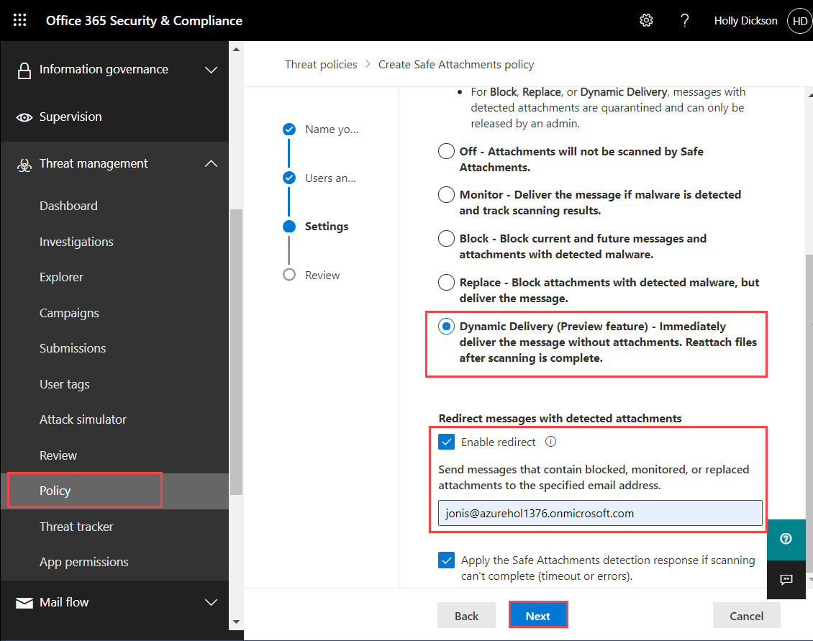

# Learning Path 2 - Lab 2 - Exercise 1 - Implement a Safe Attachments policy 

You now have a Global admin account set up for Holly Dickson, and you're signed into Microsoft 365 as Holly. In this first phase of your pilot project for Adatum, you want to create a Safe Attachments policy and turn on Microsoft Defender for Office 365, which provides advanced threat protection for SharePoint, OneDrive, and Microsoft Teams.

**Note:** You will not be able to validate the Safe Attachments policy. To do so would require that you attach a virus or malware-infected file to an email, which is something that Microsoft does not recommend.

### Task 1 – Create a Safe Attachment policy and turn on ATP for SharePoint, OneDrive, and Microsoft Teams

In this task, you will turn on Windows Defender for Office 365, which provides advanced threat protection (ATP) for SharePoint, OneDrive, and Microsoft Teams. You will also create a Safe Attachments policy that will test email attachments for malware that are sent to recipients within the xxxxxZZZZZZ.onmicrosoft.com domain. You will configure the policy so that if an attachment is blocked, it will be removed from the email that is sent to the recipient, and a copy of the email will be redirected to Joni Sherman for additional review.

1. You should be logged into Microsoft 365 as **Holly Dickson**.

2. In your Edge browser, select the **Microsoft 365 admin center** tab. In the left-hand navigation pane, under **Admin centers**, select **Security**. This will open a new tab in your browser for the **Office 365 Security &amp; Compliance center**. 

   **Note:** If you are redirected to the **Microsoft 365 Defender** page instead of **Office 365 Security & Compliance center**, Navigate to :
```
https://protection.office.com/
``` 


3. In the **Office 365 Security &amp; Compliance center**, in the left-hand navigation pane select **Threat Management** and then select **Policy**.

4. In the **Policy** window, double-click the **Safe Attachments** tile.

5. In the **Safe attachments** window, on the menu bar, select **Global settings**.

    

6. In the **Global settings** pane that appears, set the following options and then select **Save**:

    - **Turn on Defender for SharePoint, OneDrive and Microsoft Teams** - set the toggle switch to **On** (this enables Windows Defender for Office 365, formerly known as Advanced Threat Protection, or ATP)
    - **Turn on Safe Documents for Office clients** - set the toggle switch to **On**

7. On the **Safe attachments** window, select **+Create** on the menu bar to initiate the **New Safe Attachment Policy** wizard.

8. On the **Name your policy** page, enter **AttachmentPolicy1** in the **Name** field and then select **Next**.

9. On the **Users and domains** page, in the **domians** field type **onmicrosoft.com**. Then select the **onmicrosoft.com domain**. Select **Next**.

10. On the **Settings** page, select the **Dynamic Delivery** option. This option will still send the email but will hold the attachment until it has been scanned and marked acceptable.

11. Scroll to the bottom of the **Settings** page and select the **Enable redirect** check box. 

12. In the **Send the attachment to the following email address** field, enter **JoniS@xxxxxZZZZZZ.onmicrosoft.com** (where xxxxxZZZZZZ is the tenant prefix provided by your lab hosting provider), and then select **Next**.

    

18. On the **Review your settings** page, review the options that you selected. If any need to be corrected, select the appropriate **Edit** option and make the correction. If they all appear correct, select **submit**.

**Note:** If you receive a Client Error dialog box that indicates an error occurred when creating the policy, then the permissions assigned to Holly through the Organization Management role haven’t fully propagated through the system. For this lab, instead of waiting an hour or so for this permission replication to occur, select OK in this dialog box and then perform the following PowerShell commands that will enable you to customize organization management objects. Once you’ve completed these steps, you will resubmit the Review page to save the malware policy that you just created.

- On LabVM, you must open an elevated instance of Windows PowerShell. Select the magnifying glass (Search) icon on the taskbar at the bottom of the screen ad type powershell in the Search box that appears. In the list of search results, right-click on Windows PowerShell (do NOT select Windows PowerShell ISE) and select Run as administrator in the drop-down menu.

    

- Maximize your PowerShell window. In Windows PowerShell, at the command prompt, type the following command and press Enter:
```
Install-Module -name Exchangeonlinemanagement
```
- If you are prompted to confirm whether you want to install the module from an untrusted repository (PSGallery), enter A to select [A] Yes to All.

- At the command prompt, type the following command and press Enter:
```
Connect-exchangeonline
```
- A Microsoft 365 Sign in window will appear. Enter in the username for **Holly Dickson** and then select Next.

- In the Enter password window, enter the password **Pa55.wd**, and then select Sign in. It may take a moment to sign in before it returns a command prompt.

- At the command prompt, type the following command and press Enter (Note: This command may fail the first time. If it fails, re-run this step until it returns a successful result (the command prompt appears with no errors); testing shows that it sometimes takes two attempts):
```
Enable-OrganizationCustomization
```
- Close the PowerShell window.

- Return to your Edge browser and the Review page for your new policy. Select Submit to resubmit your policy. This time the policy should be successfully saved.

19. If a **Security & Compliance** dialog box appears with a message about updating your organization settings, select **Yes**.

      It may take a minute or so to update the organization settings. Once the settings are updated, the **AttachmentPolicy1** policy that you created will appear in the Safe attachments list. 

20. Leave the LabVM and the Security &amp; Compliance Center tab open for the next lab.


**NOTE:** Unfortunately, we are unable to create a training lab in which you can validate the Safe Attachments policy that you just created. To do so, you must send an email that contains a malicious attachment. There are some common test viruses that are available, such as the EICAR test virus; however, with well-known test viruses such as EICAR, the messages in which they are attached get quarantined before they can be processed by Windows Defender for Office 365. Since the Safe Attachments functionality is meant to protect against unknown and zero-day viruses and malware, it is very difficult, and not recommended, to create such an attachment.

That being said, after you have defined Safe Attachment policies in your real-world environment, one good way to see how the service is working is by viewing Advanced Threat Protection reports. For more information on using ATP reporting to validate your Safe Links and Safe Attachment policies, see [View reports for Office 365 Advanced Threat Protection](https://docs.microsoft.com/en-us/office365/securitycompliance/view-reports-for-atp).


# Proceed to Lab 2 - Exercise 2

