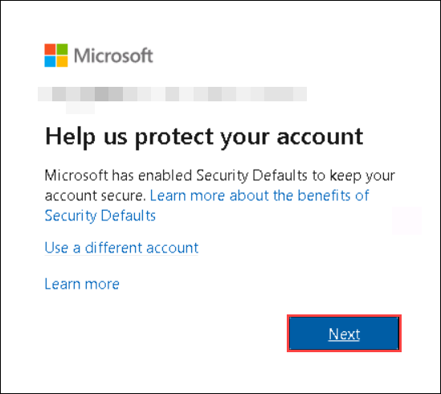
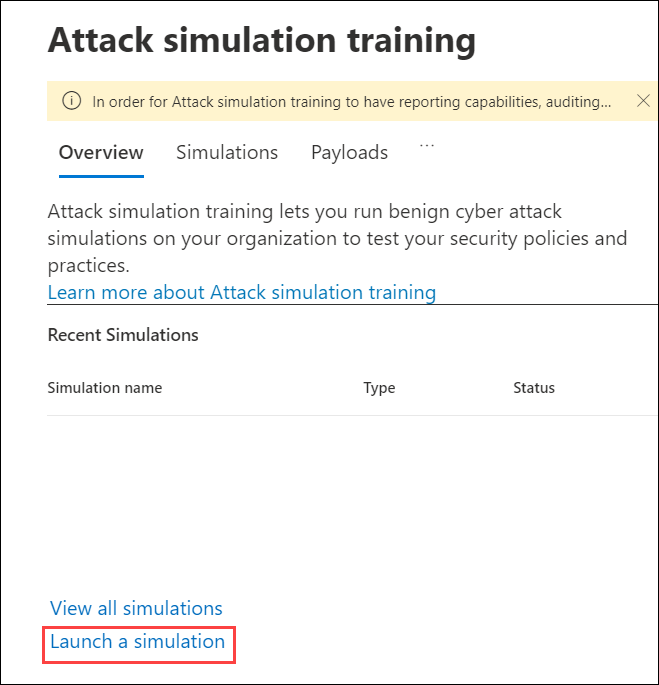
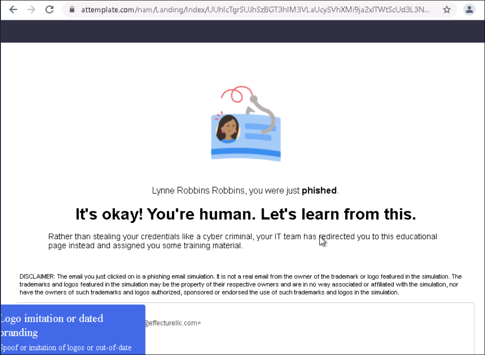

# Learning Path 3 - Lab 3 - Exercise 1 - Conduct a Spear Phishing attack using Attack Simulation training

Holly Dickson is concerned that some users at Adatum may require education about phishing attacks. As part of her pilot project, Holly has decided to use the Microsoft 365 Attack simulation training feature to determine her users' susceptibility to phishing attacks.

### Task 1: Enable Multifactor Authentication for the Global Admin
To use Microsoft's Attack simulation training feature to simulate a phishing attack, you must first enable Multifactor Authentication (MFA) for either your entire organization or for just the Global admin who will run the simulation. For her pilot project, Holly does not want to set up MFA for all the Adatum users at this point in time; therefore, she will enable MFA for her user account only, and then after she finishes running the Attack simulation training, she will turn MFA back off. 

**Important:** To implement MFA, you will need to use your mobile phone to receive a verification code so that you can enter it into your tenant as a second form of authentication. If you do not have a phone, you will have to skip this lab. If this is the case, notify your instructor, who can potentially partner you with another student to follow along through this lab.

1. In your **Edge** browser, you should still be logged into Microsoft 365 as Holly Dickson. To enable MFA for Holly Dickson's user account, select the **Microsoft 365 admin center** tab in your browser, and then in the left hand-navigation pane, select **Users** and then select **Active users**.

2. In the **Active users** window, on the menu bar at the top of the user list, select **Multi-factor authentication**. If it does not appear, select the **ellipsis (More actions)** icon. In the drop-down menu that appears, select  **Multi-factor authentication**.

   

3. In the **multi-factor authentication** window, the **users** tab is displayed by default. Note the MFA status for all existing user accounts, which is **Disabled**. Select the check box for **Holly Dickson**, and in Holly's properties pane that appears on the right, select **Enable**.

   

4. On the **About enabling multi-factor auth** dialog box that appears, select **enable multi-factor auth**. 

   

5. When the **Updates successful** dialog box appears, select **close**. In the **multi-factor authentication** window, verify Holly's MFA Status has changed to **Enabled**. 

7. You must now sign out of Microsoft 365 as Holly, close your browser session (to clear cache), open a new session, and then log back in as Holly using MFA. The first time you sign back in after having MFA enabled for your user account, you will be asked for the authentication information needed for MFA, such as your phone number and authentication options. You will then be texted a verification code to validate the authentication process works. You will perform these steps in the remaining portion of this task. 

	You must begin by signing out of Microsoft 365 as Holly, so select the **HD** user icon in the upper right corner of the browser and in the **Holly Dickson** window that appears, select **Sign out**. 

8. Once you are signed out, close the browser session and all the browser tabs. This will close your Edge browser.

9. Select the **Edge** icon on your taskbar to open a new browser session. In your browser go to the **Microsoft Office Home** page by entering the following URL in the address bar: **https://portal.office.com/** 

10. In the **Sign in** window, enter **Holly@xxxxxZZZZZZ.onmicrosoft.com** (where xxxxxZZZZZZ is the tenant prefix provided by your lab hosting provider) and then select **Next**. In the **Enter password** window, enter **Pa55w.rd** and select **Sign in**.

11. Because MFA is enabled for Holly, a **Help us protect your account** window appears. Select **Next**.

	

12. In the Keep your account secure window, you have the option to select the method to use for MFA.  Microsoft Authenticator is one option. For expediency in this lab exercise, you will choose a different method.  Select **I want to set up a different method**.  From the Chose a different method pop-up window, select the **drop-down arrow** and select **Phone** then select **Confirm**.

   	

13. In the window that opens, ensure your country is selected then enter the mobile phone number you wish to use and select, ensure that **Text me a code** is selected, then press **Next**.  The screen will display, "SMS verified. Your phone was registered successfully".  Select **Next**. then select **Done**.  this completes the one-time registration process.

   	

   	

   	

   	

14. If you take too long to complete the above process, the **Enter password** window will appear with a message indicating you took too long to complete the sign in process, so you will be timed out. If this occurs, you must sign in again with Holly's password of **Pa55w.rd**. Another verification code will be texted to your phone, so enter it in the **Enter code** screen that appears and select **Verify**.

15. On the **Stay signed in?** dialog box, select the **Don’t show this again** check box and then select **Yes.** 

20. If a **Get your work done with Office 365** window appears, then close it now. 

21. On the **Microsoft Office Home** tab, in the column of Microsoft 365 app icons that appears on the left side of the screen, select the **Admin** icon, which is the last icon in the list. This opens the **Microsoft 365 admin center** in a new browser tab. This will prepare you for the next lab exercise when you disable MFA for Holly Dickson after completing the Attack simulation training.

29. Select a new tab in your **Edge** browser and enter the following URL in the address bar: **https://security.microsoft.com**. This will open the **Microsoft 365 Defender** portal. You will resume from here in the next task when you launch a spear phishing attack using Attack simulation training.  

30. You have now configured MFA for Holly Dickson, you have signed into the **Office 365** portal as Holly using MFA, you have opened the Microsoft 365 admin center for future labs, and and you are ready to run the Attack simulator training in the Microsoft 365 Defender portal. Leave everything as is in your VM and proceed to the next task.

### Task 2: Configure and launch a Spear Phishing attack

Now that Holly has turned on MFA, she is ready to run Microsoft 365's Attack simulation training feature and launch a simulated spear phishing attack. This will provide visibility into how well Adatum is prepared to handle such a security attack. Microsoft 365 includes an Attack simulation training feature that enables you to create simulations and run them against all your users or a select group of users. Each phishing attack includes what is referred to as the "payload", which is the message in the email that contains the malicious component hackers use to gather information, deposit malicious code, and so on. The Attack simulation training feature includes a number of payload templates that you can choose from, and you can create your own payload if you so desire. In this lab exercise, you will use one of the existing payload templates. In the next lab exercise, you will create your own custom payload.

1. You should still have the **Microsoft 365 Defender** portal open in in your **Edge** browser from the prior task. If not, enter **https://security.microsoft.com** in the address bar, and then if you receive the dialog box asking for a second form of authentication, proceed through the verification process. 

2. In the **Microsoft 365 Defender** portal, under **Email & collaboration** in the left-hand navigation pane, select **Attack simulation training**. 

	

3. On the **Attack Simulation training** page, you reviewed the four types of simulated attacks that are available in the prior task. For this simulation, Holly has decided to conduct an account breach in which she will use a URL to try and obtain usernames and passwords. This is referred to in the Attack Simulator as a **Credentials Harvest** attack.  

	You can launch this attack either from **Simulations** tab or selecting the **Launch a simulation** link on the **Overview** page. Since the **Overview** tab has additional information and is the default page when selecting the **Attack simulation training** service, it is recommended that you launch it from there so that you can learn about the specifics of this type of attack.  
	
	On the **Overview** tab, at the bottom of the **Recent Simulations** section, select **Launch a simulation**. This initiates a **Simulation** wizard.

	

4. On the **Select Technique** page, review the specific information related to the **Credentials Harvest** attack type. Select the **View details of credential harvest** link. This opens a **Credential Harvest** pane on the right. Review the **Description** and the **Simulation steps** for this type of attack. When you're done, close the **Credential Harvest** pane.

	

5. On the **Select Technique** page, select the **Credentials Harvest** attack type if it's not already selected by default, and then select **Next**.

6. In the **Simulation** wizard, the steps involved in the simulation are displayed in the left-hand pane. While you can manually create a phishing campaign, it is recommended that you take advantage of the available templates that will prefill most of the information for you. The key to a successful phishing attack is to create a very intriguing, real-world looking email, and the templates provide very creative solutions.  

	On the **Name Simulation** page, provide the following information: 
	- Simulation Name: **PhishingTest1**
	- Description: **This simulation is to provide insight on targeted email threats against users inside the company.**

	

7. Select **Next**.

8. On the **Select Payload** page, hover your mouse over **2 Failed Messages** in the list of payloads and then select the circle that appears to the left of it. Select **Next**. 

	

9. On the **Target Users** page, select **Include all users in my organization**. This will display all of Adatum's users. Select **Next**.

	

10. On the **Assign Training** page, under the **Preferences** section, the **Assign training for me (Recommended)** option should be selected by default (if not, select it now). Select the **Due Date** field. In the drop-down menu that appears, select **7 days after Simulation ends** and then select **Next**.

	

11. On the **Training landing page**, the **Select the landing page option to be used** field should be prefilled with the **Microsoft landing page** option (if not, select it now). Select the **Preview page** button that appears below this field. 

12. The **Microsoft landing page** appears in the pane on the right. This provides an example of what the landing page will look like when someone experiences a phishing attack. Review the features of this landing page, and then close **Microsoft landing page** pane.

14. On the On the **Training landing page**, note the text that appears in the **Header** and **Body** fields. This is the text that you saw when you previewed the Microsoft landing page. Change the values of these fields to something different, and then select the **Preview page** button again. In the **Microsoft landing page** that appears in the pane on the right, you should see the changes that you made to the header and body text fields. Close the **Microsoft landing page** pane when you're done reviewing.

	

15. Select **Next**.

16. On the **Launch Details** page, select the **Launch this simulation as soon as I'm done** option and then select **Next**.

	

17. On the **Review Simulation** page, review the entered information. If anything needs to be changed, select the appropriate **Edit** option to make the change. Once everything is correct, select **Submit**. After a few minutes you will receive a confirmation stating **Simulation has been scheduled for launch**. Select **Done**.

	
	
	
	
### Task 3: Review the attack simulation results

In this task, you will verify whether Adatum has received the email that you configured in the Attack simulation training. You will then review the diagnostic feedback associated with the Spear Phishing attack that you simulated.

1. Open a **new Google Chrome browser** from the desktop. 

2. In the Chrome browser, in the **Outlook** tab in which you are signed in as the ODL_user Administrator. In the **ODL_user Administrator** window that appears, select **Sign out**.

3. Close all browser tabs except for the **Sign out** tab. In the **Sign out** tab, enter the following URL in the address bar to navigate directly to Outlook on the web: **https://outlook.office365.com**.
 
4. In the **Pick an account** window, select **Use another account**. 

5. In the **Sign in** window, enter **lynner@xxxxxZZZZZZ.onmicrosoft.com** (where xxxxxZZZZZZ is the tenant prefix ID provided by your lab hosting provider), and then in the **Enter password** window, enter **Pa55w.rd** and select **Sign in**. 

6. Close the **Welcome** window.

7. In Lynne's Outlook Inbox, you should see the spear phishing email that was sent by the Attack Simulator. Select the email to open it and review the details in the body of the message. 

	**NOTE!** It can take up to 15 minutes for the email to arrive.  Wait for the email before proceeding.

8. Select the link that is included in the email. Even though you know this is a spear phishing attack, this will enable you to see the effect of doing so in the Attack Simulator report that tracks the results of the spear phishing campaign.

	

9. In the **Sign in** dialog box that appears, enter **lynner@xxxxxZZZZZZ.onmicrosoft.com** (where xxxxxZZZZZZ is the tenant prefix ID provided by your lab hosting provider), and then enter **Pa55w.rd** in the **Enter password** window. Select **Sign in**. 

	

10. This displays a web page that explains how you have redirected to it as part of a Phishing awareness test being run by your organization. Read through the contents of this page. 

	

11. Switch back to the **Edge broswer**.

12. In your browser session where you are logged in as Holly Dickson, you should still be on the **Attack simulation training** page. If the **PhishingTest1** simulation does not appear in the **Recent Simulations** list, select the **Refresh** icon to the left of the URL on the address bar. The **PhishingTest1** simulation should now appear. Select the **PhishingTest1** simulation to view the diagnostic results that were captured for this simulation.

	

13. A **PhishingTest1** page should appear. Review all the information collected for this simulated attack. When you're finished, select the **X** in the upper right-hand corner of the window to close it. 

	

14. Leave your Edge browser open and do not close any of the tabs.
    

# Proceed to Lab 3 - Exercise 2
