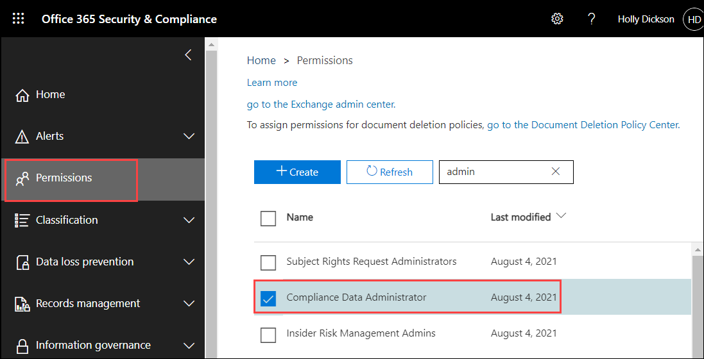

# Learning Path 3 - Lab 3 - Exercise 3 - Prepare for Alert Policies

Alerts are policies designed to automatically notify administrators when key actions have occurred in their Microsoft 365 tenant. Alerts can be an easy way to ensure that change logs are up-to-date and that business policies are being followed inside your Microsoft 365 tenant.

In your role as Holly Dickson, Adatum’s Enterprise Administrator, you have Microsoft 365 deployed in a virtualized lab environment. One of Adatum’s business requirements is to set up an alert notification system so that targeted administrators are automatically notified through email when certain actions occur. As you proceed with your Microsoft 365 pilot project, you want to test out Microsoft 365’s alert notification system by creating and validating several types of alerts.

There are two requirements to viewing alerts in the Security and Compliance Center – turning on Audit Logging and assigning the proper Role Based Access Control (RBAC) permissions to the users who will view alerts. 

- **Audit logging.** If you’ll recall, towards the end of Lab 1 you turned on Audit Logging. You performed this task in Lab 1 because it can take an hour or two to propagate that setting through the system before you can successfully implement alerts. So hopefully this propagation completed while you completed the previous modules.

- **RBAC permissions.** In this exercise, you will assign the necessary RBAC role group to Lynne Robbins, who is the user that Holly selected for testing alerts in Adatum's Microsoft 365 pilot project. 

### Task 1 – Assign RBAC Permissions for Alert Notification Testing

The alerts a user can see on the **View alerts** page is dependent on the assigned RBAC roles, which determine the depth of insight and control a user has. How is this accomplished? The management roles assigned to users (based on their membership in role groups in the Security and Compliance Center) determine which alert categories a user can see on the **View alerts** page (this was covered in the topic on Alerts in the previous module). 

For Adatum’s pilot project, Lynne Robbins has been selected to test the alert notification system. For Lynne to be able to view alerts and receive alert notifications, she must first be assigned appropriate RBAC permissions in the Security and Compliance Center.

The three alerts that you will create in this lab are assigned to two Alert categories: **Permissions** and **Data Loss Prevention**. The Compliance Data Administrator role group, which includes the Compliance Administrator role, provides permissions for these two alert categories; therefore, assigning Lynne Robbins to this role group will enable her to view the alerts that are created in this lab.


|                               | **Data governance** | **Data loss prevention** | **Mail flow** | **Permissions** | **Threat Management** | **Others** |
|:-------------------------------:|:---------------------:|:--------------------------:|:---------------:|:-----------------:|:-----------------------:|:------------:|
| Compliance Data Administrator | X                   | X                        |               | X               |                       | X          |

Perform the following steps to assign Lynne Robbins the Compliance Data Administrator role group, which includes the Compliance Administrator role.

1. You should still be logged into Microsoft 365 as Holly Dickson (**holly@xxxxxZZZZZZ.onmicrosoft.com)** with a password of **Pa55w.rd**. 

2. After finishing the previous lab, you should still be in the **Microsoft 365 admin center** in your browser. In the left-hand navigation pane, select **Show all**, and then under the **Admin centers** group, select **Security**.

Note: If you are redirected to the Microsoft 365 Defender page instead of Office 365 Security & Compliance center, Navigate to :

```
https://protection.office.com
```

3. In the **Office 365 Security &amp; Compliance center**, in the left-hand navigation pane, select **Permissions**.

4. On the **Permissions** page, select the **Compliance Data Administrator** role group. 

  

5. In the **Compliance Data Administrator** pane, scroll to the bottom and in the **Members** section, select **Edit**. 

6. In the **Editing Choose members** window, select **Choose members**. 

7. In the **Choose members** window, select **+Add**, and then in the list of users that appears, select **Lynne Robbins,** and then select **Add.**

8. In the **Choose members** window, select **Done.**

9. In the **Editing Choose members** window, select **Save.**

10. In the **Compliance Data Administrator** window, select **Close.**

11. Leave the **Security and Compliance Center** tab open for the next task.

You have now added Lynne Robbins to the Compliance Data Administrator role group.


# Proceed to Lab 3 - Exercise 4
