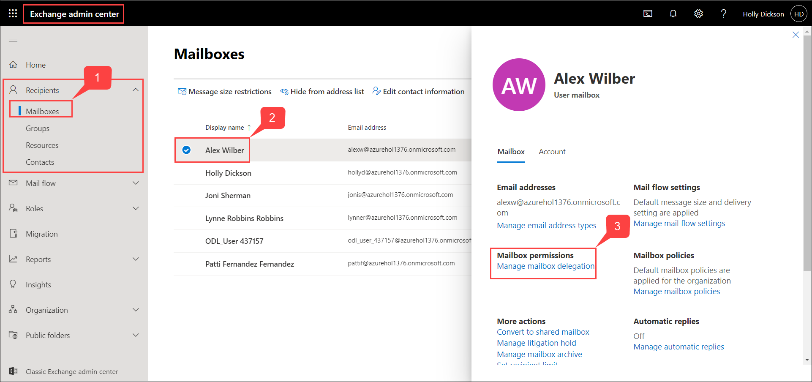

# Learning Path 3 - Lab 3 - Exercise 4 - Implement Mailbox Permission Alert

In this exercise you will configure and test an alert that will notify Lynne Robbins when FullAccess permissions are granted to any mailbox within Adatum.

### Task 1 – Create a Mailbox Permission Alert

1. You should still be logged into Microsoft 365 as Holly Dickson (**holly@xxxxxZZZZZZ.onmicrosoft.com)** with a password of **Pa55w.rd**. 

2. In the **Office 365 Security &amp; Compliance** center, in the left-hand navigation pane, select **Alerts,** and then under it, select **Alert policies**.

3. In the **Alert policies** window, select **+New alert policy**.

	

4. In the **New alert policy** window, enter the following information:

	- Name: **Mailbox permission change**

	- Description: **This alert notifies Lynne Robbins when FullAccess permissions are granted to any mailbox in Adatum Corp.**

	- Severity: **Medium**

	- Category: **Permissions**

	

5. Select **Next.**

6. On the **Choose an activity, conditions and when to trigger the alert** window, enter the following information:

	- Activity is: select the drop-down arrow in the field, enter **mail** in the search box, and select **Granted mailbox permission**

	- How do you want the alert to be triggered? **Every time an activity matches the rule**

	

7. Select **Next.**

8. On the **Decide if you want to notify people when this alert is triggered** window, enter the following information:

	- Email recipients: Select the "X" to the right of **Holly Dickson's** account to remove her, enter **Lynne**, and then select **Lynne Robbins** from the user list

	- Daily notification limit: **No limit**
	
	
	
9. Select **Next.**

10. Review your settings. When everything is correct, scroll to the bottom of the window and verify the **Yes, turn it on right away** option is selected (select it if necessary) and then select **Finish**.

	
	
11. Verify your new alert policy appears in the list on the **Alert policies** page and its **Status** in **On**.	!	
	

12. Leave the Edge Browser and the Microsoft 365 admin center and Security and Compliance Center tabs open for the next task!

You have now created an activity alert in the Security & Compliance Center that is triggered when FullAccess permissions are granted to any mailboxes.

### Task 2 – Validate the Mailbox Permission Alert

In the prior task, you configured an alert that will notify Lynne Robbins when FullAccess permissions are granted to any mailbox within Adatum. To test this alert, Holly Dickson will change the FullAccess permission on Alex Wilber’s mailbox by granting Joni Sherman FullAccess to his mailbox. This activity should trigger the alert policy that you just created, which should send an alert notification email to Lynne Robbins’ mailbox. You will then log into the Client 2 VM as Lynne Robbins and see if she received this email. 

1. You should still be logged into Microsoft 365 as **Holly Dickson**. 

2. In your Edge browser, select the **Microsoft 365 admin center** tab, and then in the left-hand navigation pane, under the **Admin centers** group, select **Exchange**. This opens the Exchange admin center for Exchange Online.	
	
	

3. In the **Exchange admin center**, in the left-hand navigation pane, select **(1) recipients**. 

4. In the **recipients** window, the **mailboxes** tab is displayed by default. Select **(2) Alex Wilber** from the list of mailboxes and then select the **Alex Wilber** to open up the **Alex Wilber user mailbox dialog box** and select **(3) Manage mailbox delegation**.	

	

5. On the **Manage mailbox delegation** window, select **Edit** in the **read and manage(0)**.

	

6. On the **Manage mailbox delegation** window, select **+ Add permissions**.	

	

7. In the **Add read and manage permissions** window, select **Joni Sherman**, and then select **Save** and close all the dialog boxes.
	
	

8. Since **Holly Dickson** has changed the mailbox permissions for Alex Wilbur by giving Joni Sherman FullAccess permissions to his mailbox, an alert email should automatically be sent to Lynne Robbins’ Inbox that notifies her of this event.	

	‎Switch to the **Chrome Browser**. 

9. In your Chrome browser, select the **Mail - Lynne Robbins - Outlook** tab that has Outlook on the web open for Lynne Robbins' mailbox. In Lynne Robbins’ **Inbox**, an email should be received from the Alerts notification system (**Office365Alerts@microsoft.com**) to let her know that Holly Dickson has made a Mailbox permission change.  
	
	
	
	**Note:** In can take up to 15 minutes or so for the email to be received in Lynne's Inbox. 

11. Open the email and review the contents. Scroll to the bottom of the email and select the **View alert details** button. This opens the **Security and Compliance Center**, displays the **View alerts** window, and opens the **Mailbox permission change** alert.  

	Scroll down through the **Mailbox permission change** alert and review all the information. When you are done, select **Close** to close the **Mailbox permission change** alert, then close the **View alerts** tab in your browser.

	

12. Switch back to the Edge Browser.	

13. In the **Microsoft 365 Security &amp; Compliance center**, in the left-hand navigation pane, select **Alerts,** and then under it, select **View Alerts**. The notification that was just created based on the **Mailbox permission change** alert should appear in the list.

	

14. In your browser, close the Exchange admin center tab (**mailboxes - Microsoft Exchange**), but leave the other browser tabs open.

15. Leave your Chrome and Edge browsers open for the remaining tasks in this lab.

You have just successfully tested a mailbox permission alert that sent an alarm message on granting FullAccess to a user mailbox.	

# Proceed to Lab 3 - Exercise 5
