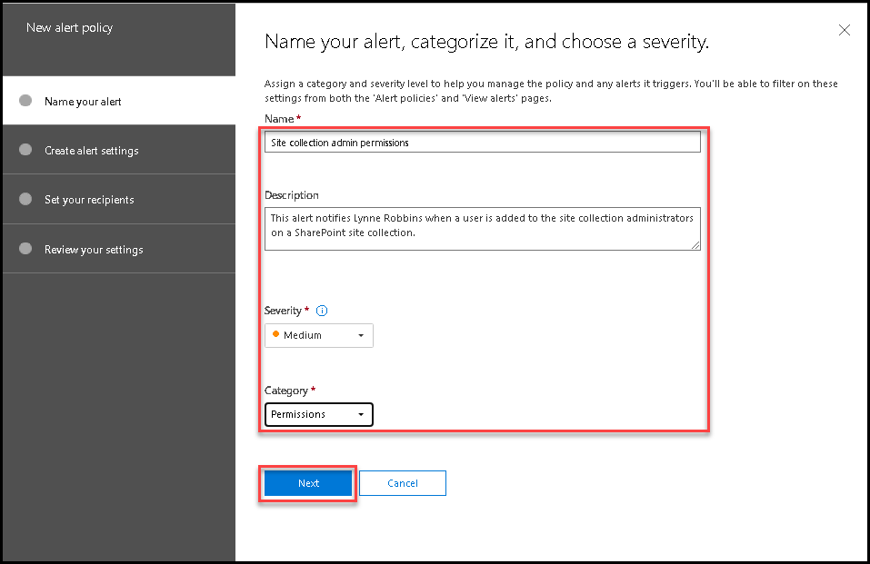
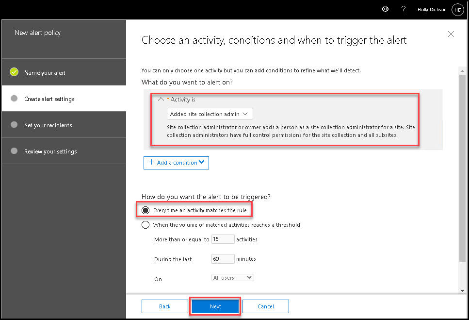
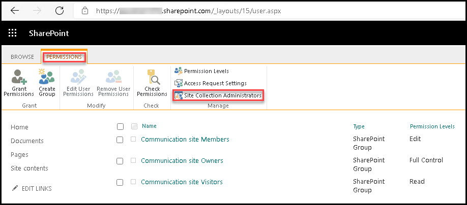
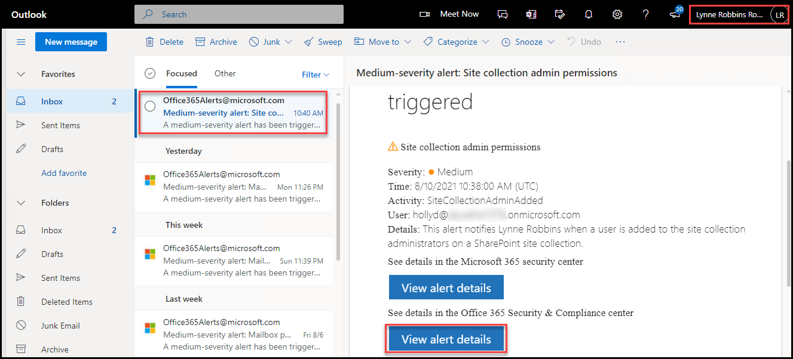
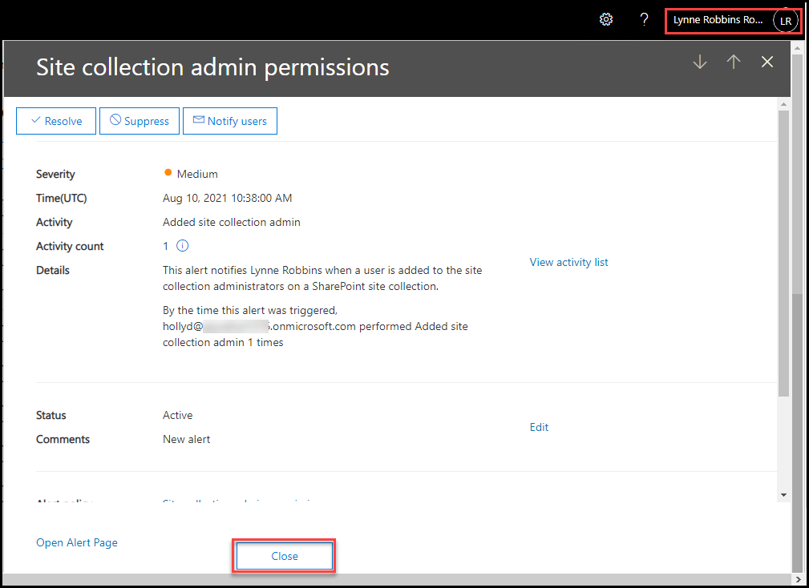
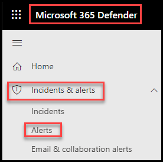

# Learning Path 3 - Lab 3 - Exercise 5 - Implement SharePoint Permission Alert

In this exercise you will configure and test an alert that notifies Lynne Robbins when a user is added to the site collection administrators for a SharePoint site collection.

### Task 1 – Create a SharePoint Permissions Alert

1. You should still be logged into Microsoft 365 as Holly Dickson (**holly@xxxxxZZZZZZ.onmicrosoft.com)** with a password of **Pa55w.rd**.

2. IIn your Edge browser, in the **Microsoft 365 Defender** tab, you should still be in the **Alert policy** window from the prior lab exercise (if not, then in the left-hand navigation pane, select **Policies & rules** and then select **Alert policy**).

3. In the **Alert policy** window, select the **+New alert policy** on the menu bar.

	

4. In the **New alert policy** window, enter the following information:

	- Name: **Site collection admin permissions**

	- Description: **This alert notifies Lynne Robbins when a user is added to the site collection administrators on a SharePoint site collection.**

	- Severity: **Medium**

	- Category: **Permissions**

	

5. Select **Next.**

6. On the **Choose an activity, conditions and when to trigger the alert** window, enter the following information:

	- Activity is: select the drop-down arrow in the field, enter **site collection** in the search box, and select **Added site collection admin**

	- How do you want the alert to be triggered? **Every time an activity matches the rule**

	

7. Select **Next.**

8. On the **Decide if you want to notify people when this alert is triggered** window, enter the following information:

	- Email recipients: Remove **Holly Dickson** and add **Lynne Robbins**

	- Daily notification limit: **No limit**

	

9. Select **Next.**

10. Review your settings. When everything is correct, verify the **Yes, turn it on right away** option is selected and then select **Finish**.

	

11. Verify your new alert policy appears in the list on the Alert policies page and its Status in On. !

12. Leave the Edge Browser tabs open for the next task!

You have now configured an additional alert policy that monitors when a site collection administrator is added to SharePoint Online site collections.

### Task 2 – Validate the  SharePoint Permissions Alert

In the prior task, you configured an alert that will notify Lynne Robbins when a site collection admin is added to a site collection. To test this alert, Holly Dickson will add Alex Wilber as a site collection admin to the global SharePoint Communication site. This activity should trigger the alert policy that you just created, which should send an alert notification email to Lynne Robbins’ mailbox. You will then switch to the Client 2 VM to see if Lynne received this email. 

1. You should still be logged into Microsoft 365 as **Holly Dickson**. 

2. In your **Microsoft Edge** browser, open a new tab and enter the following URL in the address bar: **https://xxxxxZZZZZZ.sharepoint.com/_layouts/15/settings.aspx** (replace xxxxxZZZZZZ with the tenant prefix provided by your lab hosting provider). This opens the **Site Settings** for the global SharePoint Communication site.

3. On the **Site Settings** window, under the **Users and Permissions** section, select **Site permissions**. 

	

4. In the ribbon at the top of the page, the **Permissions** tab is displayed by default. Under the **Manage** group, select **Site Collection Administrators**.

	

5. In the **Site Collection Administrators** dialog box, the administrator accounts assigned to this role group are displayed in the data entry field. To the right of the final account, enter **Alex**, select **Alex Wilber** from the list of users that appears, and then select **OK**. 

	

6. Since a new site collection admin has been added, an alert should automatically be sent to Lynne Robbins’ Inbox notifying her of this event. Perform the remaining steps to verify that Lynne received this email.

	‎‎Switch to the **Chrome Browser**. 

7. From the prior task, you should still be logged into **Outlook on the web** as **Lynne Robbins**. Monitor Lynne's Inbox to view the email generated by the alert that you just created.  

	**Note:** Based on lab testing, the time for an email to be generated and received in Lynne's Inbox can range from a couple of minutes to an hour. 

8. Once the email arrives in Lynne's Inbox, open the email and review the contents. Scroll to the bottom of the email and select the **View alert details** button. This opens the **Office 365 Security and Compliance** center, displays the **View alerts** window, and opens the **Site collection admin permissions** alert.  

	

	Scroll down through the alert and review all the information. When you are done, select **Close** to close the alert, then close the **View alerts** tab in your browser.

	

9. Switch back to the Edge Browser.

10. In your Edge browser, select the **Alert policy** tab that displays **Microsoft 365 Defender**. In the left-hand navigation pane, select **Incidents & alerts** to expand the group, and then select **Alerts**. The notification that was just created based on the **Site collection admin permissions** alert should appear in the list.

	

11. In your browser, close the **Permissions: Communication site** tab, but leave the other browser tabs open.

12. Leave your Chrome and Edge browsers open for the remaining tasks in this lab.

You have now successfully tested the SharePoint alert to monitor site collection admin permissions on SharePoint sites. 

# Proceed to Lab 3 - Exercise 6
