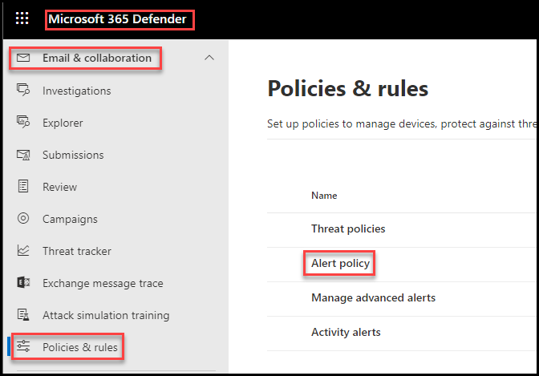
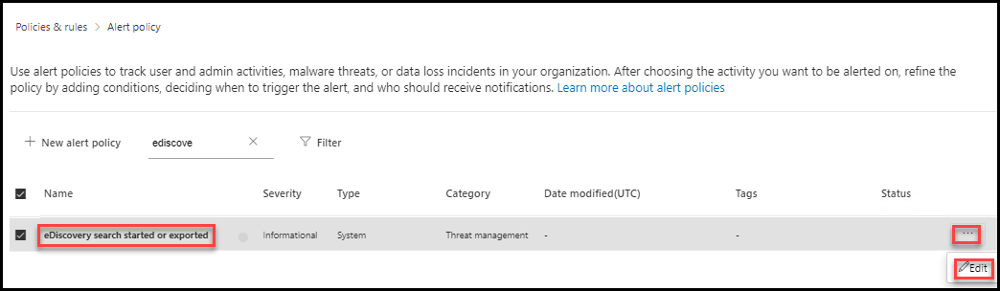
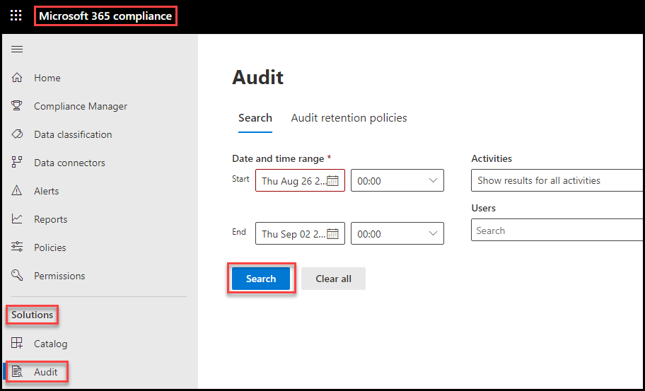

# Learning Path 3 - Lab 3 - Exercise 6 - Test the Default eDiscovery Alert

In this exercise you will test a default Microsoft 365 alert policy that notifies all tenant admins, such as Holly Dickson, whenever an eDiscovery search has been created or exported.

**Note:** Creating an eDiscovery alert of this nature is important because an eDiscovery search, when left unregulated, can pull sensitive content that can be exported to an unauthorized source.

### Task 1 – Review the default eDiscovery Alert

In this task, you will verify whether a default Microsoft 365 alert is triggered when somebody in your tenant creates an eDiscovery search or exports data from an existing search. Since Holly Dickson is assigned the Global Admin role, she is automatically a member of the Tenant Admins and will be one of the recipients of this alert. 

1. You should still be logged into Microsoft 365 as Holly Dickson (**holly@xxxxxZZZZZZ.onmicrosoft.com)** with a password of **Pa55w.rd**. 

2. In your **Microsoft Edge** browser, select the **Alerts** tab that displays **Microsoft 365 Defender**.

3. In **Microsoft 365 Defender**, under the **Email & collaboration** group, select **Policies & rules**. 

4. On the **Policies & rules** page, select **Alert policy**. 

	

5. On the **Alert policy** page, You want to search through the default system policies for a policy named **eDiscovery search started or exported**. Since there are so many pre-existing system policies, the easiest way to locate the policy is to search for it. In the **Search** field at the top of the screen, enter **eDiscovery**.

6. In the policy list, the **eDiscovery search started or exported** policy should appear. Select the check box next to this policy.

7. An **eDiscovery search started or exported** pane should appear. Scroll down through **eDiscovery search started or exported** pane and verify the settings are configured as follows:

	- Status: **On**
	
	- Conditions: **Activity is eDiscoverySearchStartedOrExported**

	- Aggregation: **Single event**

	- Scope: **All users**

	- Email recipients: **TenantAdmins**

	

8. If all settings are correct, select the **Close** button to close the **eDiscovery search started or exported** pane.

9. In the **Alert policies** list, select the **ellipsis** icon that appears on the far right side of the **eDiscovery search started or exported** row, and then in the menu that appears, select **Edit**.

	

10. An **Edit recipients** pane appears. This window enables you to edit the email recipients who are notified when this policy is triggered. You will not change the value here; instead, the purpose of this step is to show you how to change the recipient list in your real-world implementations for any of the default system policies. Select **Close**.

	

You have now reviewed the default Microsoft 365 eDiscovery alert that notifies tenant admins when an eDiscovery search is created or exported.

### Task 2 – Validate the default eDiscovery Alert

To test this default alert, Holly Dickson will create an eDiscovery search. This activity should trigger the alert policy, which should send an alert notification email to all Tenant Admins. Holly is a Global admin, who by default are members of the Tenant Admin group; therefore, she should receive the email notification generated by this alert. 

1. You should still be logged into Microsoft 365 as Holly Dickson (**holly@xxxxxZZZZZZ.onmicrosoft.com)** with a password of **Pa55w.rd**. 

2. In your **Microsoft Edge** browser, select the **Microsoft 365 admin center** tab. 

3. In the **Microsoft 365 admin center**, in the left-hand navigation pane under the **Admin centers** group, select **Compliance**.

4. In the **Microsoft 365 compliance** portal, in the left-hand navigation pane, under the **Solutions** group, select **Content search**.

5. The **Content search** window has two tabs - a **Search** tab and an **Export** tab. The **Search** tab is displayed by default. Select **+New search** that appears on the menu bar. This initiates the **New search** wizard.

	

6. In the **New search** wizard, in the **Name and description** page, enter **Confidential search** in the **Name** field and then select **Next**.

7. In the **Locations** page, the **Specific locations** option is selected by default. There are three groups of locations, each of which can be turned On or Off through its respective toggle switch. Turn the toggle switch **On** for **Exchange mailboxes**, but leave the toggle switches **Off** for the other two locations. Select **Next**.  

	

	**Note:** The **Included** column indicates that all mailboxes will be included in the search, but it also provides the option to optionally choose specific mailboxes if you wish. For this lab, leave the default value as is to search all mailboxes.

	**Warning:** At least one location must be set to **On**; otherwise, you will receive an error.  

8. In the **Define your search conditions** page, enter **Confidential** in the **Keywords** field and then select **Next**.

9. In the **Review your search and create it** page, review the settings and edit any (if necessary) to make any corrections. Once everything appears OK, select **Submit**. 

10. On the **Content search** page, note that the **Status** of the search is **Starting**.  

	**Important:** When you submit a new search, the system saves the search and then immediately runs it. By saving this eDiscovery search, the eDiscovery alert should be triggered, thereby creating an email notification that should be sent to the Inbox of all users with tenant admin permissions. You do NOT have to wait for the Search to finish before testing whether the alert sent the email notification. The alert notification system will process the email at the time the search is saved.

11. The search that you created should only take a couple of minutes to complete. You can either proceed to the next step while the search is running, or if you wish, you can select the **Refresh** icon on the menu bar every minute or so until the **Status** changes to **Completed**.

12. To test this alert, open a new tab in your browser and go to **Outlook on the web** by entering the following URL in the address pane: **https://outlook.office365.com**.

13. When Outlook opens, if the language and time zone window appears, select your Language and Time zone and select **Save**.

14. Monitor Holly's Inbox for the email that was automatically sent by the Alerts notification system to inform her that an eDiscovery search was created or exported. Once the email is received, open it and review the contents, then close the message.  

	**Note:** It may take up to 10 minutes or so before the email arrives in Holly's Inbox.

	
		

15. In your **Edge** browser, switch back to the **Microsoft 365 Compliance** portal (the **Content search** tab) and under the **Solutions** group in the left-hand navigation pane, select **Audit**. 

16. At the bottom of the page, select the **Search** button to display all recent activity. This will display the activity that created this alert.  

	

	**Note:** In the list of search results, note how the **User** for the prior alerts is listed as Holly, while the user for the eDiscovery alert is listed as **Service Account**. This is because the eDiscovery alert is a default system alert rather than a custom alert created by an individual user. It may take few minutes to hours to update the log, if you can't see the ediscovery log do not wait, proceed to next step.

17. In your browser, leave the Outlook tab (**Mail-Holly Dickson - Outlook**) open as you will use it shortly in another lab exercise. Leave all your other browser tabs open as well.

You have now successfully tested the Microsoft 365 eDiscovery system alert that monitors the creation of an eDiscovery search or the export of data from a completed search.

# End of Lab 3
