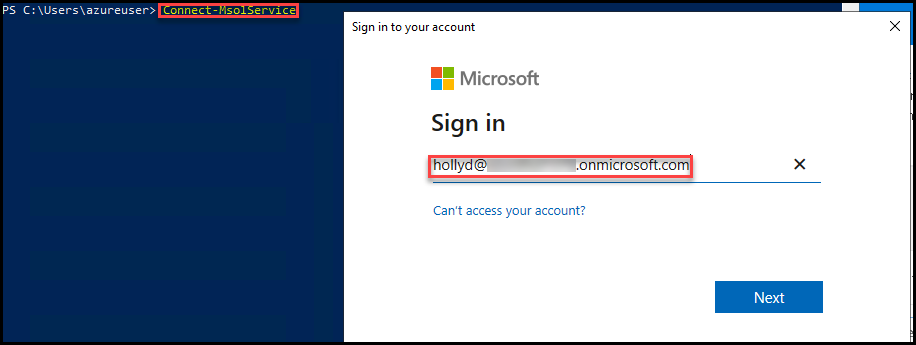
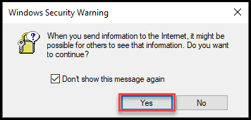
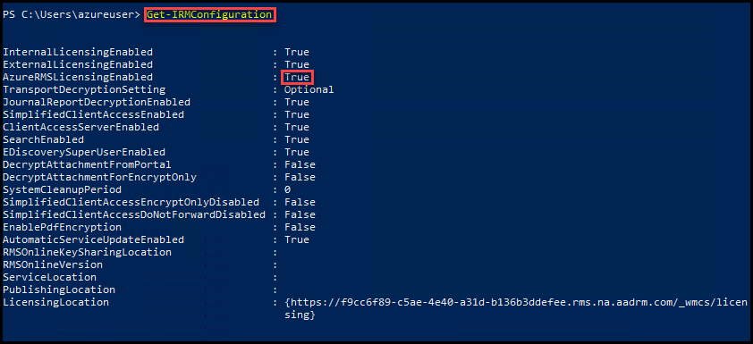
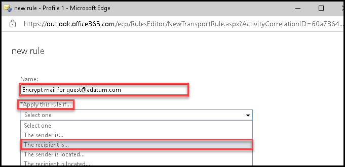
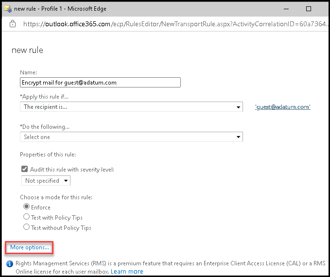
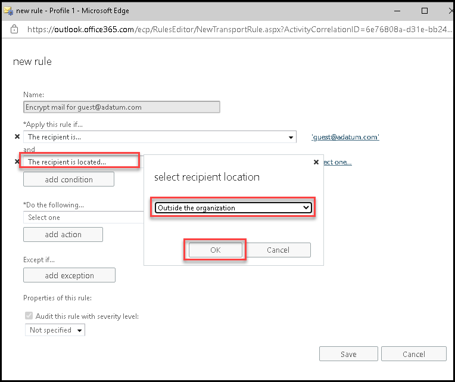
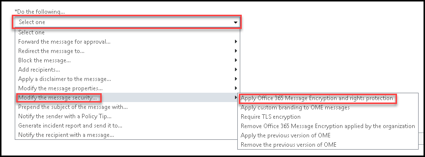
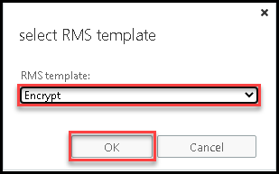
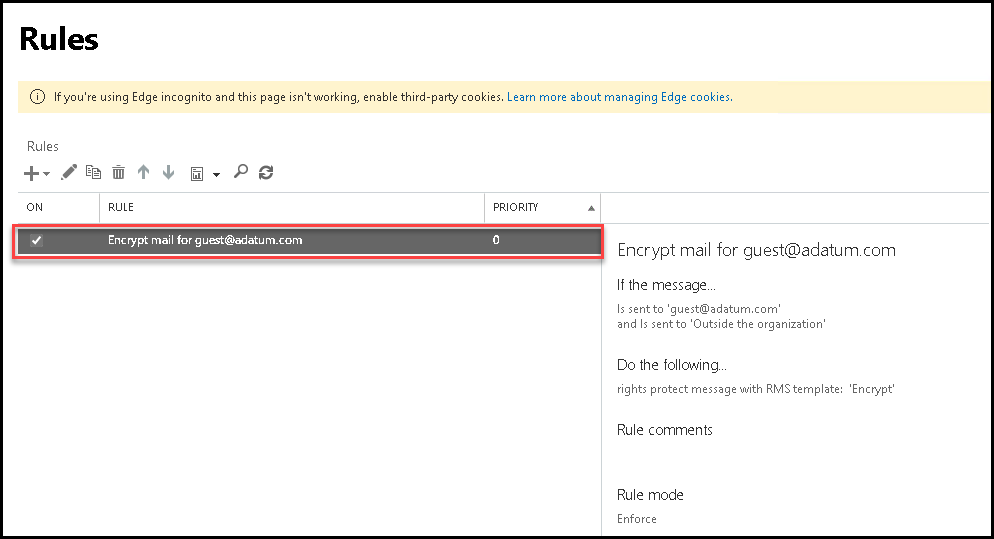
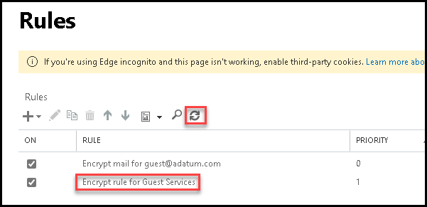

# Learning Path 4 - Lab 4 - Exercise 1 - Configure Microsoft 365 Message Encryption

In this lab, you will take on the persona of Holly Dickson, Adatum’s Enterprise Administrator. You have been tasked with piloting the use of Microsoft 365 message encryption in Adatum’s Microsoft 365 deployment. Since message encryption rules can be created using both Exchange Online and Windows PowerShell, you have decided to test each method to determine which you prefer to use once you go live.

In this exercise you will set up Azure Rights Management Services (RMS) for your tenant. You will also learn how to create a mail flow encryption rule using both the Exchange Admin Center and Windows PowerShell.

### Task 1 – Enable Azure Rights Management for Exchange Online

In this task you will use Windows PowerShell to access Exchange Online and then, through a string of commands, you will confirm that Azure RMS is active.  

1. You should still be logged into Microsoft 365 as Holly Dickson (**holly@xxxxxZZZZZZ.onmicrosoft.com)** with a password of **Pa55w.rd**. 

2. To open Windows PowerShell, enter **powershell** in the **Search** box on the taskbar. 

3. In the menu that appears, right-click on **Windows PowerShell** and select **Run as administrator** in the drop-down menu. 

	

4. In **Windows PowerShell**, you must begin by installing the **Microsoft Azure Active Directory Module for Windows PowerShell** by running the following command at the command prompt: 

	‎**Install-Module MSOnline** 
	
5. If you are prompted to install the **NuGet provider**, enter **Y** to select **[Y] Yes**. 

6. If you are prompted to confirm whether you want to install the module from an untrusted repository (PSGallery), enter **A** to select **[A] Yes to All.** 

	

7. Once the installation is complete, the screen will return to the command prompt. You must then run the following command to initiate a connection to Azure Active Directory:  
	
	**Connect-MsolService**  ‎

8. A new window will appear requesting your credentials. Sign in as **Holly@xxxxxZZZZZZ.onmicrosoft.com** (where xxxxxZZZZZZ is the tenant prefix provided by your lab hosting provider) with a password of **Pa55w.rd**.   

	

	If **Windows Security Warning** window is prompted click in **Yes**

		

9. Running unsigned PowerShell scripts from remote computers requires changing the execution policy for PowerShell. You should run the following command that changes the Execution Policy for this PC to **unrestricted**, which sets access to the external authorization for this PC so that it can connect to Microsoft online and load all configuration files and run all scripts:    

	**Set-ExecutionPolicy unrestricted**   
	
10. If you are prompted whether you want to change the execution policy, enter **A** to select **[A] Yes to All**.

	
	‎
11. You must then run the following command to prompt for the username and password of the user who will be running any subsequent commands; this set of credentials will be stored in the $Cred macro:  

	**&dollar;Cred = Get-Credential**  
	
12. A **Windows PowerShell credential request** window will appear. Sign in as **Holly@xxxxxZZZZZZ.onmicrosoft.com** (where xxxxxZZZZZZ is the tenant prefix provided by your lab hosting provider) and a password of **Pa55w.rd**.  

	

13. You must then run the following command to create a PSSession (titled $Session) that establishes a remote connection to Exchange Online through PowerShell. When you create a PSSession, Windows PowerShell establishes a persistent connection to the remote computer. Without the -Credential parameter that invokes the $Cred macro from the prior step, this command would prompt you for the credentials of the user authorizing this command. In this case, by invoking the $Cred macro, it applies Holly’s username and password. 

	**&dollar;Session = New-PSSession -ConfigurationName Microsoft.Exchange -ConnectionUri https://outlook.office365.com/powershell-liveid/ -Credential $Cred -Authentication Basic -AllowRedirection** 

	

	**Note:** It’s important to note that you must connect to Exchange Online PowerShell with an admin account that cannot be enabled for multi-factor authentication (MFA). In a real-world environment, if your admin account is enabled for MFA, you must install the Exchange Online Remote PowerShell Module and use the **Connect-EXOPSSession** cmdlet to connect. For more information, see the following article on how to [Connect to Exchange Online PowerShell using multi-factor authentication](https://docs.microsoft.com/en-US/powershell/exchange/exchange-online/connect-to-exchange-online-powershell/mfa-connect-to-exchange-online-powershell?view=exchange-ps).  
	
14. You should then run the following cmdlet to import commands, such as cmdlets, functions, and aliases, from the PSSession ($Session) created in the prior step. In this case, it imports the Exchange Online session into the PowerShell GUI.  

	**Import-PSSession $Session**    

	

	‎**Note:** You can ignore the warning message that is displayed regarding unapproved verbs.  
	
15. You must then run the following command to view the Information Rights configuration for Exchange Online:   

	‎**Get-IRMConfiguration**  

16. To validate whether Azure Rights Management Services is enabled, scroll through the list of parameters that’s displayed and locate the **AzureRMSLicensingEnabled** parameter. If this value is set to **$true**, then Azure RMS is turned On and you can proceed to the next step.   

	

	**Important:** If **AzureRMSLicensingEnabled** is set to **$false**, then you must run the following command to turn on Azure RMS before you can proceed to the next step:  

	**Set-IRMconfiguration -azureRMSLIcensingEnabled $true**

17. Now that Azure RMS is enabled, you should run the **Test-IRMConfiguration** cmdlet to test Information Rights Management (IRM) configuration and functionality, including availability of an Active Directory RMS server, pre-licensing, and journal report decryption. To perform this test, run the following command to test the IRM configuration for messages sent from Holly Dickson: 

	**Test-IRMConfiguration -Sender Holly@xxxxxZZZZZZ.onmicrosoft.com -Recipient Holly@xxxxxZZZZZZ.onmicrosoft.com** (where xxxxxZZZZZZ is the tenant prefix provided by your lab hosting provider) 

	**Note:** The results should appear as follows:  
	
	Results: Acquiring RMS Templates ...

 		- PASS: RMS Templates acquired. Templates available: Confidential \ All	Employees, Highly Confidential \ 
		All Employees, Encrypt, Do Not Forward.

 	Verifying encryption ...

 		- PASS: Encryption verified successfully.

 	Verifying decryption ...

 		- PASS: Decryption verified successfully.

 	Verifying IRM is enabled ...

 		- PASS: IRM verified successfully.

	OVERALL RESULT: PASS  
	
		
	‎
18. Leave your PowerShell window open as you will return to it in a later task; simply minimize the PowerShell window for now.
  

### Task 2 – Create a Mail Flow Encryption Rule using the Exchange admin center

In this task, you will create an encryption rule for messages inside your Exchange Online environment by using the Exchange admin center. In the next task, you will do the same thing but using PowerShell instead. 

1. You should still be logged into Microsoft 365 as Holly Dickson (**holly@xxxxxZZZZZZ.onmicrosoft.com)** with a password of **Pa55w.rd**. 

2. In the **Microsoft Edge** browser got to **Microsoft 365 admin center**, in the left-hand navigation pane, select **Show all** (if necessary), and then under **Admin centers**, select **Exchange**. This will open the Exchange Online admin center.

	

3. In the **Exchange admin center**, in the left-hand navigation pane select **Rules** under **mail flow.**

4. In the **Rules** tab, select the **plus sign** (**+**) icon to create a new rule. This displays a drop-down menu of actions. Select **Create a new rule.**

	

5. In the **new rule** window, in the **Name** box, enter **Encrypt mail for guest@adatum.com** as the name of this rule.

6. Select the drop-down arrow in the **Apply this rule if**… condition box. In the drop-down menu, select **the recipient is**. 

	

7. For this condition, you must either select an existing name from the user list or type a new email address in the **check names** box. In this case, enter **guest@adatum.com** in the **Check names** box then click on **Check names** and then select **OK**.

	

8. You need to add more conditions, so scroll down (if necessary) and select **More options**.

	

9. Select **add condition**. 

	

10. Note how a second condition box appears below **The recipient is…** condition box. In this second condition box, select the drop-down arrow and select **The recipient**. Then in the drop-down menu select **is external/internal.**

	

11. In the **select recipient location** dialog box, select the drop-down arrow. In the drop-down menu, select **Outside the organization** and then select **OK.** 

	

12. You now need to define an action to perform when this rule is applied. In the **Do the following…** box, select the drop-down arrow. In the drop-down menu, hover your mouse over **Modify the message security…** and in the menu that appears, select **Apply Office 365 Message Encryption and rights protection.**

	

13. In the **select RMS template** dialog box, select the drop-down arrow, select **Encrypt**, and then select **OK.**

	

14. Select **Save.** Once the rule is saved, it should appear in the list of rules in the Exchange admin center.

	

		

15. Leave your browser tabs open and proceed to the next task. 
 

### Task 3 – Create a Mail Flow Encryption Rule using Windows PowerShell

In a prior task, you configured a mail flow encryption rule using the Exchange admin center. In this task, you will create a mail flow encryption rule using Windows PowerShell. 

1. Now switch to the PowerShell window that you used in the prior task. Select the PowerShell icon on the taskbar. 

	**Important:** If you closed the previous PowerShell session, then repeat steps 1-14 from Task 1 to create a PSSession that establishes a remote connection to Exchange Online through PowerShell and then imports the Exchange Online session into the PowerShell GUI. This is required because the New-TransportRule cmdlet used in the next step does not exist in MsolService because it is an Exchange Online cmdlet; therefore, you must connect to the Exchange Online session through PowerShell to access this cmdlet.

2. In this step, you will create a mail flow rule by using the **New-TransportRule** cmdlet, and you will set the **ApplyOME** encryption parameter to $true. This rule will encrypt all outgoing mail from Adatum that is being sent to Gservices@adatum.com.   

	To create this rule, run the following command: 

	**New-TransportRule -Name "Encrypt rule for Guest Services" -SentTo "Gservices@contoso.com" -SentToScope "NotinOrganization" -ApplyOME $true**   
	
	**Note:** This command will take several seconds to complete.

	

3. To verify the rule exists, minimize your PowerShell window. In your Edge browser session, you should still be in the **mail flow** window of the **Exchange admin center**, and the **rules** tab should be displayed. The list of rules should only display the **Encrypt mail for guest@adatum.com** rule that you created in the prior task. 

	‎On the menu bar that appears above the list of rules, select the **Refresh** icon. In the refreshed list, the rule that you just created using PowerShell should appear as well.

	

4. Leave your browser session open for the next exercise.

# Proceed to Lab 4 - Exercise 2
