# Learning Path 4 - Lab 4 - Exercise 3 - Initialize Compliance 

In your role as Holly Dickson, Adatum’s Enterprise Administrator, you have Microsoft 365 deployed in a virtualized lab environment. As you proceed with your Microsoft 365 pilot project, your next steps are to implement archiving and retention at Adatum. You will begin by initializing compliance through the MDM auto-enrollment of new devices in your tenant. You will then configure retention tags and policies, and you will implement archiving with MRM retention tags. 

### Task 1 - Create a Group for Compliance Testing

To test archiving and retention in your Adatum pilot project, you will create a new mail-enabled security group and assign two users to the group – Joni Sherman and Lynne Robbins. These will be your two test users involved in the Windows Information Protection (WIP) pilot program. This group will then be used in the next task when you configure MDM auto-enrollment for new devices in your tenant. 

1. You should still be logged into Microsoft 365 as Holly Dickson (**holly@xxxxxZZZZZZ.onmicrosoft.com)** with a password of **Pa55w.rd**. 

2. In **Microsoft Edge**, select the **Microsoft 365 admin center** tab; if you closed this tab earlier, then open a new tab and go to **https://admin.microsoft.com**  

	At this point, you probably have quite a few tabs open in your browser. If you wish, you can take this opportunity to close every tab except for the **Office 365 Home** tab and the **Microsoft 365 admin center** tab.

3. In the **Microsoft 365 admin center**, in the left-hand navigation pane, select **Groups** and then select **Active groups** below it.

4. On the **Active groups** window, select **Add a group** to create a new group for compliance testing. 

	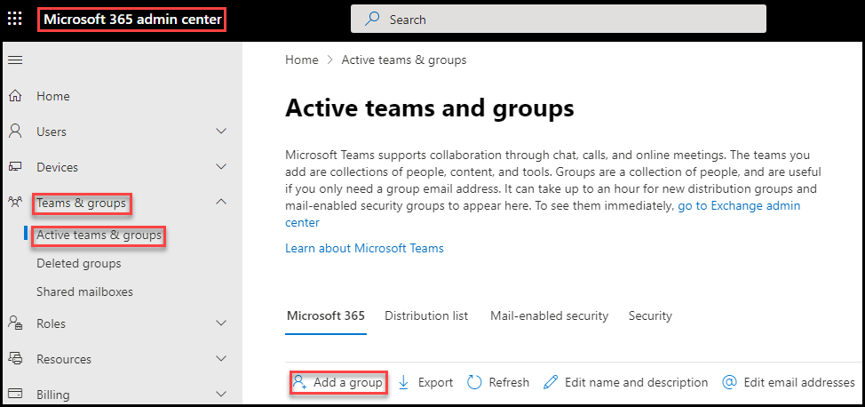

5. In the **Add a group** window, adding a group is a multi-step process, as depicted in the flow diagram on the left-hand side of the window. As you progress through the steps, enter the following information to create a new group:

	- Type: **Mail-enabled security**

	- Name: **WIP Users** (tab into the **Description** field to enable the **Next** button)

	- Group email address: **wipusers** 

	- Group email address domain: to the right of the group email address alias is the email address domain. **xxxxxZZZZZZ.onmicrosoft.com** (where xxxxxZZZZZZ is the tenant prefix provided by your lab hosting provider) should be displayed here. Select this field so enable the **Next** button but do not change its value.

	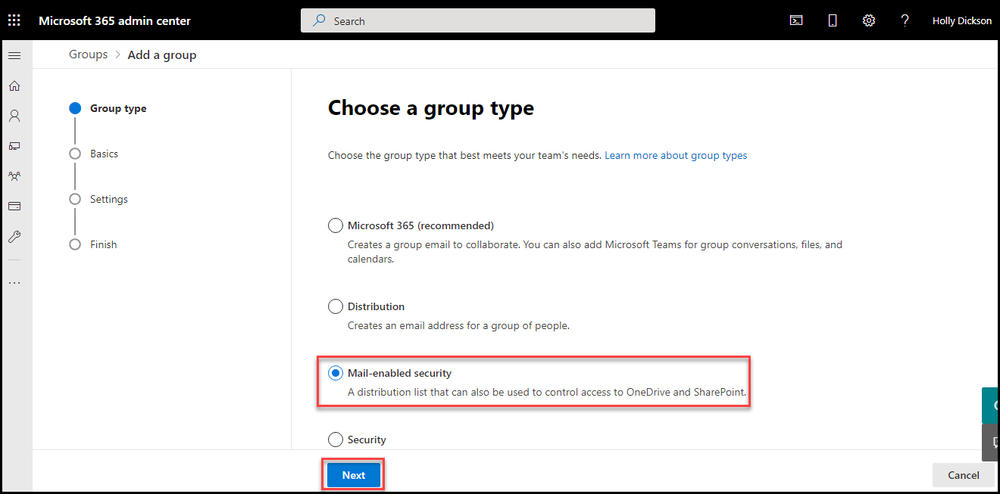
		
	

6. On the **Review and finish adding group** window, select **Create group**. Once the group is created, note the warning at the top of the **New group created** window that indicates it can take up to an hour for the group to appear in the Groups list. Our testing experience has shown that the group normally appears within a few minutes.

	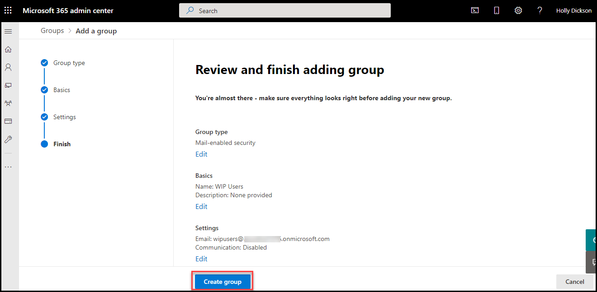

7. On the **New group created** window, select **Close**. 

8. This will return you to the **Active groups** list in the **Microsoft 365 admin center**. Go to **Mail-enabled security** tab and select the **Refresh** icon on the menu bar to refresh the list of groups. You cannot proceed until the WIP Users group appears in the list; therefore, keep refreshing the list every minute or so.

	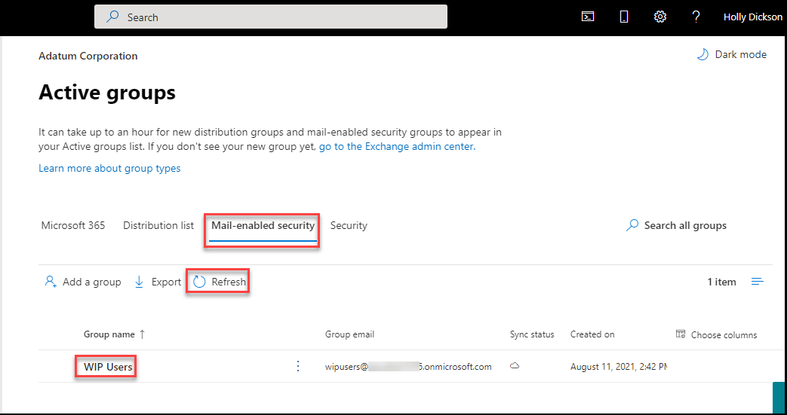

9. Once **WIP Users** appears In the **Groups** list, select it.

10. In the **WIP Users** pane that appears, select the **Members** tab. 

11. In the **Members** tab, in the **Members** section select **View all and manage members**.

	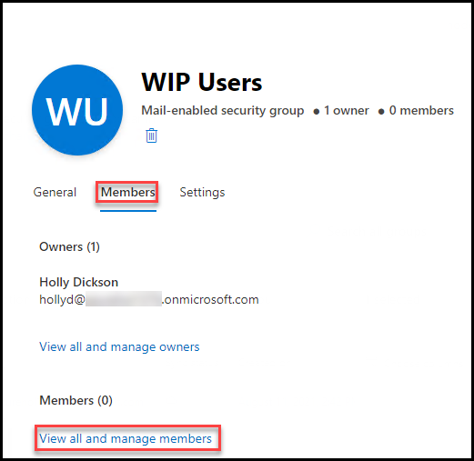

12. In the **View members** window, select the **+Add members** button; this displays the list of users.

	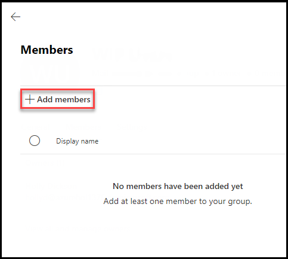

13. In the list of users, select **Joni Sherman** and **Lynne Robbins**, select **Add**, and then select **Close**.   

	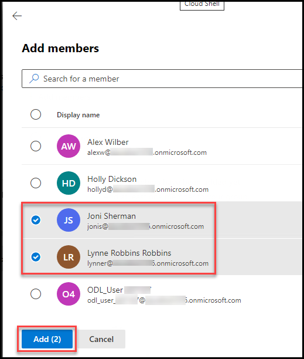

	‎**Note:** It may take a few minutes for both Joni and Lynne to display in the list of users. Simply refresh the list until both users appear.

14. In the **WIP users** window, select **Close**.

15. Leave your browser open to the Microsoft 365 admin center and proceed to the next task.

### Task 2 – Configure Mobile Device Management (MDM) Auto-enrollment

In this task you will activate MDM auto-enrollment for new devices in your Adatum Corporation tenant. The devices will belong to members of the WIP Users group that you created in Azure AD in the prior task. Activating MDM auto-enrollment is required so that you can implement Windows Information Protection in a later lab. You will also verify that Intune is set by default as your mobile device management authority. 

1. You should still be logged into Microsoft 365 as Holly Dickson (**holly@xxxxxZZZZZZ.onmicrosoft.com)** with a password of **Pa55w.rd**. 

2. In the **Microsoft 365 admin center** tab in your browser, in the left-hand navigation pane, select **Show all** (if necessary), and then in the **Admin centers** section, select **Azure Active Directory**.

	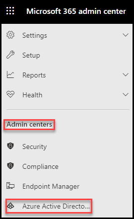

3. In the **Azure Active Directory admin center**, select **Azure Active Directory** in the left-hand navigation pane.

4. This returns the **Adatum Corporation | Overview** page. Under the **Manage** section in the middle pane, scroll down and select **Mobility (MDM and MAM)**.

	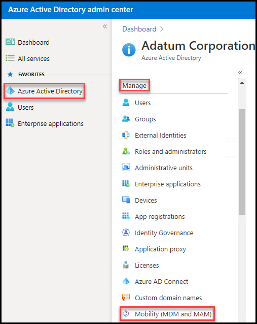

5. In the right-hand pane, select **Microsoft Intune**.

	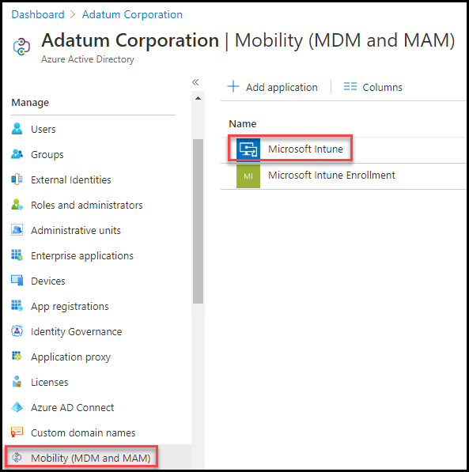

6. This returns the **Configure** window, from which you can configure MDM and MAM settings for Microsoft Intune. For the **MDM User scope** option, select **Some.** This will display a **Groups** option below the **MDM user scope** option. 

	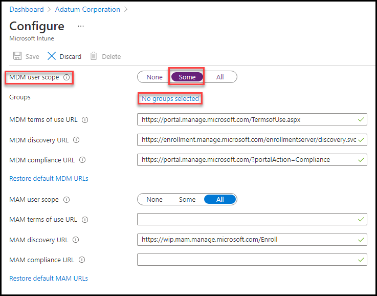

7. To the right of the **Groups** option, select **No groups selected**. 

8. In the **Select groups** pane that appears, scroll down through the list of groups, select **WIP Users**, and then at the bottom of the pane select the **Select** button.  

	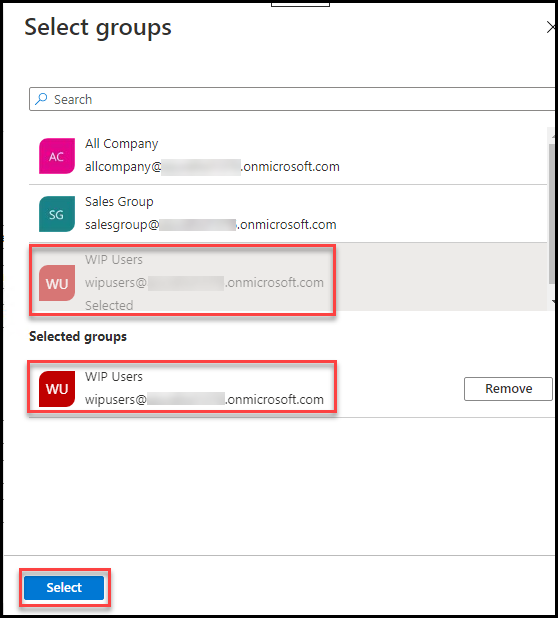

	**Note:** You configured the **MDM user scope** to automatically enroll devices that belong to members of the **WIP Users** group into MDM management with Microsoft Intune. Once Holly tests this feature in Adatum's pilot project, and assuming she is satisfied with the results, she will then set the **MDM user scope** to **All**.
	
9. This returns the **Configure** window. In the middle pane, select **Restore default MDM URLs** to ensure the correct URLs are set. 

10. Select **Save** on the menu bar at the top of the page.

	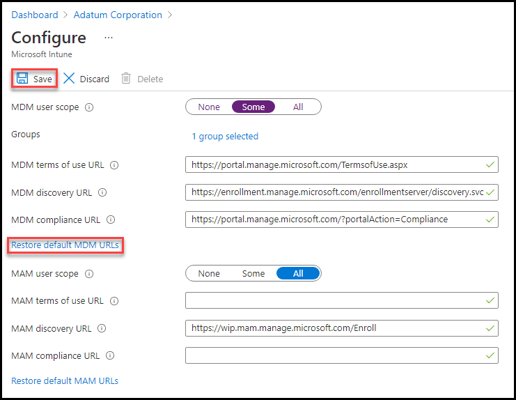

11. Select the **Microsoft 365 admin center** tab in your browser. In the left-hand navigation pane, under the **Admin centers** section, select **Endpoint Manager**.

	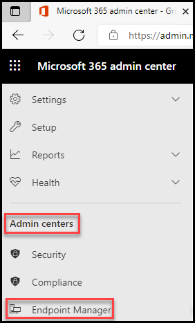

12. In the **Microsoft Endpoint Manager admin center** window, select **Tenant administration** in the left-hand navigation pane.

13. In the **Tenant admin | Tenant status** page, verify the **MDM authority** is set to **Microsoft Intune**.

	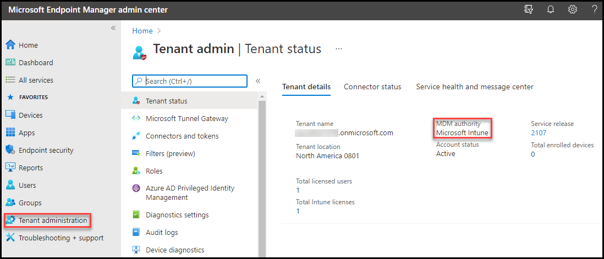

14. In your Microsoft Edge browser, you can close the Endpoint Manager admin center tab and the Azure Active Directory admin center tab. Leave the Microsoft Office Home tab and the Microsoft 365 admin center tab open.

You have configured automatic enrollment in Intune for devices of users in the WIP Users group, and you have verified the MDM authority for Adatum's tenant is set to Microsoft Intune.

# Proceed to Lab 4 - Exercise 4
