# Learning Path 4 - Lab 4 - Exercise 4 - Configure Retention Tags and Policies  

In this exercise, you will implement archiving with MRM retention tags. You will then configure retention tags and policies through two different ways - first, through the Exchange Admin Center, and second, through the Microsoft 365 Compliance Center. 

### Task 1 – Activate In-Place Archiving

In this next phase of your Adatum pilot project, you will access the Microsoft 365 Compliance Center to activate Holly Dickson’s archive mailbox.   

1. You should still be logged into Microsoft 365 as Holly Dickson (**holly@xxxxxZZZZZZ.onmicrosoft.com)** with a password of **Pa55w.rd**.

2. In Microsoft Edge, in the **Microsoft 365 admin center**, under the **Admin centers** group, select **Compliance** to open the Microsoft 365 Compliance center.

	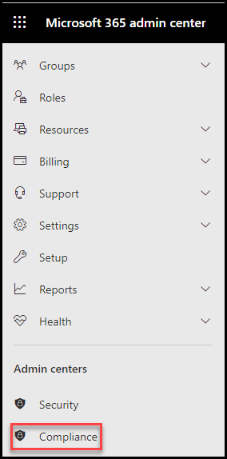

3. In the **Microsoft 365 Compliance** center, in the left-hand navigation pane, select **Information governance**. 

	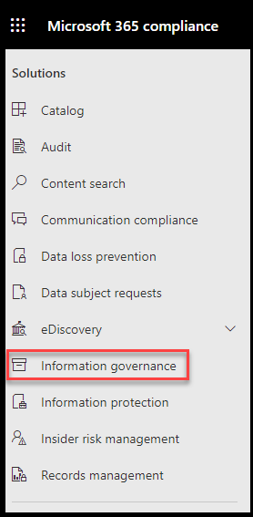

4. On the **Information governance** page, the **Labels** tab appears by default. In the list of tabs along the top of the page, select **Archive**.

4. On the **Archive** page, note that the archive mailboxes for all users other than Holly Dickson have a status of **Enabled**. These archive mailboxes were enabled when the VM lab environment was built for this training course and these users were preconfigured in the tenant. However, since you added Holly's user account in one of the first labs at the start of this course, her archive mailbox is **Disabled** by default.

	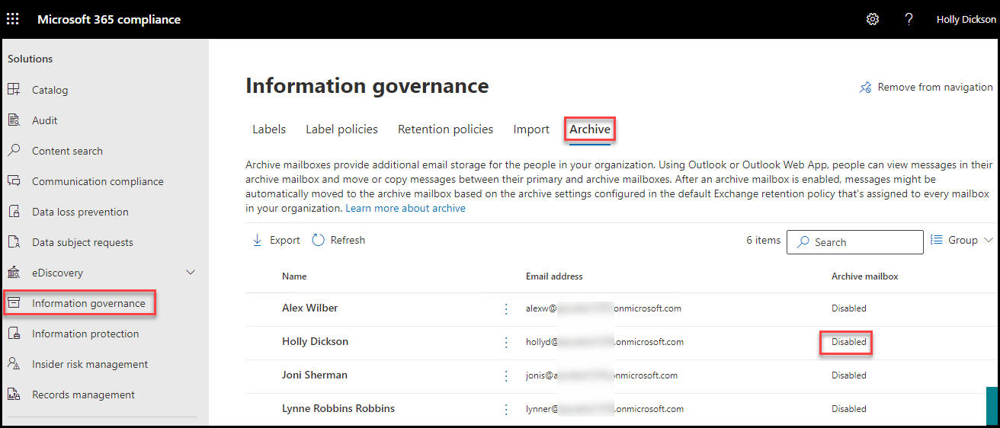

5. To enable Holly’s archive mailbox, select the check box next to **Holly Dickson** in the user list and then select **Enable Archive** in the menu bar that appears above the list of users.

	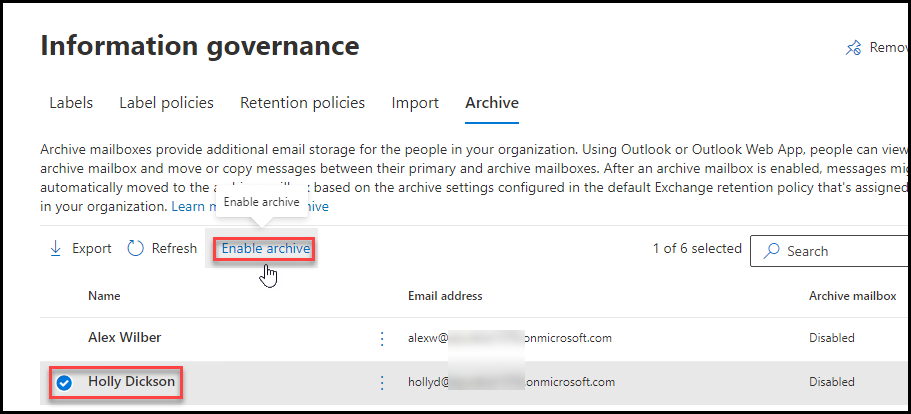

6. In the **Warning** dialog box that appears, select **Enable** to confirm this action.

	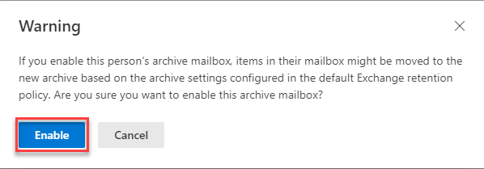

7. In your Microsoft Edge browser, leave the Microsoft 365 Compliance Center tab open as you will use it in a later task in this lab. 
 

### Task 2 – Create an MRM retention tag and policy in the Classic Exchange Admin Center

As part of your pilot project for Adatum, you will configure MRM retention through the Exchange Admin Center by creating an MRM retention tag and then adding it to a new MRM retention policy. You will also assign several default tags to the policy as well. You will then assign this retention policy to Joni Sherman and Lynne Robbins’ mailboxes.

1. Open a new tab on your Edge browser and go to **https://outlook.office365.com/ecp/**. 

2. In the **Classic Exchange admin center**, in the left-hand navigation pane, select **compliance management**.

	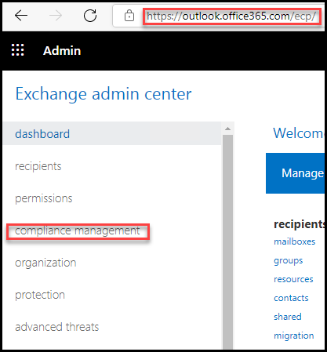

  **Note**: If you are redirected to New Exchange admin center, swicth toggle before **Default to new Exchange admin center** to change to classic exchange admin center.

3. In the **compliance management** window, in the list of tabs that appear across the top of the page, select **retention tags**.

4. You want to create a retention tag, so select the **plus (+) sign** icon in the toolbar that appears above the list of existing retention tags. In the drop-down menu that appears, select **applied by users to items and folders (personal)**.

	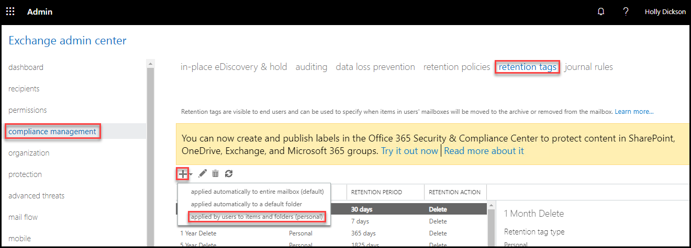

5. In **new tag applied by users to items and folders (personal)** window, enter **3 Years Move – Archive after three years** in the **Name** field.

6. Under **Retention Action**, select the **Move to Archive** option.

7. Under **Retention period**, select the **When the item reaches the following age (in days)** option and enter **1095** in the retention period field that appears below this option (1095 days = 3 years).

8. In the **Comment** field, enter **Personal tag to archive email three years after being received**.

9. Select **Save** to save the retention tag.

	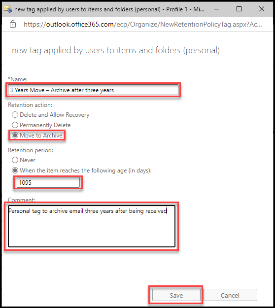

10. On the menu bar on the top of the page, select the **retention policies** tab.

11. In the **retention policies page**, note that there is one default retention policy. Since this policy is selected by default, its corresponding properties are displayed in the detail pane on the right-side of the screen. This information displays all the default retention tags that have been assigned to this policy.  

	You want to create a custom retention policy, so select the **plus (+) sign** icon in the toolbar that appears across the list of existing retention policies. 

	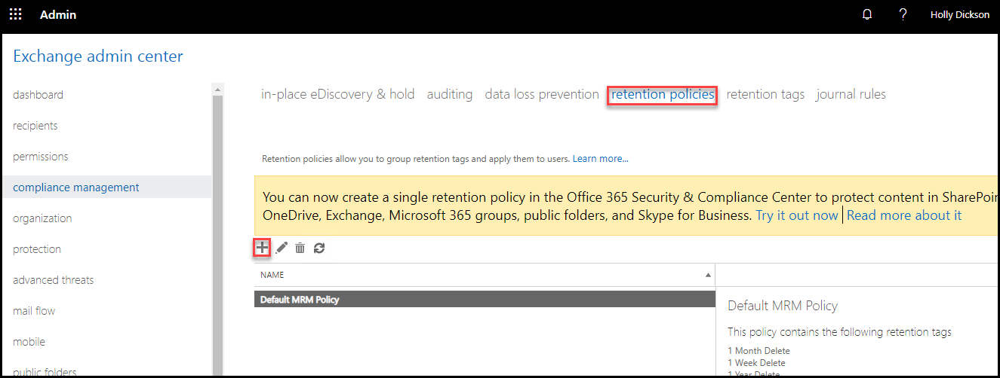

12. In **new retention policy** window, enter **Office Retention Policy** in the **Name** field.

13. You now want to assign one or more retention tags to this new policy. Below **Retention tags**, select the **plus (+) sign** icon.

	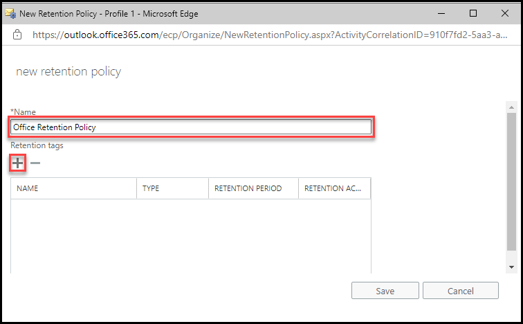

14. In the **select retention tags** window, select the **3 Years Move** tag that you just created, select the **add -&gt;** button, and then select **OK**.

	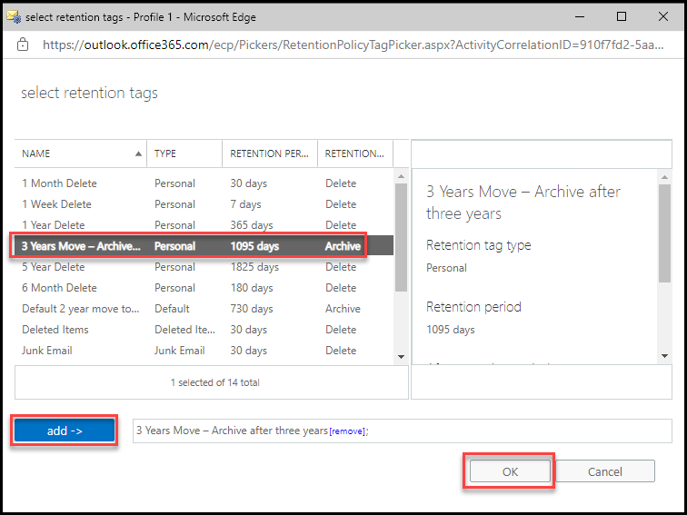

15. In addition to the personal retention tag that you just added to the retention policy, you also want to add the following default tags as well:

	- Default 2 year move to archive

	- Deleted Items

	- Junk Email

	- Recoverable Items 14 days move to archive

	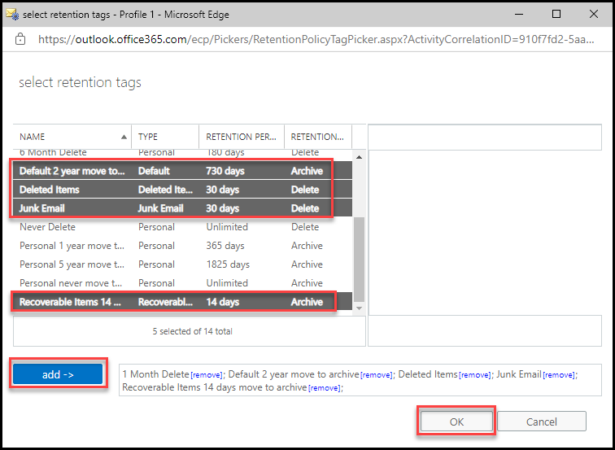

	Repeat the prior two steps to add these tags to this policy. **Hint:** Hold down the **Ctrl** key as you select each tag in the list; this will enable you to select all four default tags at one time before selecting the **add-&gt;** button.

16. On the **new retention policy** window, select **Save** and then select **OK**.

	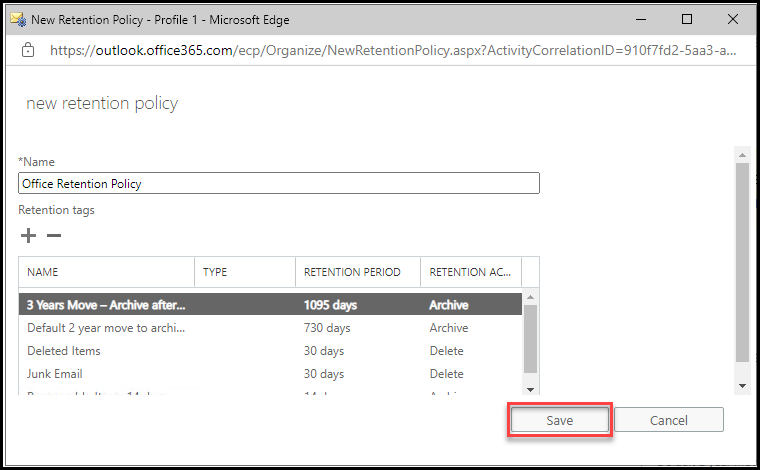

17. You are now going to apply this retention policy to the mailboxes for your two test users, Joni Sherman and Lynne Robbins. In the **Exchange Admin Center**, in the left-hand navigation pane, select **recipients**. In the **recipients** page, the **mailboxes** tab is displayed by default. 

18. In the list of recipient mailboxes, select **Joni Sherman** and then select the **pencil (edit) icon** in the toolbar to edit the properties of Joni’s mailbox.

	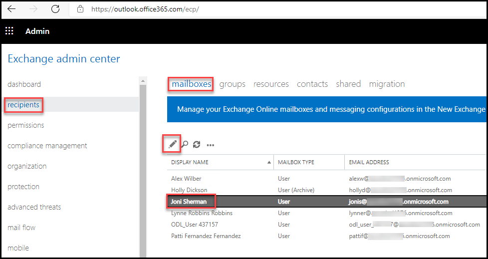

19. In the **Edit User Mailbox** for Joni Sherman, select **mailbox features** in the left-hand navigation pane.

20. If a **Warning** dialog box appears, select **OK**.

21. Select the drop-down arrow in the **Retention policy** field and select **Office Retention Policy**.

22. Select **Save** and then select **OK**.

	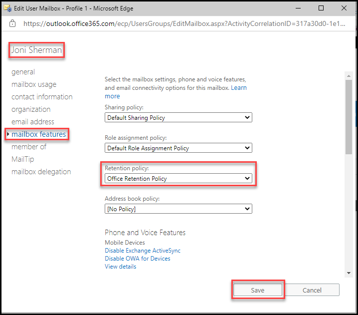

23. Repeat steps 19-23 for **Lynne Robbins**.

	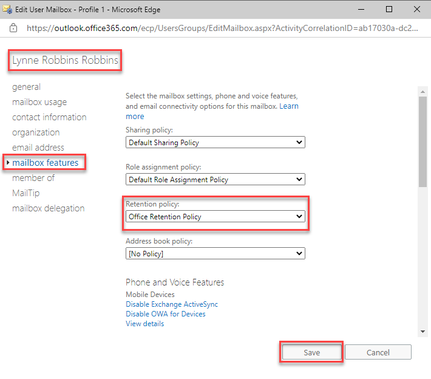

24. Leave your web browser open and proceed to the next task.

You have created a new retention policy through the Exchange Admin Center. You assigned several retention tags to this policy, including a custom retention tag, and you assigned the retention policy to Lynne and Joni’s mailboxes.

### Task 3 – Create a Retention Policy in the Microsoft 365 Compliance Center

Now that Holly has created a retention policy through the Exchange Admin Center, she wants to do the same in the Microsoft 365 Compliance Center. For this policy, Holly wants to preserve the content of all Exchange Online mailboxes from deletion for 7 years after the last modification. 

1. In **Microsoft Edge**, select the **Microsoft 365 Compliance** center tab if it's still open; otherwise, in the **Microsoft 365 admin center**, under **Admin centers**, select **Compliance**.

	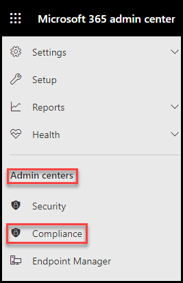

2. In the **Microsoft 365 Compliance** center, in the left-hand navigation pane, select **Information governance** and then select **Retention policies**.

3. In the **Retention policies** window, select the **+ New Retention Policy** button to start the wizard that’s used to create a new retention policy.

	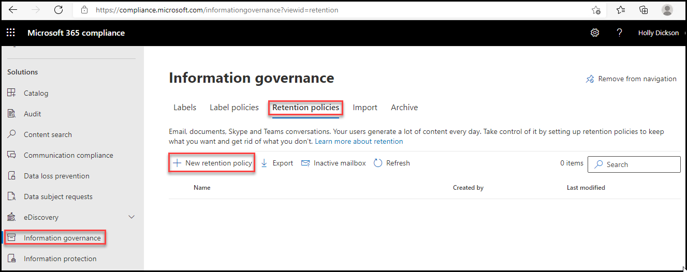

4. On the **Name your retention policy** page, enter **Exchange preservation** in the **Name** field and select **Next**.

	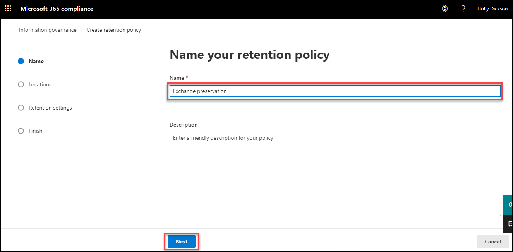

5. In the **Choose locations to apply the policy** page, as you scroll down the page, note that the **Status** of the **Exchange email** location is turned **On**. Leave this set to On. However, for all the other locations that are turned on, select their toggle switches to turn them **Off**.

6. As you scroll through the locations, **Exchange email** should be the only location turned on.

7. Select **Next**.

	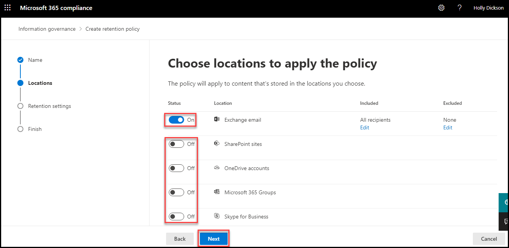

8. On the **Decide if you want to retain content, delete it, or both** page, leave the **Retain items for a specific period** option selected, as well as the **7 years**. Do not change these fields. 

	However, in the **Start the retention period based on** field, it currently indicates **when items were created**. Select the drop-down arrow for this field and select **when items were last modified**.  
	
	In the **At the end of the retention period** option, select **Delete items automatically**.

	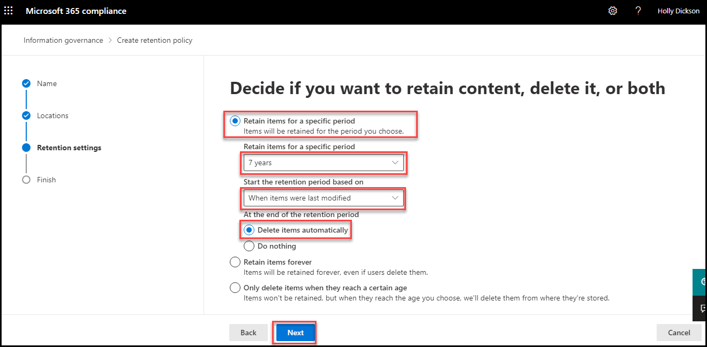

9. Select **Next**.

10. On the **Review and finish** page, review all the settings. If any need to be corrected, select the **Edit** option and make the appropriate correction. Once everything looks correct, select **Submit** to finish the wizard.

	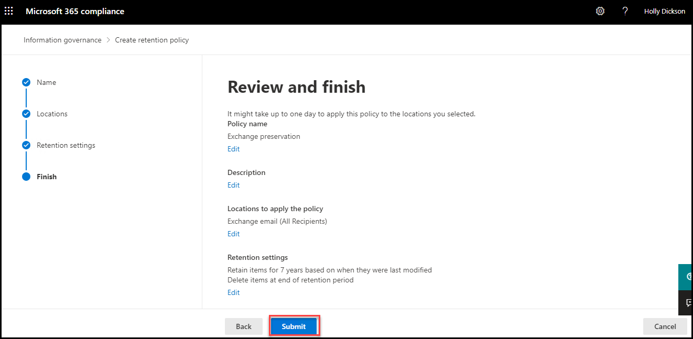

12. Select **Done**.

11. Leave your web browser open as well as all tabs for the next lab.

You have now created a new retention policy in the Compliance Center that retains all Exchange emails from all mailboxes for 7 years after the last modification.

 # End of Lab 5
 
