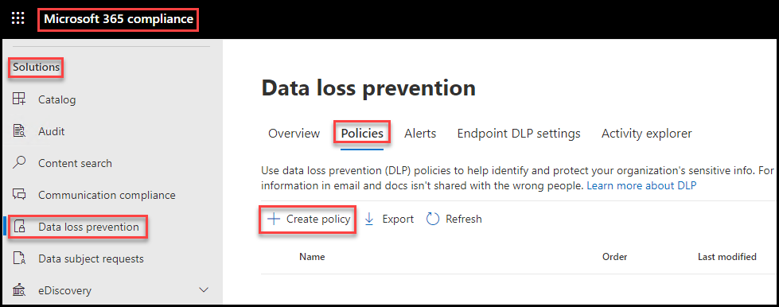
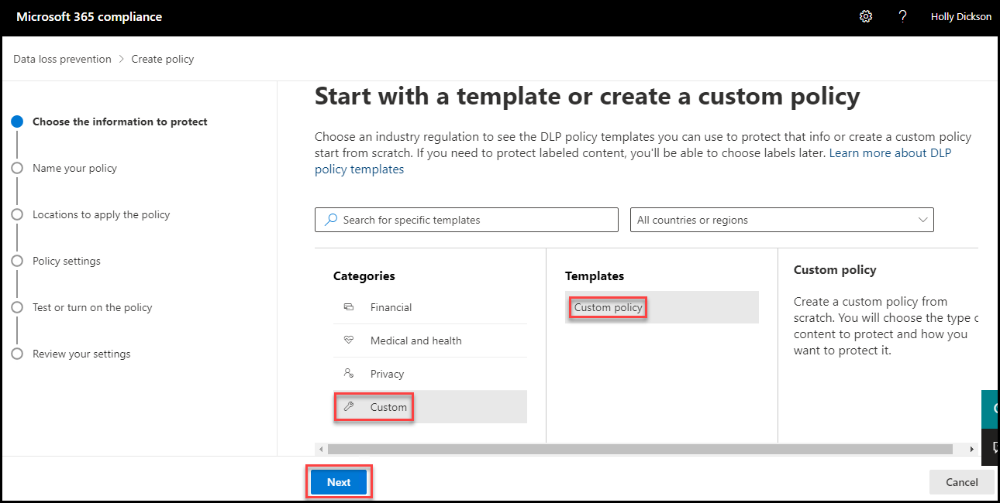
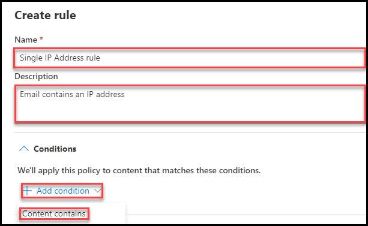
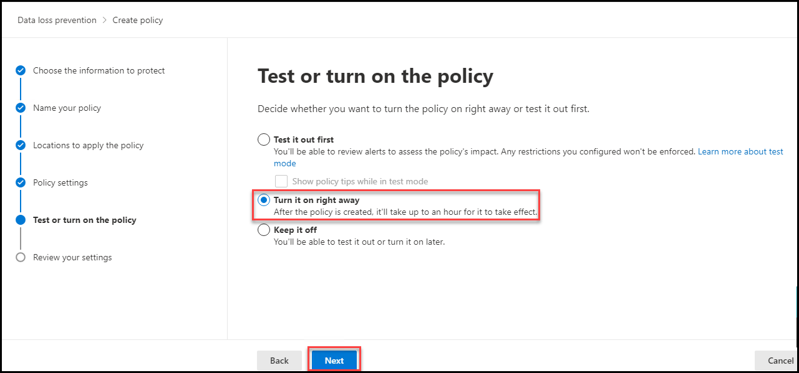
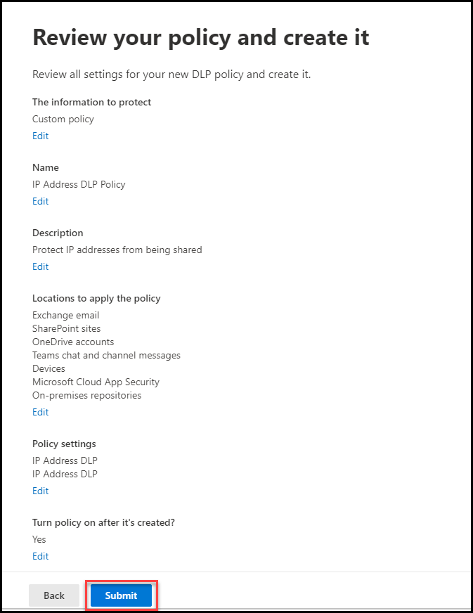

# Learning Path 5 - Lab 5 - Exercise 1 - Manage DLP Policies  

In your role as Holly Dickson, Adatum’s Enterprise Administrator, you have Microsoft 365 deployed in a virtualized lab environment. As you proceed with your Microsoft 365 pilot project, your next steps are to implement Data Loss Prevention (DLP) policies at Adatum. You will begin by creating a custom DLP policy in this exercise, and then you’ll test DLP policies related to email message archiving and emails with sensitive data. 

### Task 1 – Create a DLP policy with custom settings

In this task you will create a Data Loss Prevention policy in the Security & Compliance Center to protect sensitive data from being shared by users. The DLP Policy that you create will inform your users if they want to share content that contains IP addresses. 

The policy will contain two rules, or actions, each of which is dependent on the number of IP addresses in the message. If the message contains one IP address, the policy will notify people with a policy tip and still email the message. However, if the content contains at least 2 IP addresses, then the message will be blocked, an incident email with a high sensitivity level will be sent to the sender, and a policy tip will be displayed that allow the sender to override the email blockage if the sender provides a business justification within the policy tip.

**IMPORTANT:** Unfortunately, you will be unable to test the policy tips in this DLP Policy. When you use the Security and Compliance Center to create a DLP policy that contains a policy tip, the policy tip will NOT be displayed if you also created mail flow rules in the Exchange admin center. If you will recall, back in Module 4, Lab 4, Exercise 1, you created two mail flow transport rules in Exchange, one using the Exchange admin center and the other using PowerShell. 

Because you created mail transport rules in the Exchange admin center in the prior lab, policy tips that you configure for DLP policies in the Security and Compliance Center will NOT work. The DLP policy will work, but the policy tip action will not. Even if you delete the mail transport rules, the policy tips will still not function. 

Given that, you will still configure a policy tip for the DLP policy that you create in this task; doing so will provide you with experience in configuring policy tips even though you won't be able to verify them. The reason for this is that we also wanted you to experience creating mail transport rules in the earlier lab, even though we knew it meant you would not be able to see the policy tips  in this DLP lab.  

1. You should still be logged into Microsoft 365 as Holly Dickson (**holly@xxxxxZZZZZZ.onmicrosoft.com)** with a password of **Pa55w.rd**. 

2. In **Microsoft Edge**, the Microsoft 365 compliance center tab should still be open; if not, then open a new tab and navigate to **https://compliance.microsoft.com**.

3. In the **Microsoft 365 compliance** center, in the left-hand navigation pane, select **Data loss prevention**.

	

4. On the **Data loss prevention** window, selecty the **Policies** tab.

	

4. In the **Policies** tab, select **+Create policy** on the menu bar to start the wizard for creating a new data loss prevention policy.

5. On the **Start with a template or create a custom policy** page, there are four types of policies listed in the left-hand pane - Financial, Medical and health, Privacy, and Custom. The first three (Financial, Medical and health, and Privacy) provide templates that can be used to create a policy. The **Custom** type is not based on a template. The column in the left-hand pane displays the policy categories, while the middle pane displays the available templates to choose from for that policy type. When you select a template in the middle pane, the right-hand pane displays the type of information that is protected in that template.   

    For example, select **Financial** in the left-hand pane and then scroll through the various templates that you can choose from in the middle pane. Select one or two of the templates to see what type of information it protects. Do the same for the **Medical and health** and **Privacy** policy types.   

	

    Select **Custom** in the left-hand Categories pane, select the **Custom policy** template in the middle pane, and then select **Next**.

	

6. In the **Name your DLP policy** page, enter **IP Address DLP Policy** in the **Name** field and **Protect IP addresses from being shared** in the **Description** field. Select **Next**.

	

7. On the **Choose locations to apply the policy** page, verify the **Status** toggle is set to **On** for the following options (if an option is not set to **On** by default, then set it to **On** now): **Exchange email, SharePoint sites, OneDrive accounts, Teams chats and channel messages**. Select **Next**.

	

8. On the **Define Policy settings** page, select the **Create or customize advanced DLP rules** option, (if it isn't already selected by default) then select **Next**. 

	

9. On the **Customize advanced DLP rules** page, select the **+Create rule** option on the menu bar.

	

10. On the **Create rule** page, enter the following information:
    
    - Name: **Single IP Address rule**
    
    - Description: **Email contains an IP address**
    
    - In the **Conditions** section, select **+Add condtion** and then select **Content contains**. Then enter the following condition settings:

	

    - In the **Content contains** field, select the **Add** drop-down menu and then select **Sensitive info types**.

	

    - In the **Sensitive info types** pane, type **IP address** inside the **Search** field and then hit Enter.
        
    - Select the **IP Address** check box and then select **Add**.

	

    - In the **Actions** section, select **+ Add an action**. In the drop-down menu that appears, select **Restrict access or encrypt the content in Microsoft 365 locations**.

	- In the **User notifications** section, set the **Use notifications to inform your users and help educate them on the proper use of sensitive info** toggle switch to **On**.

	

	

    - In the **Incident reports** section, set the **Sent an alert to admins when a rule match occurs** toggle switch to **On**.

    - Select the **Save** button at the page of the page.

	

	

11. On the **Customize advanced DLP rules** page, the first rule that you just created should now appear. Select the **+Create rule** option to create the second rule. 

	

12. On the **Create rule** page, enter the following information:

      - Name: **Multiple IP Address rule**

     - Description: **Email contains two or more IP addresses**

      - In the **Conditions** section, select **+Add condtion** and then select **Content contains**. Then enter the following condition settings:

        - In the **Content contains** field, select the **Add** drop-down menu and then select **Sensitive info types**.

        - In the **Sensitive info types** pane, type **IP address** inside the **Search** field and then hit Enter.

        - Select the **IP Address** check box and then select **Add**.

        - Under the **Sensitive Info types** section, the **IP Address** info type is displayed. On the right side of the IP Address row, the **Instance count** setting is set from **1** to **Any**. Change the value of the first field from 1 to **2**. By making this change, this rule will apply if 2 or more IP address appear in the email.  

     - In the **Actions** section, select **+ Add an action**. In the drop-down menu that appears, select **Restrict access or encrypt the content in Microsoft 365 locations**. Then enter the following condition settings:

        - Select the **Restrict access or encrypt the content in Microsoft 365 locations** check box.

        - Under the **Block users from accessing shared SharePoint, OneDrive, and Teams content** option, select the **Block everyone. Only the content owner, last modifier, and site admin will continue to have access** option.

     - In the **User notifications** section, set the **Use notifications to inform your users and help educate them on the proper use of sensitive info** toggle switch to **On**. 

    - In the **Incident reports** section, set the **Sent an alert to admins when a rule match occurs** toggle switch to **On**.

    - Select the **Save** button at the page of the page.

	

13. On the **Customize advanced DLP rules** page, both rules should now appear. Select **Next**.

14. On the **Test or turn on the policy** page, select the **Turn it on right away** option and then select **Next**.

15. On the **Review your policy and create it** page, review the policy that you just created. If anything needs to be corrected, select the appropriate **Edit** option and make your corrections. When everything appears OK, select **Submit**.

	

	
    
You have now created a DLP policy that scans for IP addresses in emails and documents that are sent or shared in your organization.

# Proceed to Lab 5 - Exercise 2 
