# Learning Path 5 - Lab 5 - Exercise 2 - Test MRM and DLP Policies

You are now at the point in your pilot project where you want to test the MRM and DLP policies that you created in previous lab exercises. You have decided to test the MRM policy that affects how email messages are archived, and then you want to test the DLP policy related to emails that contain sensitive information. 

### Task 1 – Activate In-Place Archiving

In this next phase of your Adatum pilot project, you will access the Microsoft 365 Compliance Center to activate Holly Dickson’s archive mailbox.   

1. You should still be logged into Microsoft 365 as Holly Dickson (**holly@xxxxxZZZZZZ.onmicrosoft.com)** with a password of **Pa55w.rd**.

2. In Microsoft Edge, in the **Microsoft 365 admin center**, under the **Admin centers** group, select **Compliance** to open the Microsoft 365 Compliance center.

	

3. In the **Microsoft 365 Compliance** center, in the left-hand navigation pane, select **Information governance**. 

	

4. On the **Information governance** page, the **Labels** tab appears by default. In the list of tabs along the top of the page, select **Archive**.

4. On the **Archive** page, verify that Lynne Robbins Archive mailbox status is Disbled.

	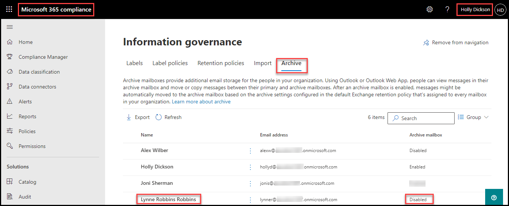

5. To enable Lynne Robbins archive mailbox, select the check box next to **Lynne Robbins** in the user list and then select **Enable Archive** in the menu bar that appears above the list of users.

	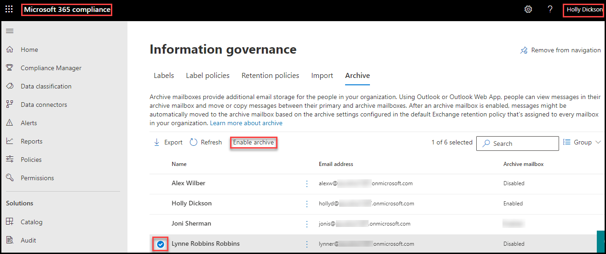

6. In the **Warning** dialog box that appears, select **Enable** to confirm this action.

	

7. In your Microsoft Edge browser, leave the Microsoft 365 Compliance Center tab open as you will use it in a later task in this lab. 
 

### Task 2 – Test an MRM Policy to Archive Email Messages

In this exercise, you will send an email from Holly Dickson to one of your pilot team users, Lynne Robbins. You will then log into Microsoft 365 as Lynne on the LON-CL2 VM, locate the email in her Inbox, and then assign the email a custom retention tag that you created. This personal retention tag will override the parent folder tag for this specific message, which will be moved to Lynne’s In-Place archive mailbox after 3 years rather than 2 years.

1. You should still be logged into Microsoft 365 as Holly Dickson (**holly@xxxxxZZZZZZ.onmicrosoft.com)** with a password of **Pa55w.rd**. 

2. In **Microsoft Edge**, select the **Microsoft Office Home** tab, and then select the **Outlook** icon in the column of app icons on the left-side of the screen. When Outlook on the web opens, you should be automatically logged in as Holly Dickson.   

	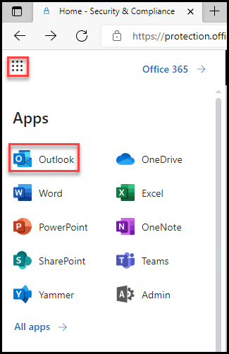

	**Note:** If **Outlook on the web** was already open, then verify that you are logged in as **Holly** by checking the user icon in the upper right corner (the **HD** circle). If Outlook was open for any other user, then close the tab and repeat the instructions in this step to open Outlook on the Web for Holly.

3. In **Outlook on the web**, in the upper left corner of the screen, select **+New message**. 

4. In the message pane that appears, enter the following information:

	- To: enter **Lynne** and then select **Lynne Robbins** from the user list that appears

	- Add a subject: **Archive Test**

	- Message area: type **Use this email to test archiving.**

5. Select **Send**.

	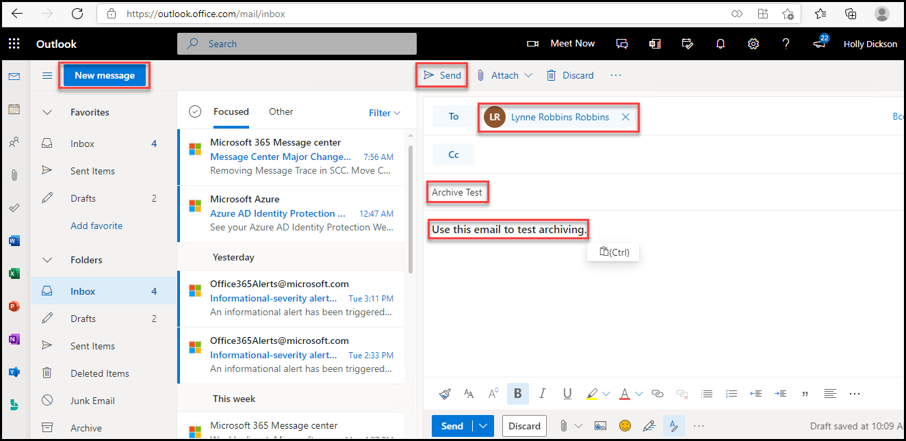

6. Switch to the **Chrome Browser**.

7. In the **Chrome** browser, you should have one tab open with Outlook on the web for Alex Wilber. Select Alex's user icon in the upper right-hand corner of the screen, and in the **My account** window that appears, select **Sign out**.

9. In the browser tab in which you are signed out, enter the following URL in the address bar: **https://outlook.office365.com**

10. You want to sign into **Outlook on the web** as **Lynne Robbins.** In the **Pick an account** window, select Lynne Robbins' user account (**LynnR@xxxxxZZZZZZ.onmicrosoft.com**).

11. In the **Enter password** window, enter **Pa55w.rd** and then select **Sign in**.

12. In **Outlook on the web**, in Lynne’s **Inbox**, you should see the email message that Holly just sent to Lynne.

	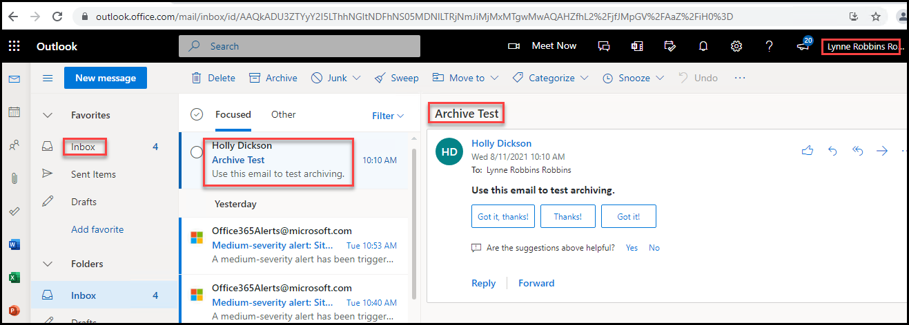

13. Back in Lab 4, you changed the assigned retention policy for Lynne’s mailbox to **Office Retention Policy**. This policy contains the **3 Year Move – Archive after three years** personal retention tag that you created in Lab 4.  

	‎Upon receiving this email from Holly, Lynne has decided to tag Holly’s email to automatically archive it after three years instead of two years, which is the default policy.   
	
	‎To accomplish this, begin by selecting the **Settings** icon in the upper right corner of the toolbar (the gear-shaped icon).

14. In the **Settings** pane that appears, select **View all Outlook settings**. 

	

15. In the **Settings** window that appears, the **Mail** option is already selected by default in the left-hand pane. In the middle pane, select **Retention policies**.

16. In the **Retention policies** pane, after a few seconds the default and custom retention policies will appear. Verify the **3 Year Move - Archive after three years** retention policy appeared in the list of policies.

	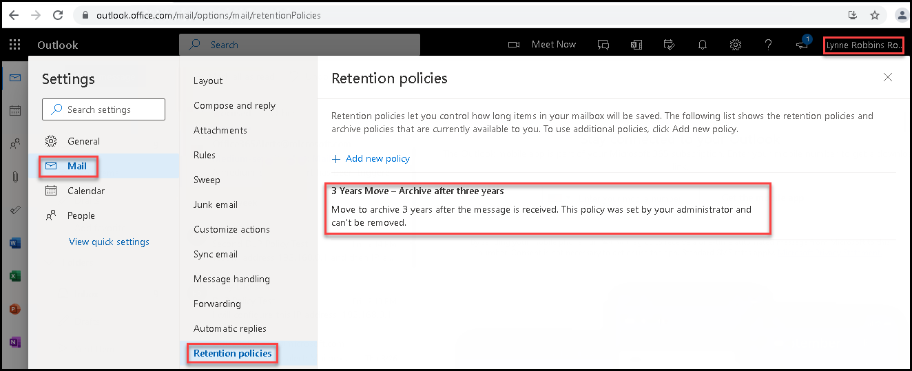

  - If the above Policy is not listed then click on **+ Add new Policy** and scroll to bottom of list of policies then select **3 Year Move - Archive after three years**, click on **Save**.

	
	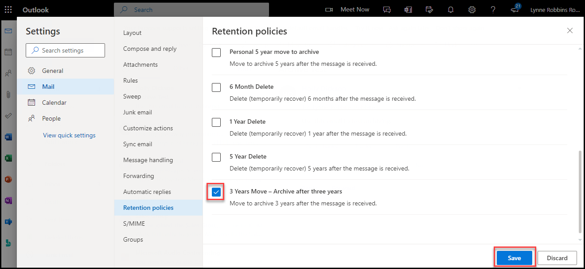	

  **Note**: You can add default and custom policies from the **Add new policy** option. It takes few hours for the policies to show in the list of policies, try logout and login for the user, still if you can't see them note this exercise and verify after some time.

17. Close the **Settings** window by selecting the **X** in the upper right corner. This returns you to Lynne’s mailbox.

18. In the **Inbox**, right-click the message that she received from Holly with the subject: **Archive Test**. In the menu that appears, scroll to the bottom and select **Advanced actions**, and then in the menu that appears, select **Assign policy**. In the **Assign Policy** menu that appears, under the **Archive Policy** section, select **3 Year Move - Archive after three years.**   

	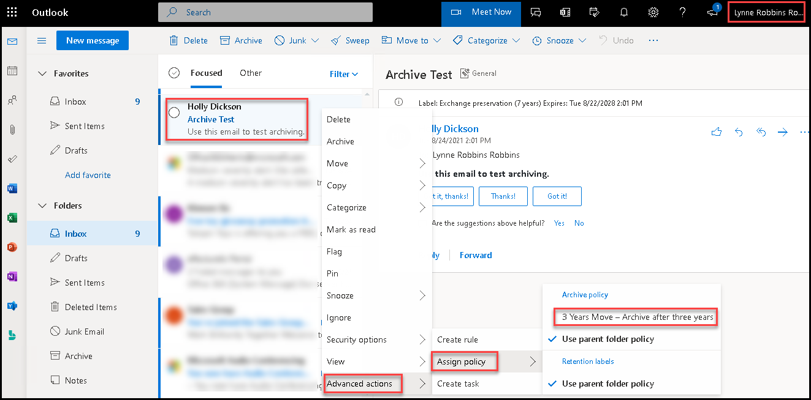

	‎**Note:** This personal retention policy will now override the parent folder policy for this specific message, which will be moved to Lynne’s In-Place archive mailbox after 3 years.

19. Leave Outlook on the web open in the Lab VM as you will return there as Lynne in the next task after receiving another email from Holly.

### Task 3 – Test a DLP Policy for Sensitive Emails

In the previous exercise, you created a custom DLP policy that searches emails for sensitive information related to IP addresses in your Adatum tenant. In this exercise, you will send two emails from Holly Dickson to Lynne Robbins; the first will include one IP address, and the second email will include two IP addresses. You will verify how each email is handled as a result of the DLP policy.

If you will recall, in the DLP policy that you created, if one IP address is discovered in an email, an email policy tip is displayed in sender's Outlook mailbox that informs the sender the email contained sensitive data. The sender will also receive an email notification, and the email with the sensitive data (in this case, the IP address) will still be sent to the recipient.

However, the email will be blocked if two or more IP addresses are discovered in the mail. An email policy tip is displayed in Outlook for the sender just as before, but in this case, the DLP policy was set up to allow the sender to override the blocked email and allow it to be sent.  

**Important:** Unfortunately, you will be unable to test the policy tips in this task. As was mentioned in the prior exercise, when you use the Security and Compliance Center to create a DLP policy that contains a policy tip, the policy tip will NOT be displayed if you also created mail flow rules in the Exchange admin center. If you will recall, back in Module 4, Lab 4, Exercise 1, you created a mail flow transport rule in the Exchange admin center. As a result, the policy tips that you configured for DLP policies in the Security and Compliance Center will NOT work. The DLP policy will work, but the policy tip will not be displayed. Even if you delete the mail transport rules, the policy tips will still not function. 

Therefore, when you send an email with two IP addresses in this task, all you can do is verify that the email message is blocked. The policy tip will not display; therefore, you will be unable to override the blockage and send the email. While we wanted you to experience creating mail transport rules in the earlier lab, we also knew this would not allow you to see policy tips in this lab. But it was felt that learning how to create mail transport rules in the earlier lab was worth this minor inconvenience in this lab. 

1. You should still be logged into Microsoft 365 as Holly Dickson (**holly@xxxxxZZZZZZ.onmicrosoft.com)** with a password of **Pa55w.rd**.

2. You will now send an email from Holly to Lynne, and you will include an IP address in the body of the email. In **Microsoft Edge**, the **Outlook on the web** tab should still be open for Holly. If necessary, select the **Outlook on the web** tab.

3. In the upper left corner of the screen, select **+New message**. 

4. In the message pane that appears on the right-side of the screen, enter the following information:

	- To: enter **Lynne** and then select **Lynne Robbins** from the user list that appears

	- Add a subject: **DLP Policy Test**

	- Message area: type **I will configure this IP address: 192.168.0.1.**

	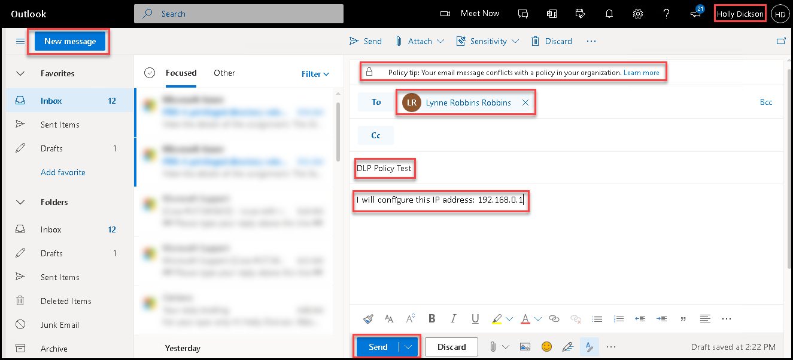

	**Note:** When drafting this email with sensitive data (in this case, an IP address) that triggers the DLP policy, a policy tip should be displayed indicating the email violated a DLP policy. Unfortunately, the policy tip will not be displayed as previously mentioned. 

5. Select **Send.**

6. Holly should receive an email in her Inbox from **Microsoft Outlook** with the subject **Notification: <policy name>** (in this case, <policy name> should be the name of the policy you created that tested for IP addresses in emails, which was **DLP policy test**). Review the content of this email. 

	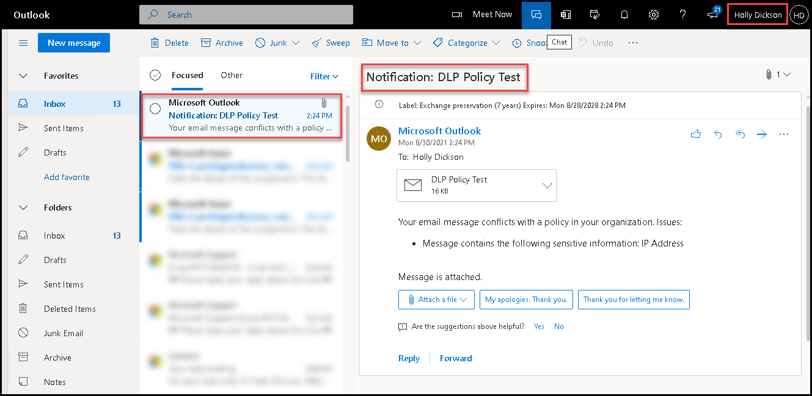

7. You will now send a second message from Holly to Lynne that contains multiple IP addresses. Repeat the process as before for creating an email to Lynne Robbins with the following information: 

	- Add a subject: **Second DLP Policy Test**

	- Message area: **Test IP address 192.168.0.1 and then IP address 172.16.0.1.**

	**Note:** When drafting this email with sensitive data (in this case, two IP addresses) that triggers the DLP policy, a policy tip should be displayed indicating the email violated a DLP policy. Because there are two IP addresses, the policy tip would indicate that the email will be blocked, but it would give you the option to override the blockage by entering a business justification for sending this sensitive data. Unfortunately, the policy tip will not be displayed as previously mentioned. 

	

8. Immediately after sending the email, Holly should receive two emails in her Inbox from **Microsoft Outlook**.  

	- The first email should have the subject **Rule detected - Low volume of content detected IP address DLP policy**. Select this email and review its contents.   

	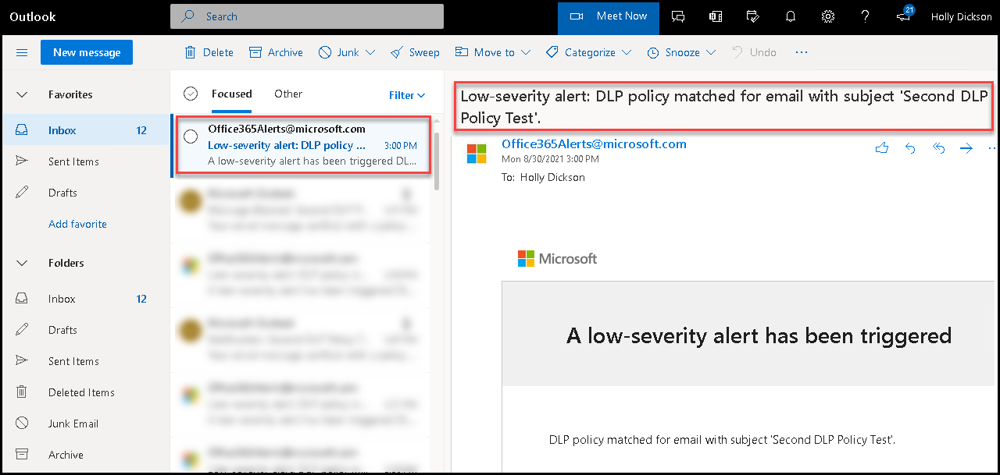

	- The second email should be a **Message Blocked** notification for the email that you just sent. Select this email to review its contents.   

	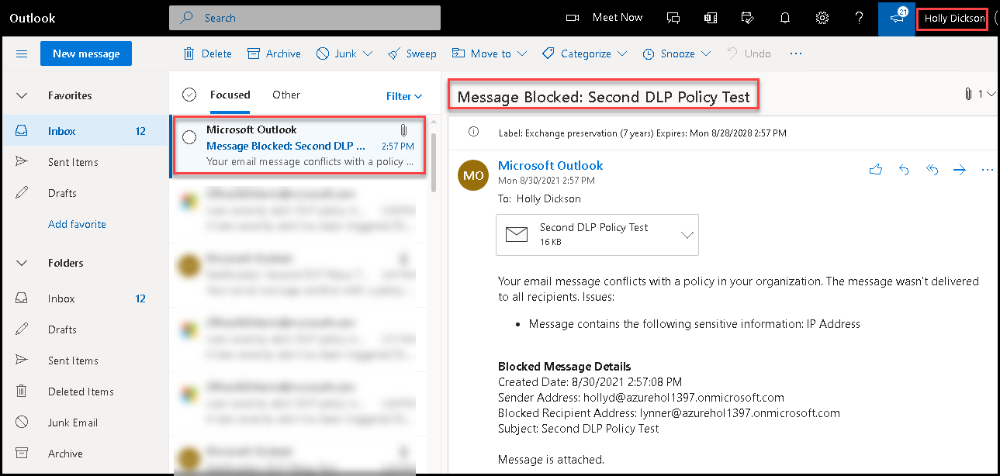

9. Switch to Chrome Browser. You should still be logged into **Outlook on the Web** in the Chrome as **Lynne Robbins**. In your browser, Lynne’s mailbox should still be open in **Outlook on the web** from when you last used it in the previous task.

10. In Lynne’s **Inbox**, you should see the first message (**DLP policy test**) that you sent, but not the second (**Second DLP policy test**). Remember, when Holly sent the second email, she received a notification that it had been blocked. 

11. Leave your browser and all its tabs open on Lab VM.

# End of Lab 5
