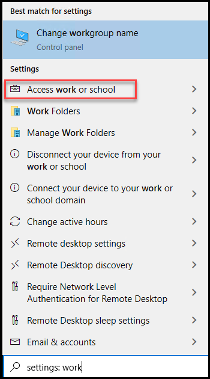

# Learning Path 6 - Lab 6 - Exercise 2 - Implement Windows Information Protection  

Now that Holly Dickson has implemented Sensitivity labels as part of her pilot project at Adatum, she is ready to implement Windows Information Protection (WIP). In your role as Holly Dickson, you will use this exercise to create a WIP policy that will be applied to any member of the WIP Users group who has an MDM-enrolled device in Intune.

### Task 1 – Configure Windows Information Protection

In this lesson you will create a WIP policy and assign to it the **WIP Users** group that you created in an earlier lab. This policy will protect files in Microsoft 365 Apps for enterprise (formerly Office 365 ProPlus) for users in the **WIP Users** group that have enrolled Windows 10 devices. You will perform this task on LON-CL1, so you must begin by signing out of Microsoft 365 as Alex Wilber and signing back in as Holly Dickson.

1. You should still be logged into Microsoft 365 as Holly Dickson (**holly@xxxxxZZZZZZ.onmicrosoft.com)** with a password of **Pa55w.rd**.

2. In the **Microsoft Edge** browser goto **https://admin.microsoft.com/**, In the **Microsoft 365 admin center**, select **Show all** in the left-hand navigation pane, and then under the **Admin centers** group, select **Endpoint Manager**.

	

8. In the **Microsoft Endpoint Manager admin center**, in the left-hand navigation pane select **Apps**.

9. In the **Apps | Overview** page, in the middle pane under the **Policy** group, select **App protection policies**.

10. On the **Apps | App protection policies** page, select **+Create Policy** on the menu bar, and then in the drop-down menu that appears, select **Windows 10**.

	

11. In the **Create policy** window, the steps to create a policy are displayed at the top of the page. You are currently in step **1 - Basics**. Enter the following information and then select **Next**:

	- Name: **WIP Client Protection**

	- Description: leave blank

	- Enrollment state: **With enrollment**

	

12. In the **Create policy** window, you are now in step **2 - Targeted apps**. Enter the following information and then select **Next**:

	- Protected apps: select **+Add**. In the **Add apps** pane that appears on the right, scroll to the bottom and select **Office-365-ProPlus-1810-Allowed.xml**, and then select **OK**. 

	

	- Exempt apps: leave blank as there will be no exempt apps in this policy.

		

13. In the **Create policy** window, you are now in step **3 - Required settings**. Enter the following information and then select **Next**:

	- Windows Information Protection mode: **Block**
	
	- Corporate identity: verify that it displays **xxxxxZZZZZZ.onmicrosoft.com** (where xxxxxZZZZZZ is the tenant prefix provided by your lab hosting provider)

	

14. In the **Create policy** window, you are now in step **4 - Advanced settings**. Do not change any of the default settings, so select **Next**.

	

15. In the **Create policy** window, you are now in step **5 - Assignments**. Enter the following information and then select **Next**:

	- Included groups: select **+Add groups**. In the **Select groups to include** pane that appears on the right, select the **WIP Users** group and then select the **Select** button at bottom of the pane.

	

16. In the **Create policy** window, you are now in step **6 - Review + create**. Review the settings and if anything is incorrect, select the **Previous** button to return back to the appropriate step to make your correction. If all the settings are correct, then select the **Create** button.

	

17. On the **Apps | App protection policies** window, note the value of the **Deployed** column is **No** for the **WIP Client Protection** policy that you just created. Select **Refresh** on the menu bar above the list of policies. The **Deployed** status should now display **Yes**.

	
		

18. Leave your browser and all its tabs open for the next lab.

You have now created an **App protection policy** (which is a Windows Information Protection policy) that protects files in Microsoft 365 Apps for enterprise for users in the **WIP Users** group that have enrolled Windows 10 devices.

### Task 2 – Use Windows Information Protection

In this exercise you will enroll your Lab VM device to Azure AD. You will then test the WIP policy that you created in the prior task by creating a work document and then copy and pasting from it to a personal location. This will test the WIP protection feature that prevents copy and pasting between a protected Word document and an untrusted website in your Edge browser. Since the WIP policy that you created was assigned to the WIP Users group, you must switch to Lab VM and create the document while signed in as Joni Sherman, who is a member of this group.

1. Switch to the **Chrome Browser**, where you should still be logged into **Outlook on the Web** as **Joni Sherman**. If not login with  **JoniS@xxxxxZZZZZZ.onmicrosoft.com** and password **Pa55w.rd**.

2. Minimize your **Firefox** browser.

3. In the **Search** box on the taskbar at the bottom of the window, type **Work** (not **Word**, but **Work**). In the menu that appears, if **Settings** is not expanded, then select it now. Under **Settings**, select **Access work or school**.

	

	

4. In the **Access work or school** window, select **Connect**.

	

5. In the **Set up a work or school account**, enter **JoniS@xxxxxZZZZZZ.onmicrosoft.com** (where xxxxxZZZZZZ is the tenant prefix provided by your lab hosting provider) in the **Email address** field and then select **Next**.

	

6. On the **Enter password** window, enter **Pa55w.rd** and select **Sign in**.

7. If a **More information** is required dialog box appears, select the X in the upper-right corner to close it.

8. In the **Access work or school** window, Joni's email address now appears as a work or school account. Close the **Settings** window.

	

7. Select the **Start** icon in the the bottom left corner of the taskbar, and in the **Start** menu, select **Microsoft Word**. 

	

8. Select **Blank document**.

9. If a **What’s New** window opens, close it.

10. In the document, type **Protected business content**.

	

11. Select **File** from the menu bar above the ribbon, select **Save As** on the left menu, and then select **Browse** from the **Save As** menu.

	

12. In the **File Explorer** window, you should see a **lock symbol** that appears to the left of the **File name** field. Next to this lock symbol is a drop-down arrow. Select this arrow, and in the menu that appears, select **Work (xxxxxZZZZZZ.onmicrosoft.com).**

  **Note**: If you can't see lock symbol when you try to save then come back to this exercise after some, It takes few hours time for the option to show up.

13. Accept the default file name **Protected business content.docx**, change the file path to your **Documents** folder and select **Save**.

	

14. In the Word document, select the sentence that you typed in the document, then right-click on the selected text and select **Copy**.

	

15. Select the **Chrome** icon on the taskbar (Make sure JoniS@xxxxxZZZZZZ.onmicrosoft.com already loggin in another tab). In your browser, open a new tab, click in the Search box and press **Ctrl-V** on your keyboard to paste in the copied text. Instead of seeing the copied text, a pop-up window should appear with the following message: **Your organization doesn't allow you to use work content here.** Select **OK**.

	

	You have just verified that WIP protection prevents copy and pasting between a protected Word document and an untrusted website in your Edge browser.

16. Leave your Lab VM and browser open for the next lab.

You have just enrolled the Lab VM to your tenant, so the Client app protection policy **WIP Client Protection** that you configured in the last task could be applied to protect the content of a Word document.

# End of Lab 6
