# Learning Path 7 - Lab 7 - Exercise 1 - Conduct a data search

Data subject requests (DSRs) are used to search for and extract all known information on a person of interest. A data search can come from the person in question or from an authorized source. In this exercise you will configure and export content search from the Microsoft 365 Compliance center.

**IMPORTANT:** You should only run a content search if the request is made by a Data Privacy officer or a Human Resources manager. Due to data privacy legal concerns, you should NEVER run a content search unless instructed to do so.

### Task 1 – Run a content search

Holly Dickson is Adatum’s Enterprise Administrator. In her role as the company’s Microsoft 365 Enterprise Administrator, she is responsible for implementing Adatum’s Microsoft 365 pilot project. Holly wants to use this project to test Microsoft 365 search functionality; specifically, by creating a search request for email messages sent to and from Holly and the ODL User. 

**Note:** To perform this task, Holly must be assigned to the eDiscovery Manager role group so that she has the necessary permissions. You added Holly to this role group in Lab 1 at the same time that you added Joni Sherman to the role group. The reason why you were instructed to add Holly to the eDiscovery Manager role group in Lab 1 rather than at the start of this lab is that it can sometimes take up to an hour or more for permissions to successfully propagate. If you had assigned Holly to this role group just prior to this query, you would have received error messages involving parameter fields because her permissions would not have completed propagating. By adding Holly to this role group at the start of this course, enough time will have elapsed between then and now for the propagation to complete. 

1. You should still be logged into Microsoft 365 as Holly Dickson (**holly@xxxxxZZZZZZ.onmicrosoft.com)** with a password of **Pa55w.rd**. 

2. In your **Microsoft Edge** browser, select the **Microsoft 365 admin center** tab, and then in the left-hand navigation pane under the **Admin centers** group, select **Compliance**.

	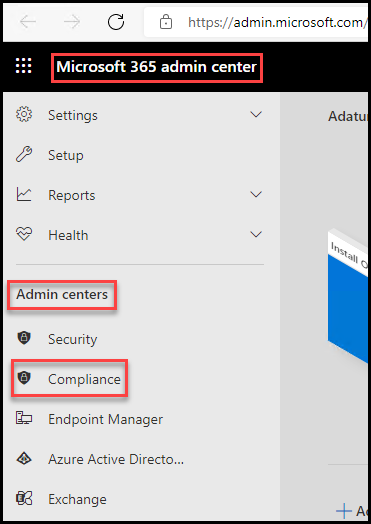

3. In the **Microsoft 365 Compliance** center, in the left-hand navigation pane select **Content search**. Then click on **New search** This initiates the **New search** wizard.

	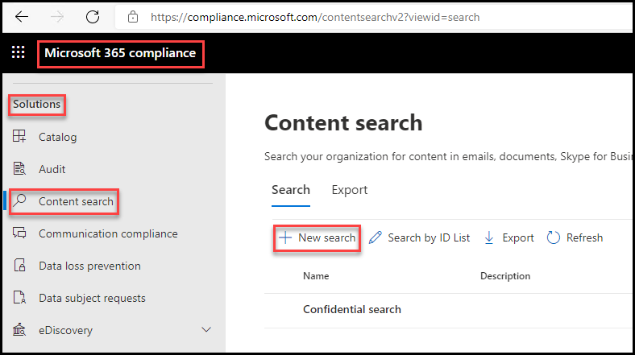

4. In the **Name and description** page, enter the following information and then select **Next**:

	- Name: **Holly Dickson test search**

	- Description: **This is a test of the content search feature to pull info on Holly Dickson and the ODL User**

	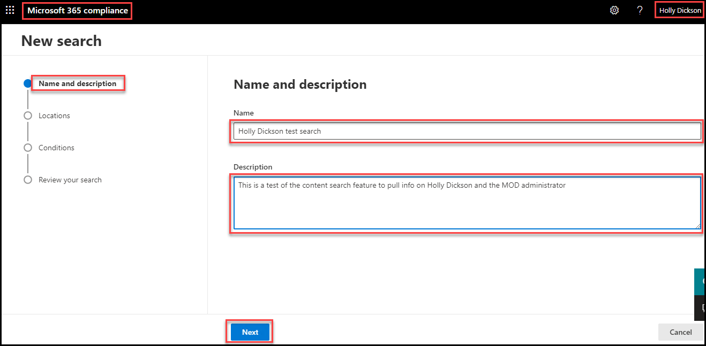

5. In the **Locations** page, select the **Exchange mailboxes** toggle switch to turn it **On**. 

6. To the right of **Exchange mailboxes**, select **Choose users, groups, or teams**.

	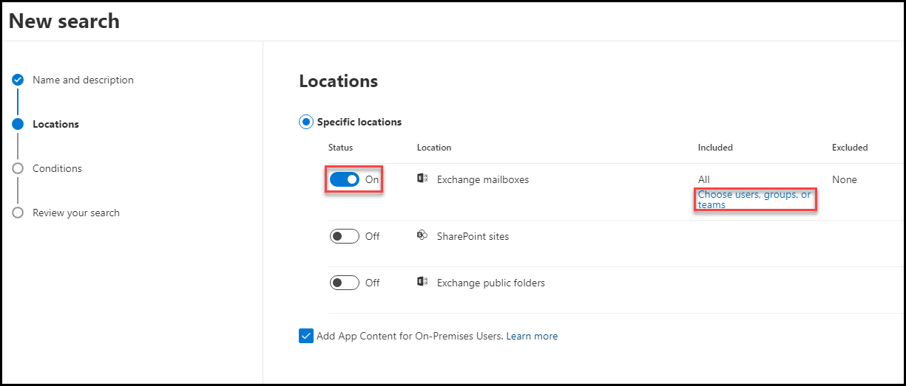

7. In the **Exchange mailboxes** pane that appears on the right, enter **holly** in the **Search** field and press Enter. Once Holly's mailbox is displayed, select the check box to the left of her mailbox and then select **Done**.

	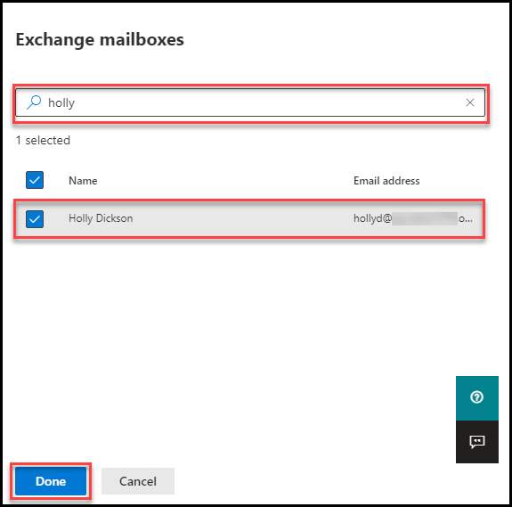

8. In the **Locations** page, select **Next**.

9. In the **Define your search conditions** page, you want to define conditions that will search for all mail sent to and from Holly Dickson and the ODL User. 
Begin by selecting **+ Add condition**. In the menu that appears, select **Sender**. Select the **Choose users** field and select **Holly Dickson** from the list of users. Select the **Choose users** field again and this time select **ODL User** from the list of users.

	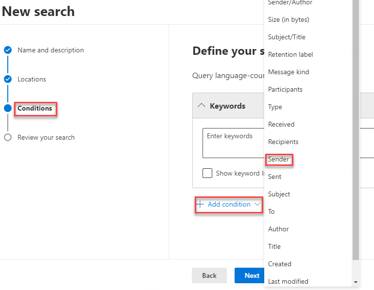

	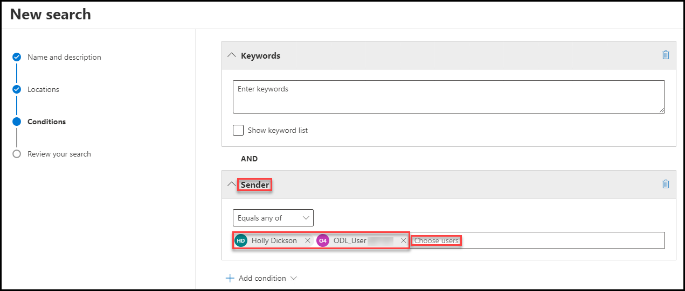

10. Repeat the prior step to add another condition. This time select **Recipients**, and in the list of users, select **Holly Dickson** and the **ODL User**.

	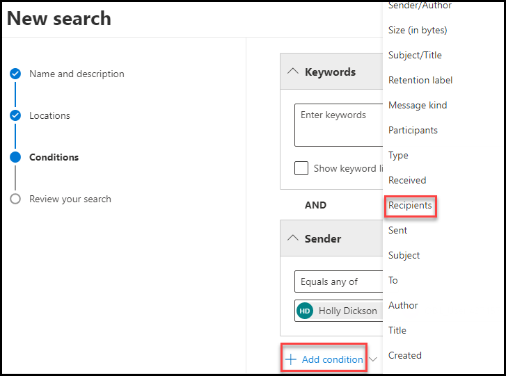
	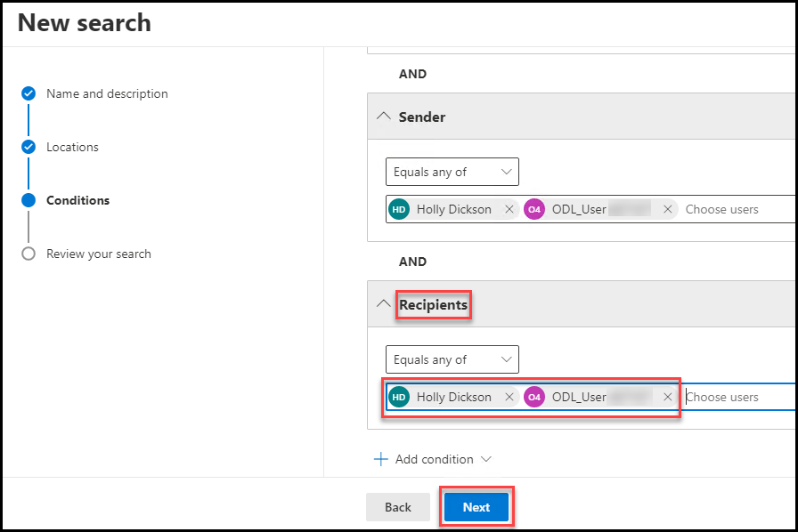	

11. Select **Next**.

12. On the **Review your search and create it** page, review your search criteria. If anything needs to be corrected, select the appropriate **Edit** link or the **Back** button to make the correction. When everything appears correct, select **Submit**.

	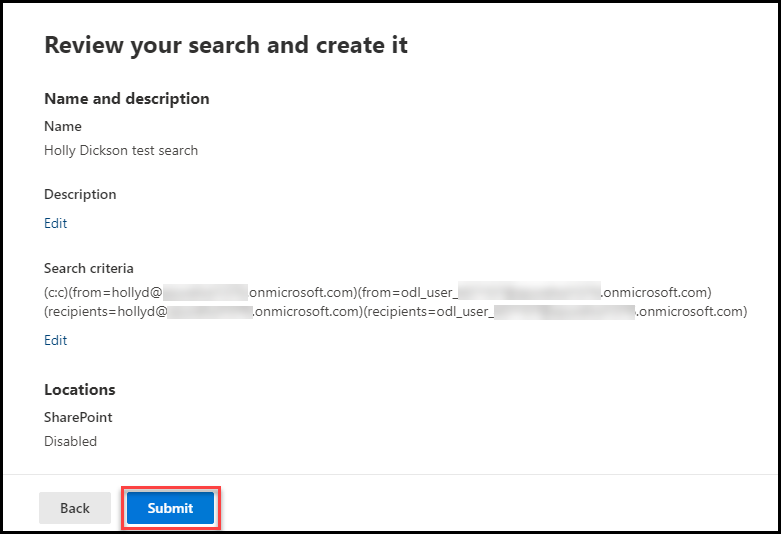

13. On the **New search created** window, select **Done**. This will start your search.

14. On the **Content search** window, note the **Status** of your search is **Starting**. After a minute or so, select the **Refresh** option on the menu bar. The **Status** should change to **Completed**.  

	‎**Note:** Depending on how much data is accrued, a query can take some time to complete. For Adatum’s pilot project, they have not accrued much in the way of email messages, so this query that checks for email to and from Holly and the ODL User should only take a minute or so to complete.

12. Once the search is complete, proceed to the next task. Leave this window open as you resume testing in the next task from this point.

### Task 2 – Export the Search Query Results

When someone opens a case to search for content, you typically export the results for further processing, oftentimes by legal teams that must investigate a case. In this task, Holly will export the search results from the previous case.

1. This task will resume from where you left off previously, which was the **Search** tab on the **Content search** window. Here you can see existing search request **Holly Dickson test search** that you just created and ran.  

	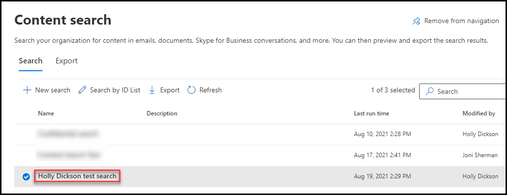

	Select the **Holly Dickson test search** record. This will open a detail pane on the right for this search request. Note the information captured for this search, including the number of items that were retrieved. Select the **Actions** button at the bottom of the pane. In the drop-down menu that appears, select **Export report**.  
	
	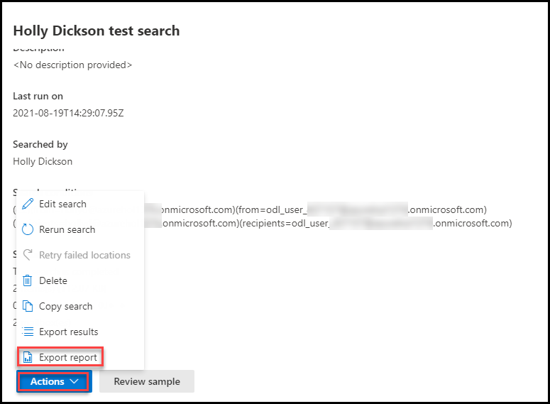

	**Warning:** Do not select the **Export results** button. Holly does not have sufficient permissions to export the results of the search (you must be assigned the Organization Management role to export search results), so this action will ultimately fail.  

2. In the **Export report** pane that appears on the right, you only want to view the items with a recognized format, so verify the first option is selected in the **Output options** section. Note the message that appears above the **Generate report** button at the bottom of the pane. Select the **Generate report** button.

	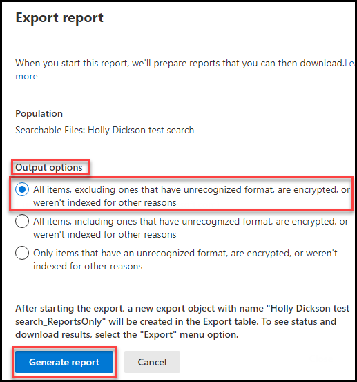

3. On the **Holly Dickson test search** pane, select the **Close** button. 

4. In the **Content search** window, the **Search** tab is currently being displayed. Select the **Export** tab.

5. In the list of Export records, select **Holly Dickson test search_ReportsOnly**. 

	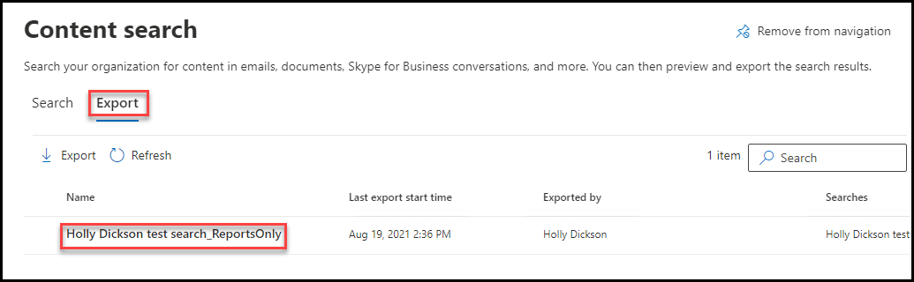

6. In the **Holly Dickson test search_ReportsOnly** pane that appears on the right, scroll down to the **Export key** section and select the **Copy to clipboard** option that appears below the export key. You will paste in this key in a few more steps.

	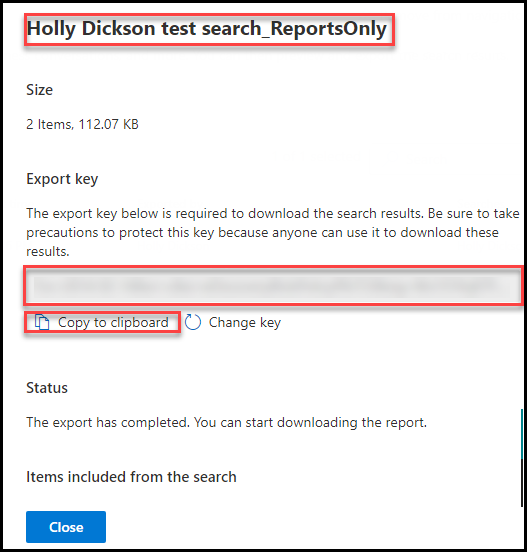

	**Note:** It takes few minutes to display export key, try refesh to check status.

7. At the top of the **Holly Dickson test search_ReportsOnly** pane, select the **Download report** button. In the **Open this file?** window that appears, select **Open**.

	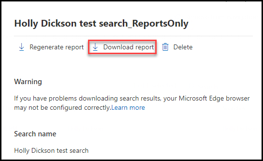
		

8. If prompted for browser selection then select **Edge** browser then click on Ok. Again click on Open if aksed for. In the **Do you want to install this application?** dialog box that appears, select **Install** to install the **Microsoft Office 365 eDiscovery Export Tool**. 

	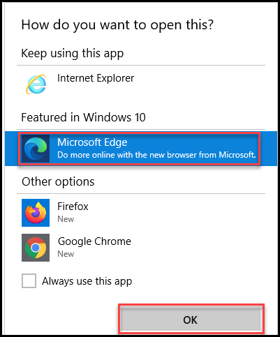
	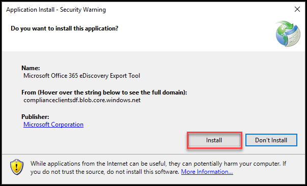

9. When the **eDiscovery Export Tool** is installed, you need to paste in the export key that you just copied to the clipboard. In the **eDiscovery Export Tool** dialog box, select into the **Paste the export key that will be used to connect to the source** field and then press **Ctrl+V** to paste in the key. 

	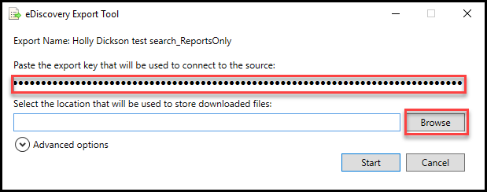

10. Select the **Browse** button next to the **Select the location that will be used to store downloaded files** field, and in the **Browse For Folder** window, select the **Documents** folder and then select **OK**.

	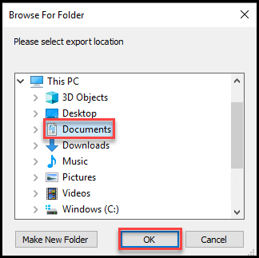

11. In the **eDiscovery Export Tool** window, select **Start** to begin the export process.

	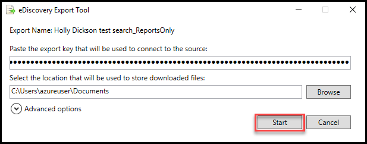

12. As soon as the **eDiscovery Export Tool** shows three green checkmarks with a **The export completed successfully** message below them, the export is done. Select the link that appears next to **Export Location**.

	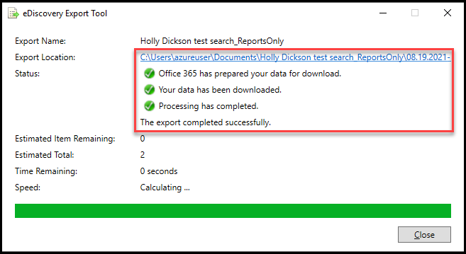

13. This opens a **File Explorer** window. Double-click the **Results.csv** file to open Excel and view the report data for all case items found. If a **How do you want to open this file?** dialog box appears, select **Excel** if it's available. If Excel is not available, uncheck the **Always use this app to open .csv files** and then select Microsoft Edge. When you're done, either close the Excel spreadsheet and the **File Explorer** window, or if you had to use Edge to view the file, close the **Results.csv** tab. 

	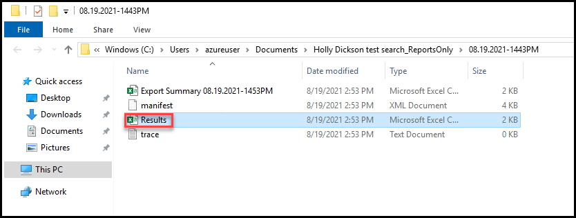
	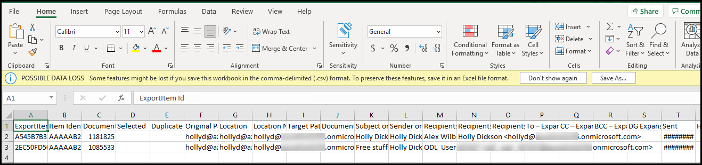
	
14. Close the **eDiscovery Export Tool** by selecting the **Close** button, and then close the **Holly Dickson test search_ReportsOnly** pane.

15. In your browser, close all tabs EXCEPT for the **Microsoft Office Home** tab and the **Microsoft 365 admin center** tab. 

You have successfully exported a case report to your local computer. Note: Because the report contains only a report and not the message or document content, you could not process this report to fulfill the data subject request's legal requirements.

# Proceed to Lab 8 - Exercise 2
