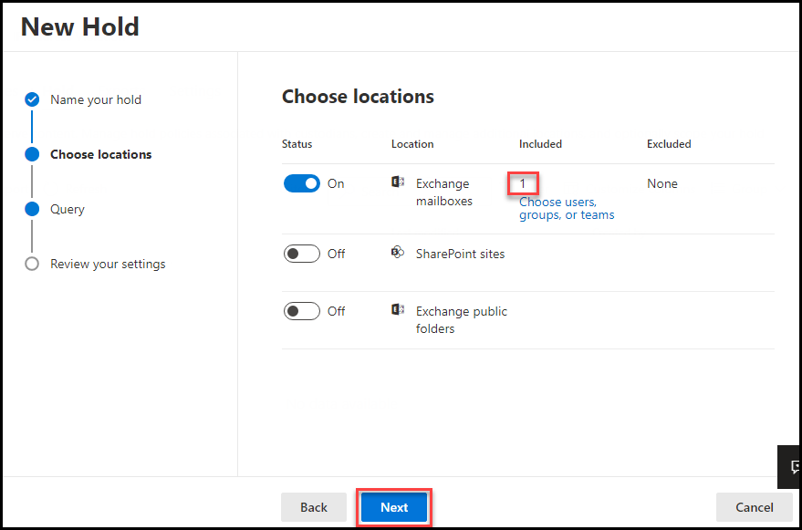

# Module 7 - Lab 7 - Exercise 2 - Investigate Your Microsoft 365 Data

In your role as Holly Dickson, Adatum’s Enterprise Administrator, you have Microsoft 365 deployed in a virtualized lab environment. As you proceed with your Microsoft 365 pilot project, you want to test how Adatum can investigate its Microsoft 365 data. You have decided to focus on performing a content search for deleted emails, which is a common request at Adatum, and then you want to analyze eDiscovery functionality by creating an eDiscovery case. You have asked Joni Sherman to conduct these tests on her client computer.

### Task 1 – Perform a content search for deleted emails

In this exercise, you will log into Microsoft 365 as Joni Sherman, and you will perform a content search that looks for emails with the keyword **IP address**.

1. Switch to **Chrome** browser, where you should be logged into **Outlook on the web** as **Joni Sherman** from a prior lab. 

2. Joni needs to access the **Office 365 Security and Compliance** center. However, while she can access the Microsoft Office Home page, she does not have admin permissions; therefore, she cannot access the Microsoft 365 admin center from the Microsoft Office Home page, which means she cannot access the Security and Compliance center from the Microsoft 365 admin center. Therefore, she will have to access the **Office 365 Security and Compliance Center** directly.  

    To do so, select a new tab in your browser and enter the following URL in the address bar: **https://protection.office.com**.

3. In the **Office 365 Security and Compliance** center**, in the left-hand navigation pane, select **Search**, and then under it select **Content search**.   

	

    ‎**Note**: If you cannot see **Search** in the navigation pane yet, you need to reload the browser tab with the **Security and Compliance Center.**

4. On the **Content search** window, in the **Searches** tab, select **(+) New search** on the top menu. This will initiate the **New search** wizard.

	

5. On the **Name your search** page, enter **Content Search Test** in the **Name** field and then select **Next**.

	

6. On the **Locations** page, verify the **Specific locations** option is selected; if not, then select it now. As you scroll down through the **Locations** window, note that there are 3 groups of locations. Each group has an On/Off toggle switch, and they are all set to Off. If you select all locations or set all 3 toggle switches to On, the query will run for an hour or more.  

    Since you do not have time in this lab to search all three locations, select the toggle switch for the first group of locations to turn it **On**, but leave the other two groups turned **Off**, and then select **Next**.

	

7. On the **Condition card** page, enter **IP address** into the **Keywords** field and then select **Next**.

	

8. On the **Review your search** page, select **Submit** then click on **done**.

9. On the **Searches** tab, the **Search query** process will automatically start. In the **Search query** pane, scroll to the right, where the **Status** of the query is displayed. Wait for the status to show **Completed**.  

	

    **Note:** It may take a couple of minutes for the query to run and the data to be displayed in the right-hand pane. When the content search finishes, you will see all mailbox items that were created for the sensitive information test of your custom DLP policy related to IP addresses. 

9. Close the **Content search** tab in your browser.

10. Leave the Security and Compliance Center tab open and continue with the next task.

You have successfully performed a content search for a specific key word across all locations of your tenant.
 

### Task 2 – Create an eDiscovery case

In this task, you will create an eDiscovery case, add an In-Place Hold to the case to preserve mailbox content, and create a search to discover data from the hold. You will continue using Joni Sherman’s user account. Having been assigned the eDiscovery Managers role back in Lab 1, Joni has the permissions necessary to create an eDiscovery case.

1. You should still be logged into Microsoft 365 as Joni Sherman in **Chrome** browser. 

2. The **Office 365 Security and Compliance Center** should still be open in a tab in Chrome. If so, select that tab now. If not, then enter the following URL in the address bar: **https://protection.office.com.** 

3. In the **Security and Compliance Center**, in the left-hand navigation pane, select **eDiscovery**, and then under it, select **eDiscovery**.

	

4. On the **Core eDiscovery** window, select the **(+) Create a case** button that appears above the list of cases.

	

5. In the **New case** window, enter **IP Address Violation** in the **Case name** field and select **Save**.

	

6. On the **Core eDiscovery** page, Click on **IP Address Violation** case to open its details.

	

7. On the **IP Address Violation** window, select the **Holds** tab on the menu bar.

8. Select **(+) Create** to create a new hold. This initiates the **Create a new hold** wizard.

	

9. On the **Name your hold** page, enter **IP Address Violation - Content** into the **Name** field and then select **Next**.

	

10. On the **Choose locations** page, turn the toggle button on for the **Exchange email** location, then select the **Choose users, groups, or teams** link.

	

12. On the **Exchange email** page, enter **Lynne** into the search field and then press the **enter** key to start search. select the check box next to **Lynne Robbins**, and then select the **Done** button at the bottom of the page.

	

15. On the **Choose locations** page, **1 user, group, or team** is displayed to the right of **Exchange email**. Select **Next**.

	

16. On the **Query conditions** page, enter **IP address** into the **Keywords** box and then select **Next**.

	

17. On the **Review your settings** page, review the values and select **Edit** next to any that need to be modified. When you are satisfied with the settings, select the **Submit** button.

	

18. On the **New Hold** window, select **Done**.

19. This returns you to the **Holds** tab on the **IP Address violation &gt; Core ED** page. Select the **Searches** tab from the top menu.

20. On the **Searches** tab, select the **+New search** button. 

	

21. In the **New search** window, in the **Name and description** pane enter **IP Address Violation - Search** in the **Name** field and then select Next.

	

22. Under **Locations**, select the **Locations on hold** option. select Next

	

23. Under **Conditions** window, in the **Define your search conditions** pane, enter **IP Address** in the **Keywords** field. Click on Next.

	

24. On the **Review your settings** page, review the values and select **Edit** next to any that need to be modified. When you are satisfied with the settings, select the **Submit** button. Then click on **Done**

	

25. This will initiate a search query that looks for the keywords **IP Address**. In the detail pane on the left, scroll to the bottom, where the **Status** of the query is displayed. Wait for the status to show **Completed**.  

    **Note:** It may take a couple of minutes for the query to run and the data to be displayed in the right-hand pane. Once the query is finished, wait for the preview results to be displayed. 

26. Close the **eDiscovery** tab in your browser.

27. Leave all browser tabs and continue with the next task.

You have now created an eDiscovery case, added an In-Place Hold to preserve mailbox content, and created a search to discover data from the hold.

# End of Lab 8
