# Learning Path 8 - Lab 8 - Exercise 1 - Configure the Microsoft Store for Business

In your role as Holly Dickson, Adatum's Enterprise Administrator, you have Microsoft 365 deployed in a virtualized lab environment as you deploy your pilot project. In this lab, you will work with the Microsoft Store for Business. 

**Important:** Company employees can use the Microsoft Store app for accessing the Microsoft Store for Business. However, because it can take up to 36 hours for newly added apps to propagate to the private store and become visible in the Microsoft Store app, this lab uses a web browser to access the Microsoft Store for Business and configure Adatum’s private store. 

### Task 1: Sign up for Microsoft Store for Business and perform initial configuration 

In this task, you will begin by installing the Microsoft Store for Business on your LON-CL1 PC. You will then configure it so that apps from the Microsoft Store for Business will be allowed to run on devices that Windows Defender Device Guard is protecting.

1. You should still be logged into Microsoft 365 as Holly Dickson (**holly@xxxxxZZZZZZ.onmicrosoft.com)** with a password of **Pa55w.rd**. 

2. In your Edge browser, open a new tab and enter the following URL in the address bar: **https://www.microsoft.com/business-store** 

3. This opens the **Microsoft Store for Business**. In the top-right corner, select **Sign in** if Holly is not logged in already.. 

4. If you are automatically signed in as Holly Dickson, then proceed to the next step; otherwise, enter **Holly@xxxxxZZZZZZ.onmicrosoft.com** (where xxxxxZZZZZZ is the tenant prefix provided by your lab hosting provider) in the **Sign in** window and then select **Next.**

5. On the **Microsoft Store for Business** page, in the menu bar at the top of the page, select **Shop for my group**. 

	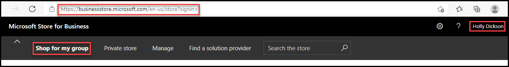

6. Scroll down to the **Made by Microsoft** section and select **Show all** (which appears on the right side of the **Made by Microsoft** section).

	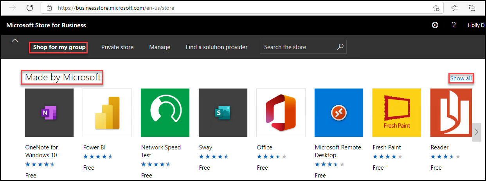

7. In the **Made by Microsoft** page, select **Microsoft Remote Desktop.**

	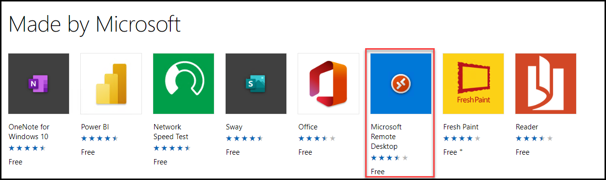

8. On the **Microsoft Remote Desktop** page, select **Get the app**. 

	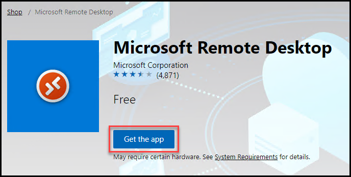

9. On the **Microsoft Store for Business and Education Services Agreement** page, scroll to the bottom of the page, select the check box in which you accept the license agreement, and then select **Accept.** 

	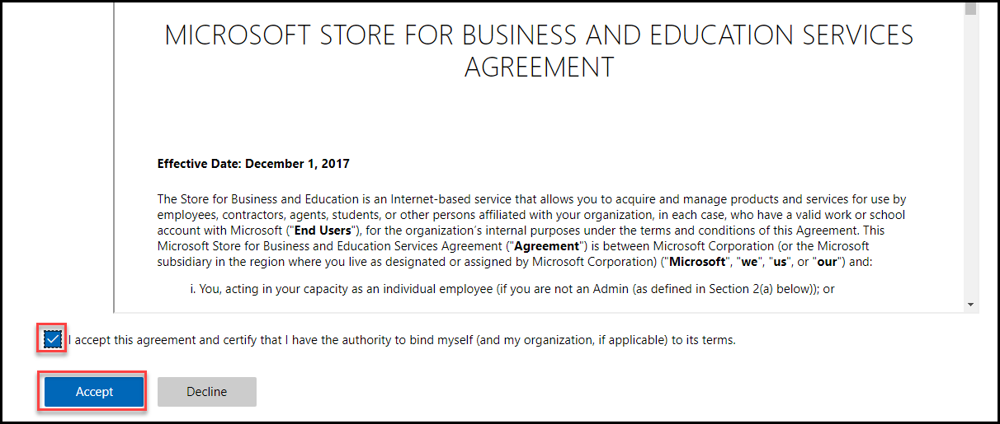

10. In the **Thanks for your order** window, select **Close**. 

	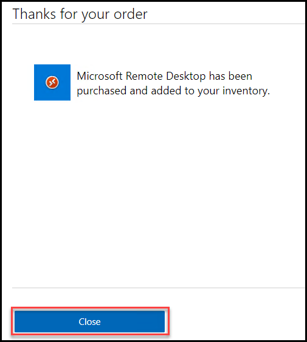

11. On the **Microsoft Store for Business** page, on the menu bar at the top of the page, select **Manage**. 

12. In the left-hand navigation pane, select **Products &amp; services**. 

13. In the **Products &amp; Services** detail pane, scroll down and verify the **Microsoft Remote Desktop** product appear.  

	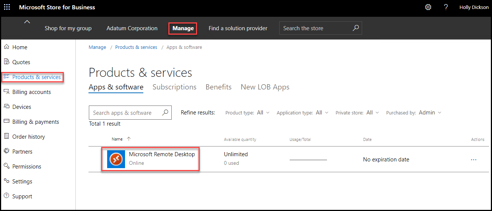

    **Note:** It may take a minute before all the apps appear on the page.

14. In the left-hand navigation pane, select **Settings**. 

15. In the **Settings** page, on the **Shop** tab, scroll down to the **Shopping experience** section and select the **Show offline apps** toggle switch to turn it **On**. 

	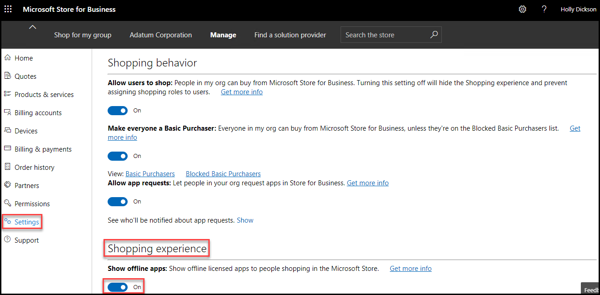

16. On the menu bar at the top of the page, select **Adatum Corporation**. This is Adatum’s private store. 

17. As part of your pilot project, you want to change the name of your store to **Adatum private store**. On the **Adatum Corporation** private store page, select the **ellipsis (…)** icon that appears to the right of **Adatum Corporation** (above each of the product tiles), and in the menu that appears, select **Edit collection**. 

	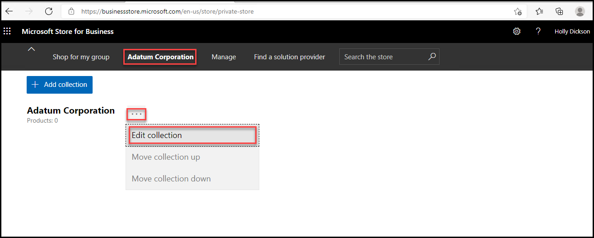

18. On the **Edit collection** page, to the right of **Adatum Corporation**, select **Rename private store**.

	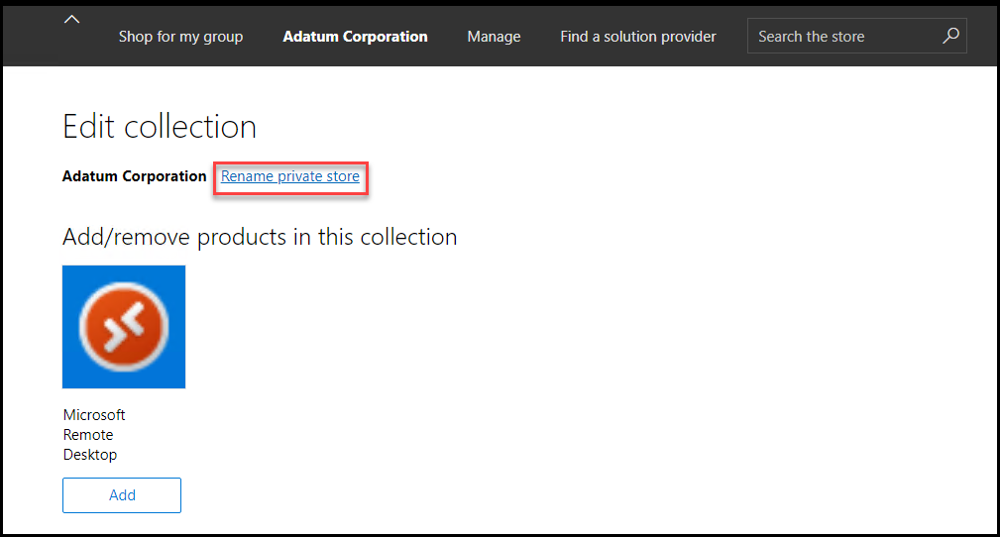

19. On the **Settings** page, under the **Private store** section, to the right of **Your private store name: Adatum Corporation**, select **Change**.

	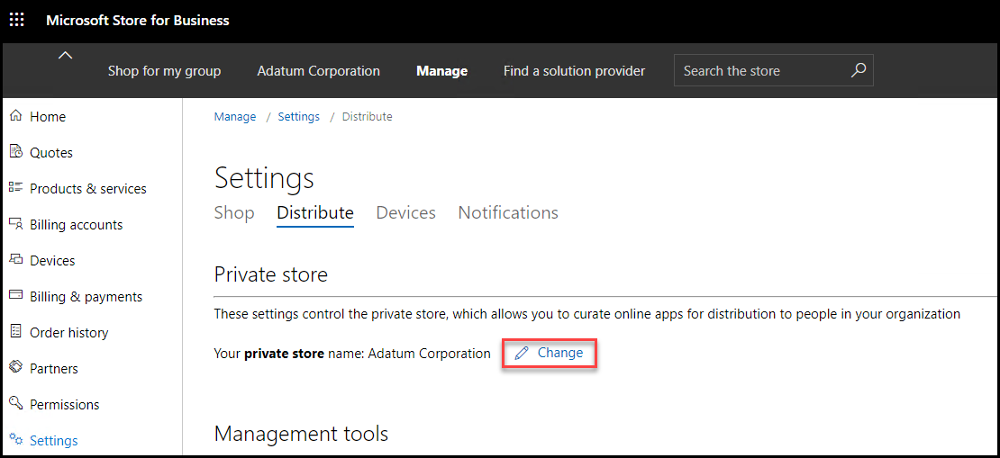

20. In the **Private store** dialog box, enter **Adatum private store** and then select **Save**.  

	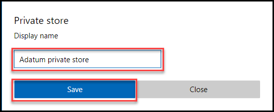

    Note the change to your private store name on the menu bar at the top of the page; instead of **Adatum Corporation**, it should now say **Adatum private store**.

21. Leave the **Microsoft Store for Business** tab open in your Edge browser. You will use this in the next exercise. 

 
# Proceed to Lab 8 - Exercise 2
