# Learning Path 8 - Lab 8 - Exercise 2 - Manage the Microsoft Store for Business

In this exercise, you will add five apps to Adatum's company store, and you will create a collection of three apps that will also be added to the store. You will then verify how those apps appear in the company store to an Adatum employee.

### Task 1: Add apps to your private store 

1. You should still be logged into Microsoft 365 as Holly Dickson (**holly@xxxxxZZZZZZ.onmicrosoft.com)** with a password of **Pa55w.rd**. On your Edge browser, you should still have the **Microsoft Store for Business** tab open. If so, select it now; otherwise, navigate to **https://www.microsoft.com/business-store**.

2. In the **Microsoft Store for Business**, you ended the previous exercise by renaming Adatum's private store and verifying the product apps that are available in it. In the menu bar at the top of the page, select **Shop for my group**. 

3. In the next several steps, you are going to get five apps, all of which you will add to Adatum's company store. You will make them available in the store for other Adatum employees, but you will NOT install them yourself.  

	Begin by scrolling down to the **Made by Microsoft** section and select **Show all** then select **3D Builder.**

	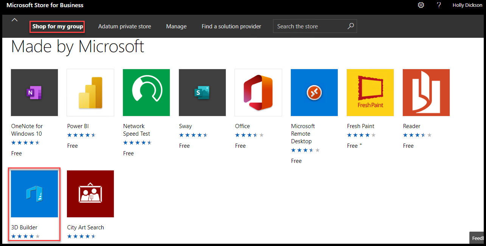

4. On the **3D Builder** window, select the drop-down arrow in the **License type** field and note the two options - **Online** and **Offline**. Select the **Online** option, and then select **Get the app**. 

	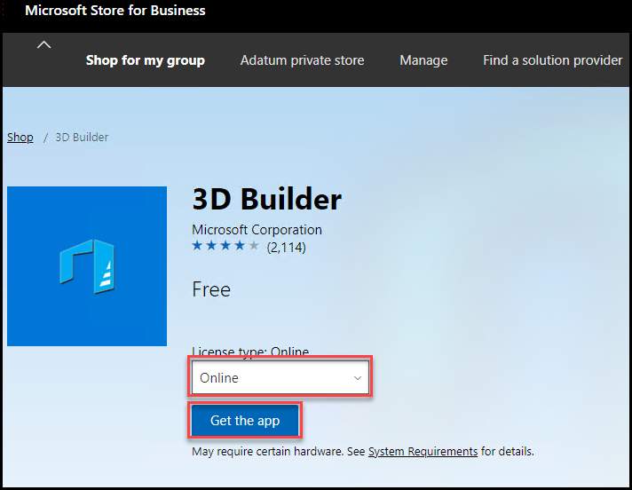

5. On the **Thanks for your order** page, select **Close**. 

6. This returns you to the **3D Builder** page. Select the **ellipsis (…)** button that appears to the right of the **Install** button to view the additional actions that are available besides Install. Notice that only the **Manage** option is available. 

	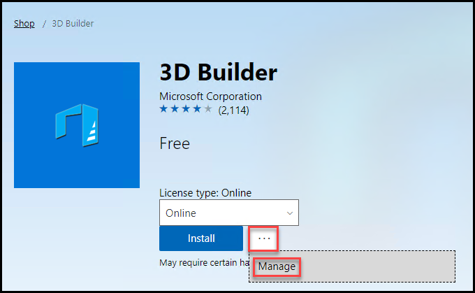

7. Select **Shop for my group** on the menu bar, then scroll down to the **Made by Microsoft** section and select **Show all**.

8. In the **Made by Microsoft** window, select **Fresh Paint.**

	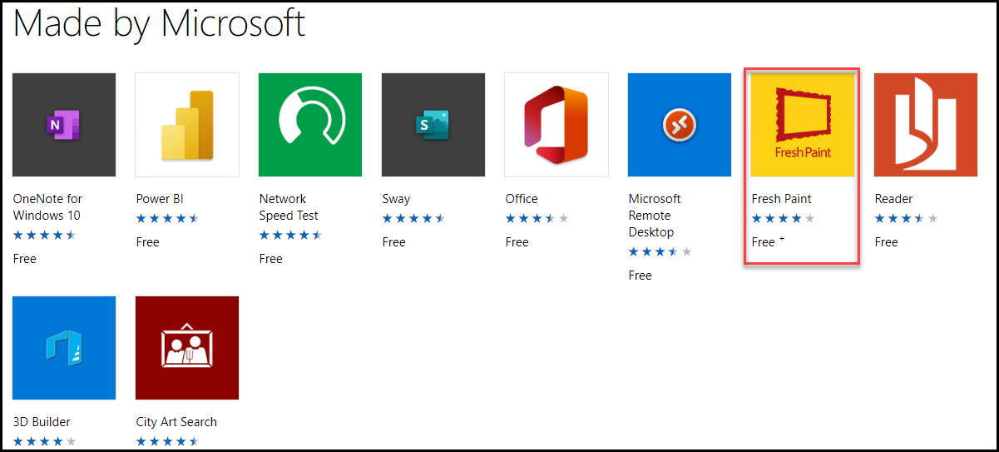

9. On the **Fresh Paint** window, leave the **License type** set to **Online** and select **Get the app.**

	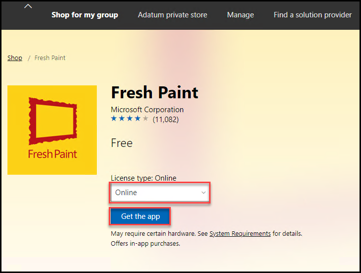

10. On the **Thanks for your order** page, select **Close**. 

11. Select **Shop for my group**, then scroll down to the **Made by Microsoft** section and select **Show all.**

12. In the **Made by Microsoft** window, select **Reader**. 

	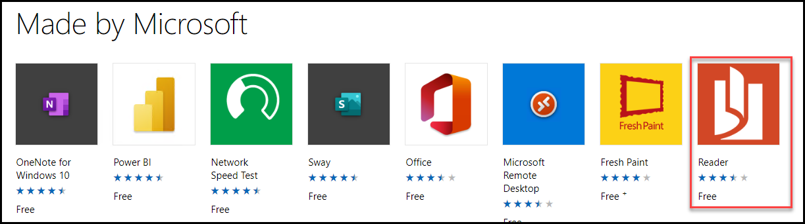

13. On the **Reader** page, the **License type:** field currently displays **Online**. Select the drop-down arrow in the **License type** field and select **Offline**, and then select **Get the app.**

	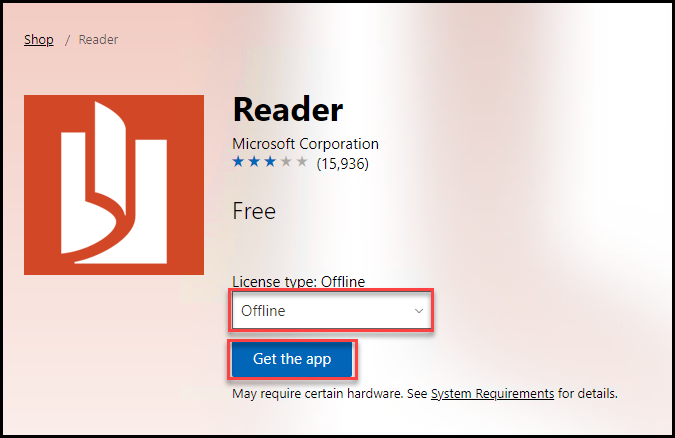

14. On the **Thanks for your order** page, select **Close**. 

15. On the menu bar at the top of the page, select **Manage.**

16. On the **Overview** page, in the **Products and Services** tile, select **Manage apps.**

	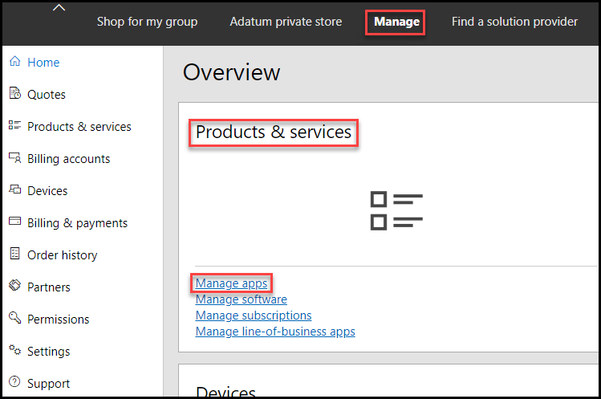

17. On the **Products and Services** page, as you scroll down through the apps, note how they all have an **Assign to People** option in their **Actions** menu - except for **Reader**, which you selected with an **Offline** license type. In the **Reader** action menu, note the **Download package for offline use** option.

	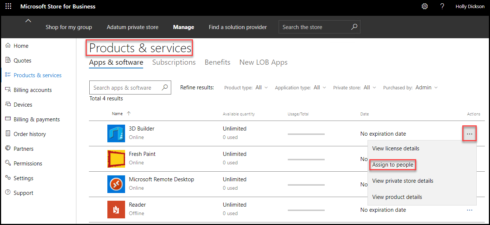
	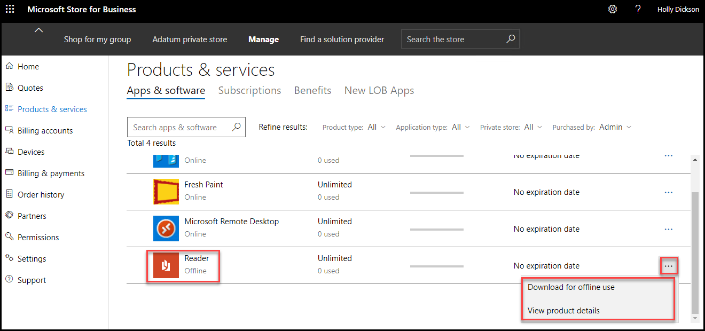

18. On the menu bar at the top of the page, select **Adatum private store.** 

19. Now that you have added these five individual apps to the company store, you will create a collection of apps that will be bundled together. On the **Adatum private store** page, select **+Add collection.**

	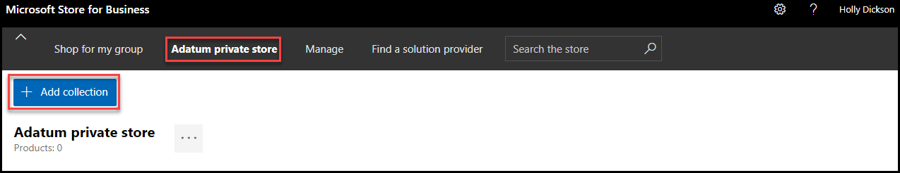

20. In the **Add a collection** window, under **Give this collection a name**, enter **Collection1** in the **Enter a collection name** field. 

21. Scroll down and select the **Add** button below each of the following products: 

	- **Fresh Paint**

	- **Microsoft Remote Desktop**

	- **3D Builder** 

	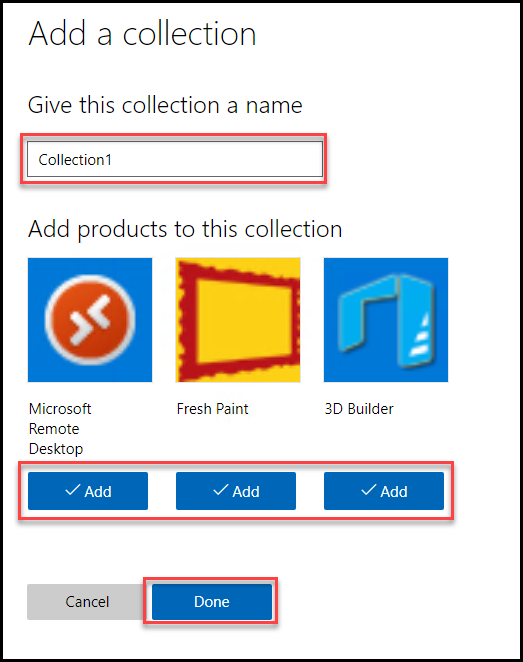

22. At the bottom of the page, select **Done**. 

23. By default, new apps are only visible to admins; as a result, they must be assigned visibility permissions to be seen by non-admins. So at this point in time, **Collection1** is only visible to admins.    

24. In the following steps you will assign visibility permissions to other users for the **Fresh Paint**, **Microsoft Remote Desktop,** and **3D Builder** apps. On the menu bar at the top of the page, select **Manage.**

25. On the **Overview** page, in the **Products and Services** tile, select **Manage apps**.

	

26. On the **Products and Services** page, scroll down through the apps and select **Fresh Paint.**

	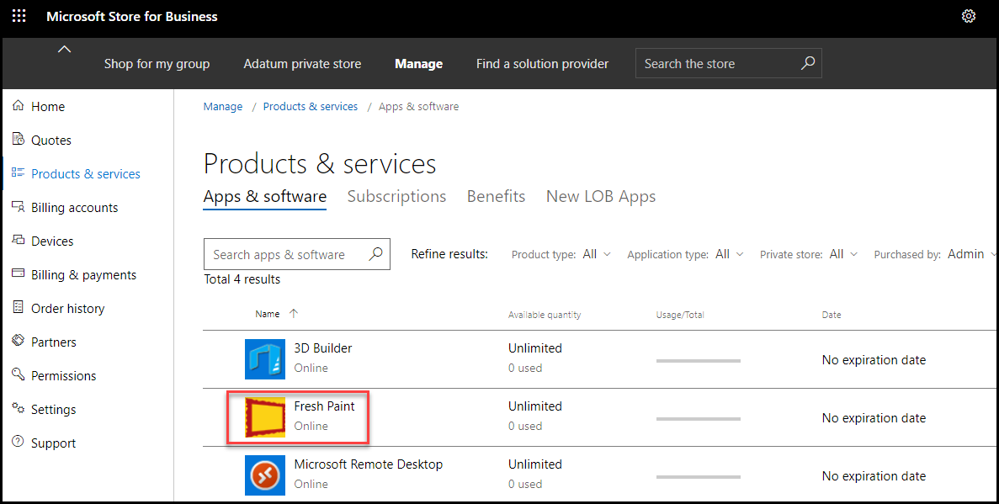

27. On the **Fresh Paint** window, select **Private store availability**. Under **Choose groups of people who can see this app**, select **Everyone** (if it’s not already selected).  

	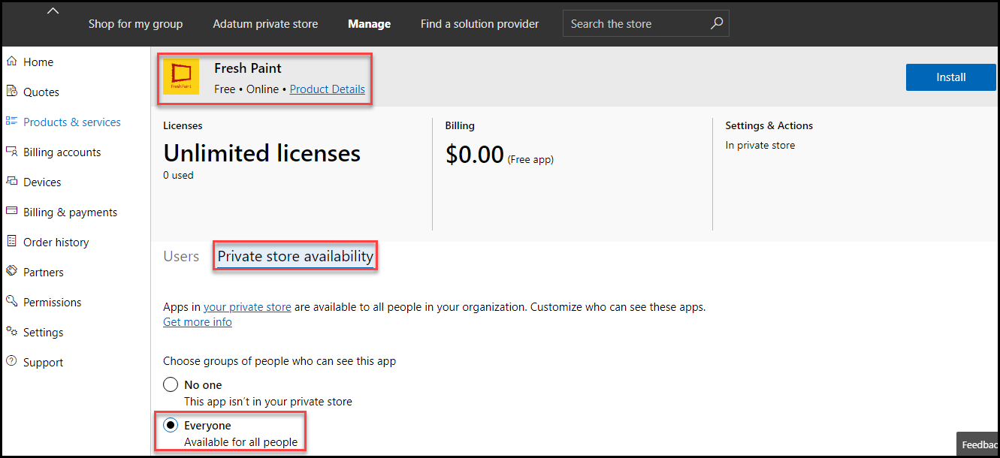

	If you had to select **Everyone**, scroll to the top of the page where you can see a **Your changes have been saved** message at the top of the window.

28. Select the back arrow to the left of the address bar to return to the **Product and Services** page. 

29. Repeat steps 26-28 for both **Microsoft Remote Desktop** and **3D Builder**.

	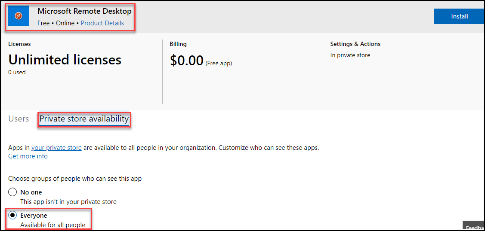
	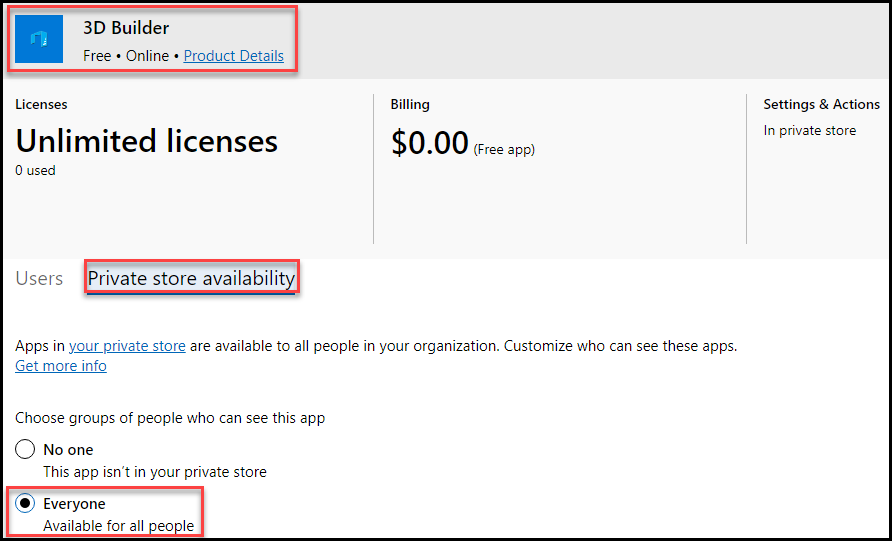	

30. Close the **Microsoft Store for Business** tab in your Edge browser. Leave the **Microsoft Office Home** tab and the **Microsoft 365 admin center** tab open for the next lab. 

### Task 2: View your private store as a company employee 

In this task, you are going to sign into the Microsoft Store for Business as one of Adatum’s employees, Joni Sherman. You’ll then verify that when Joni navigates to Adatum’s private store, she can see the 5 apps that Holly added to the private store, as well as the collection of apps that Holly created in the prior task. 

1. Switch to **Chrome** browser, where you should be logged into **Outlook on the web** as **Joni Sherman** from a prior lab.

2. In your **chrome** browser, open a new tab and then enter the following URL in the address bar: **https://www.microsoft.com/business-store**

3. On the **Microsoft Store for Business** page, in the upper-right corner of the page, select **Sign in**, if not logged in already.

4. If you are automatically signed in as Joni Sherman, then proceed to the next step; otherwise, enter **JoniS@xxxxxZZZZZZ.onmicrosoft.com** (where xxxxxZZZZZZ is the tenant prefix provided by your lab hosting provider) in the **Sign in** window and then select **Next.**

5. In the **Microsoft Store for Business**, on the menu bar at the top of the page, select **Adatum private store.**

6. In the **Adatum private store**, verify that Joni can see the following: 

	- The **Collection1** app that you created in the prior task that includes: **Fresh Paint, Microsoft Remote Desktop,** and **3D Builder**.

	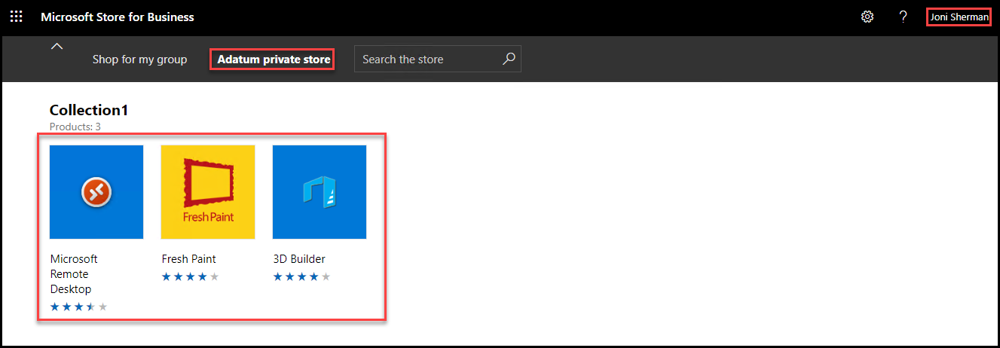

7. In your browser, close the **Microsoft Store for Business** tab.

# End of Lab 9
