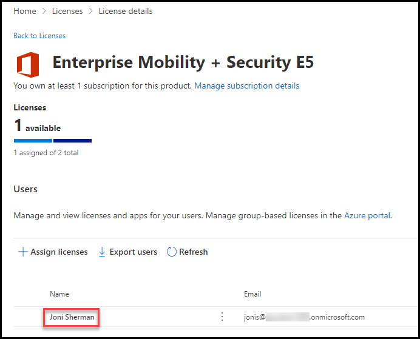

# Learning Path 10 - Lab 9 - Exercise 1 - Enable Device Management

In your role as Holly Dickson, Adatum's Enterprise Administrator, you have Microsoft 365 deployed in a virtualized lab environment for your pilot project. In this lab, you will manage user devices using Intune.

In this exercise you will verify that Adatum has installed the Enterprise Mobility + Security E5 product. You will then verify that it has been assigned to your test user accounts, and you will assign a license to yourself. You will then enable device management with Intune.

### Task 1: Verify and assign Enterprise Mobility + Security licenses

In this task you will verify that Adatum has installed the Enterprise Mobility + Security E5 product and you will check how many licenses are available. You will then verify that a license has been assigned to your test user accounts, and you will assign a license to yourself.

1. You should still be logged into Microsoft 365 as Holly Dickson (**holly@xxxxxZZZZZZ.onmicrosoft.com)** with a password of **Pa55w.rd**.

2. In **Microsoft Edge**, you should still have a tab open for the **Microsoft 365 admin center**; if so, select that tab now. If not, enter **https://portal.office.com**, sign in as **Holly**, and in the **Microsoft Office Home** page, select **Admin**.

3. In the **Microsoft 365 admin center**, select **Billing** in the left-hand navigation pane, and then under it, select **Licenses**.

	

4. On the **Licenses** page, note the number of licenses that are available with your tenant and the number that have already been assigned to user accounts for each of the available licenses. In your VM lab environment, 5 **Enterprise Mobility + Security E5** licenses were assigned to your tenant, and your lab hosting provider already assigned a license to the 4 pre-existing user accounts.  

   Note how the **Office 365 E5** & **Microsoft 365 Business Premium** licenses also available and assigned with your tenant. 
   
   In this task you will assign Holly an **Enterprise Mobility + Security E5** license. In the list of licenses, select **Enterprise Mobility + Security E5**. 

	

5. In the **Enterprise Mobility + Security E5** page, under the list of users, verify that all 4 of the pre-existing user accounts provided by your lab hosting provider have been assigned a license.  

	

   The one user who was not assigned an **Enterprise Mobility + Security E5** license is Adatum's Enterprise Administrator, You will now assign her an Enterprise Mobility + Security E5 license.  

    To assign Holly a license, select **+Assign licenses**, which appears in the menu bar above the list of users.

	

6. In the **Assign licenses to users** pane, select the **Enter a name or email address** field, and in the list of users that appears, select **Holly Dickson**, and then select the **Assign** button at the bottom of the pane.

	

7. Close the **You assigned a license to Holly Dickson** window.

8. Leave all browser tabs open for the next task.

You have now verified the available Enterprise Mobility + Security E5 licenses in your tenant and assigned an EMS E5 license to Holly.

### Task 2: Enable device management with Intune

Devices must be managed before you can give users access to company resources or manage settings on those devices. This begins with enabling device management with Intune. With Adatum's tenant, Holly will discover that Intune has been set by default as Adatum's MDM authority.

1. You should still be logged into Microsoft 365 as Holly Dickson (**holly@xxxxxZZZZZZ.onmicrosoft.com)** with a password of **Pa55w.rd**.

2. In the **Microsoft 365 admin center**, in the left-hand navigation pane under the **Admin centers** group, select **Endpoint Manager**.

	

3. In the **Microsoft Endpoint Manager admin center**, select **Devices** in the left-hand navigation pane.

4. In the **Devices | Overview** page, the **Enrollment status** tab is displayed by default. By default, Intune has been set as Adatum's MDM authority.  

   In the middle pane under the **Policy** section, select **Compliance policies**. Even though no data is currently available, review the information on the **Compliance policies | Policies** page regarding device management.

	
	

5. Select the **Back arrow** on the address bar to return to the **Devices | Overview** page. In the middle pane under the **Policy** section, select **Conditional Access**. Review the information on the **Conditional Access | Policies** page.

	

	

6. Select the **Back arrow** on the address bar to return to the **Devices | Overview** page. In the middle pane under the **Policy** section, select **Enrollment restrictions**. Review the information on the **Devices | Enrollment restrictions** page.

	
	

7. Select the **Back arrow** on the address bar to return to the **Devices | Overview** page. In the middle pane under the **Policy** section, select **Configuration profiles**. Review the information on the **Devices | Configuration profiles** page.

	
	

8. Select the **Back arrow** on the address bar to return to the **Devices | Overview** page. 

9. In your Edge browser, leave all the tabs open for the next lab exercise. 

You have now verified that Intune is the default MDM solution for your tenant.

# Proceed to Lab 10 - Exercise 2
