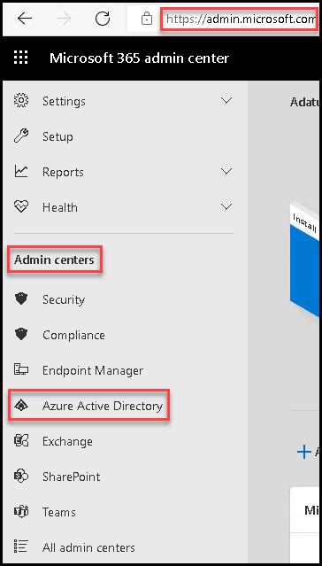
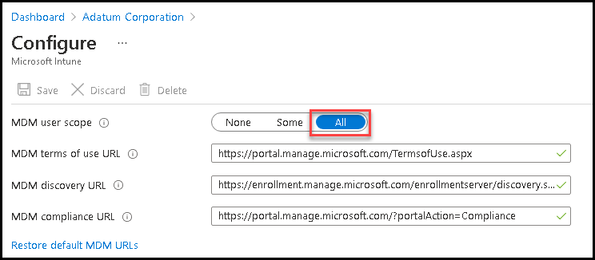
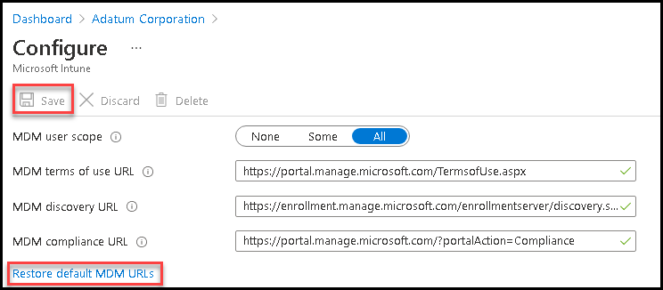
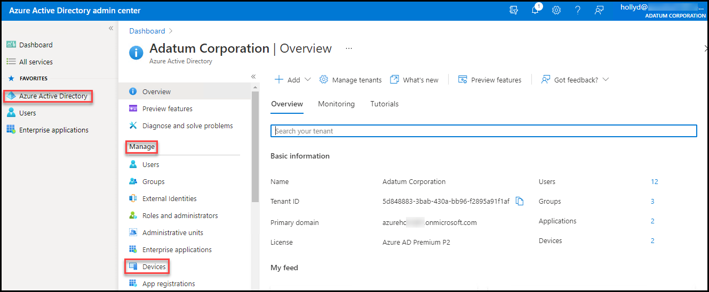
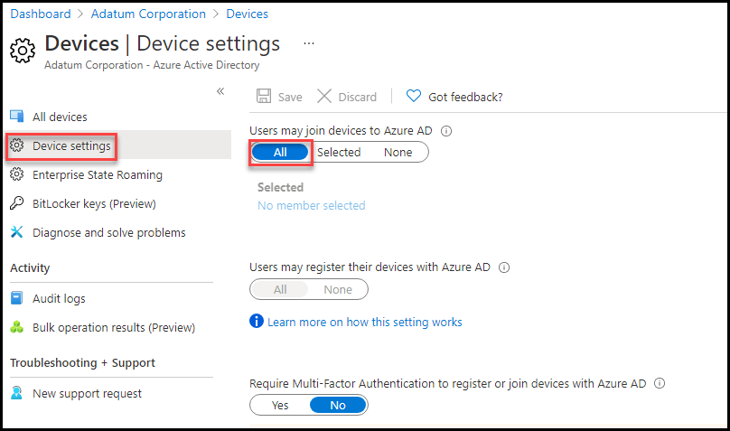
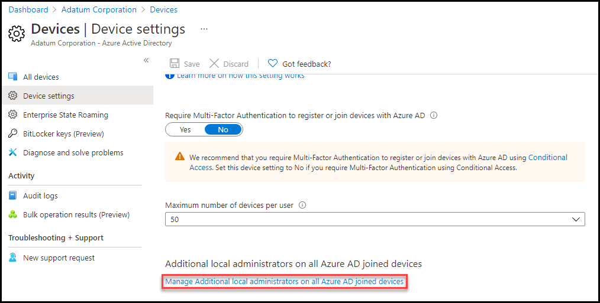
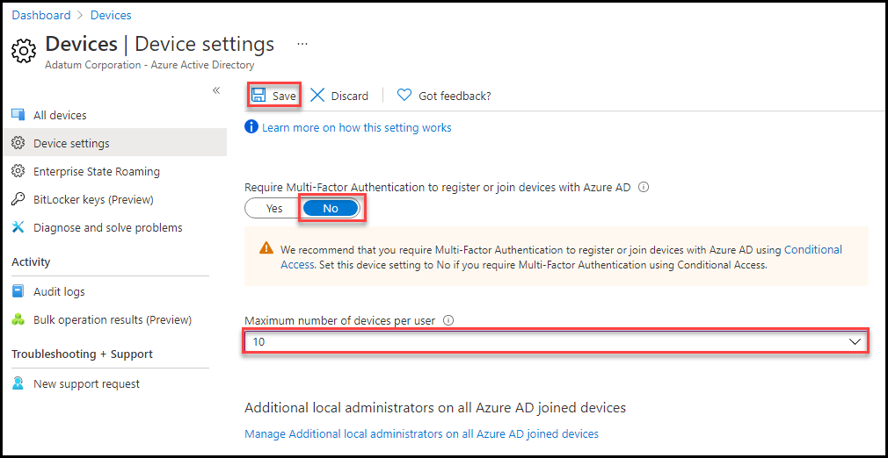
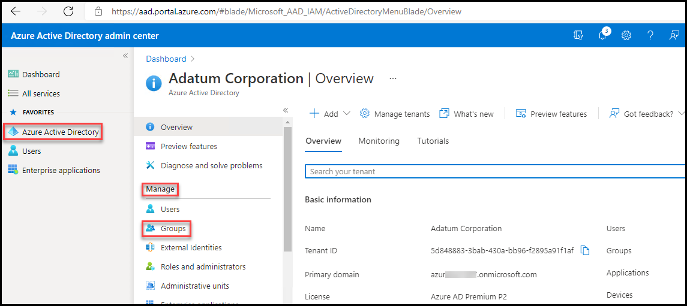
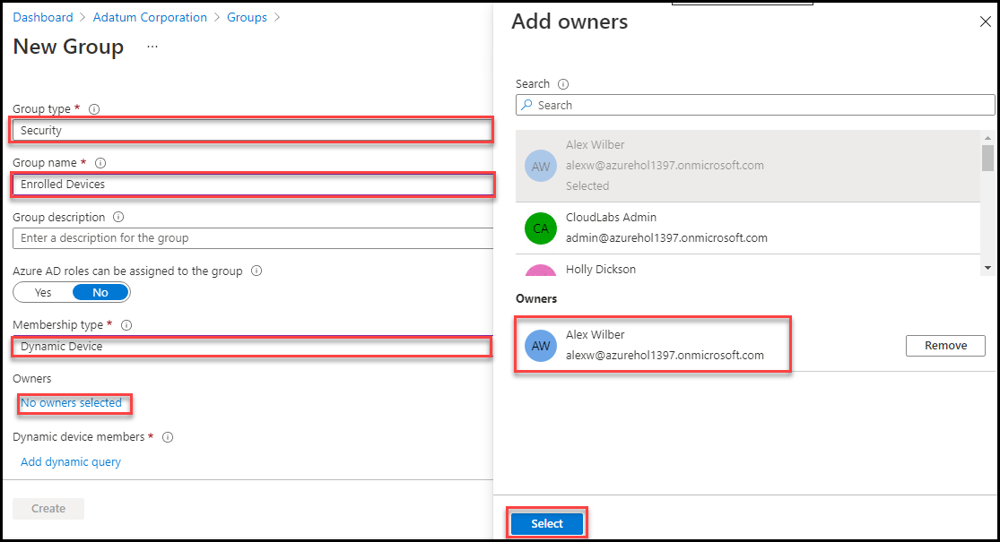
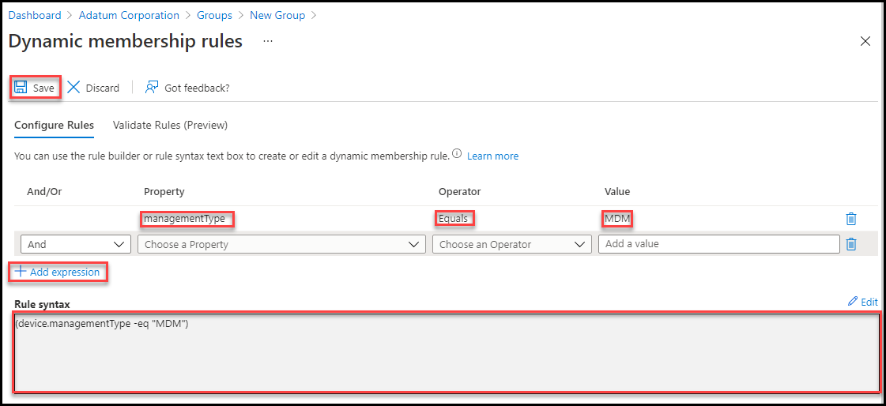

# Learning Path 10 - Lab 9 - Exercise 2 - Configure Azure AD for Intune 

In this exercise you will activate automatic client enrollment to Intune for Mobile Device Management (MDM). This will enable you to manage mobile device access and set policies for restricting access to devices unless certain actions are adopted, such as strong passwords and screen timeouts.

### Task 1: Integrate Azure AD with Intune

1. You should still be logged into Microsoft 365 as Holly Dickson (**holly@xxxxxZZZZZZ.onmicrosoft.com)** with a password of **Pa55w.rd**.

2. In your Edge browser, select the **Microsoft 365 admin center** tab, which should still be open; if not, navigate to **https://admin.microsoft.com.** 

3. In the **Microsoft 365 admin center**, in the left-hand navigation pane under **Admin centers**, select **Azure Active Directory**.

	

4. In the **Azure Active Directory admin center**, in the left-hand navigation pane, select **Azure Active Directory**.

5. On the **Adatum Corporation | Overview** window, in the middle pane under **Manage,** select **Mobility (MDM and MAM),** and then in the details pane on the right, select **Microsoft Intune**. 

	

    **Note:** If you see a notification that automatic enrollment is available only for Azure AD Premium, press F5 to refresh the page in your web browser and then select **Microsoft Intune**.

6. On the **Configure** window, in the **MDM user scope** row, select **All**. 

    **Note:** By setting this parameter to **All**, you are allowing all users who join their devices to Azure AD to automatically enroll them to Intune as well.

	

7. Below the list of MDM-related fields, select **Restore default MDM URLs** to ensure the correct URLs for client enrollment are configured.

8. In the menu bar at the top of the **Configure** window, select **Save**.

	

9. Leave all browser tabs open for the next task.

You have now configured your tenant so that all users can enroll their Windows 10 clients into Intune as soon they log into their devices with their Azure AD account credentials.

### Task 2: Configure Azure AD join

In this task, you will change the default settings for users to join their devices to Adatum's Azure AD tenant.

1. In your Edge browser, in the **Azure Active Directory admin center**, in the left-hand navigation pane, select **Azure Active Directory.**

2. In the **Adatum Corporation | Overview** window, in the middle section under **Manage**, select **Devices**.

	

3. In the **Devices | All devices** window, in the details pane on the right, verify that **VM-XXXXXX** (XXXXXX is the deployment ID) is displayed in the list of devices.  

	

   **Note:** Back in Lab 6, you performed a task that configured Mobile Device Management (MDM) auto-enrollment; this was a prerequisite to performing a later Windows Information Protection lab. When you performed this MDM configuration lab, it automatically enrolled the devices belonging to members of the WIP Users group. At the time, Joni Sherman was logged into Microsoft 365 on this VM, and since she was a member of the WIP Users group, **VM-XXXXXX** was automatically enrolled into Intune as its MDM authority.

4. In the **Devices | All devices** window, in the middle pane, select **Device settings**.

5. In the **Devices | Device settings** window, in the details pane on the right, in the **Users may join devices to Azure AD** option, verify that **All** is selected. This means that all Azure AD users can join their devices to Azure Active Directory.

	

6. Scroll down to the bottom of the window. Under **Additional local administrators on all Azure AD joined devices**, no local administrators are displayed. Select the **Manage Additional local administrators on all Azure AD joined devices**.  

	

   On the **Device Administrators | Assignments** window, note that there are no additional assignments. In the next several steps, you will add a role assignment.

7. In the **Device Administrators | Assignments** window, select **+Add assignments** on the menu bar.

	

8. In the **Add assignments** pane on the right, select **Alex Wilber** in the list of users and then select the **Add** button at the bottom of the screen.

	

9. Select the **Back arrow** on the address bar to return to the **Devices | Device settings** page. Verify the **Require Multi-Factor Auth to join devices** toggle switch is set to **No**. The **Maximum number of devices per user** is currently set to **50**; select this field and in the drop-down menu that appears, select **10**.

	

10. On the menu bar at the top of the page, select **Save**.

11. Leave all browser tabs open for the next task.

You have changed the default settings for users to join their devices to your Azure AD tenant.

### Task 3: Create dynamic Azure AD device group

In Azure Active Directory, you can use rules to determine group membership based on user or device properties. Dynamic membership is supported for security groups or Microsoft 365 groups. When a group membership rule is applied, user and device attributes are evaluated for matches with the membership rule. When an attribute changes for a user or device, all dynamic group rules in the organization are processed for membership changes. Users and devices are added or removed if they meet the conditions for a group. Devices can only be used in Security groups.

In this task, Holly wants to create a new Security group for enrolled devices within Adatum. This group will support dynamic membership when a device's management type is set to MDM.

1. In your browser, in the **Azure Active Directory admin center**, in the left-hand navigation pane, select **Azure Active Directory.**

2. In the **Adatum Corporation | Overview** window, in the middle pane under **Manage,** select **Groups**.

	

3. In the **Groups | All groups** window, in the details pane on the right, select **+New group** on the menu bar.

	

4. In the **New Group** window, enter the following information:

    - Group type: **Security**
    - Group name: **Enrolled Devices**
    - Membership type: **Dynamic Device**
    - Owner: select **no owners selected**, then in the **Add Owners** window, select **Alex Wilber** and then select the **Select** button

	

5. At the bottom of the **New Group** window, under **Dynamic device members**, select **Add dynamic query**.

	

6. In the **Dynamic membership rules** window, configure the following fields for this expression:

    - Property: select the drop-down arrow and select **managementType**
    - Operator: select the drop-down arrow and select **Equals**  
    - Value: enter **MDM**

7. Select **+Add expression**. It should display the following in the **Rule syntax** field: 

    **(device.managementType -eq  &quot;MDM&quot;)**

	

8. Select **Save** in the menu bar at the top of the window.

9. In the **New Group** window, select the **Create** button at the bottom of the window.

10. In the **Groups | All groups** window, the **Enrolled Devices** group should now appear in the list of groups.

11. Leave all browser tabs open for the next task.

# Proceed to Lab 10 - Exercise 3
