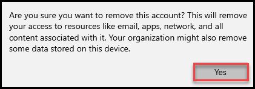

# Learning Path 10 - Lab 9 - Exercise 4 - Enroll a Windows 10 Device

One of Adatum’s goals for their Microsoft 365 deployment is to enroll their Windows 10 devices to Microsoft Intune so that the devices can be managed by MDM. As part of her pilot project, Holly Dickson wants to enroll the Lab VM to Intune. In this exercise, you will first verify that the device is not currently enrolled, and having done that, you will enroll the device to Azure AD and Intune and then verify the enrollment. 

During her pilot project, Holly plans to use certificates with Intune to authenticate Adatum’s users to applications and corporate resources through VPN, Wi-Fi, and email profiles. By using certificates to authenticate these connections, Adatum’s end-users won't need to enter usernames and passwords, which helps to make their access seamless. 

### Task 1: Disconnect the existing work account login

In Lab 6 Exercise 2 we have added **JoniS@xxxxxZZZZZZ.onmicrosoft.com** as work account in Lab VM, Now we are removing it to continue this lab.

1. In the **Search** box on the taskbar at the bottom of the window, type **Work** (not **Word**, but **Work**). In the menu that appears, if **Settings** is not expanded, then select it now. Under **Settings**, select **Access work or school**.

	

	

2. In the Access work or school window select **JoniS@xxxxxZZZZZZ.onmicrosoft.com** account and click on **Disconnect**.

	

3. When prompted for **yes** to continue, select it.

	

4. Now verify there are no accounts logged in.

	

### Task 2: Verify the device is not enrolled

Holly must begin by verifying that the device she wants to enroll into Intune (Lab VM) is not already enrolled. 

1.  You should still be logged into Microsoft 365 as Holly Dickson (**holly@xxxxxZZZZZZ.onmicrosoft.com)** with a password of **Pa55w.rd**.

2. In your **Edge** browser, the **Microsoft Endpoint Manger admin center** should still be open in the **Devices - Microsoft Endpoint Manager admin center** tab. Select this tab.

3. In the **Microsoft Endpoint Manger admin center**, in the left-hand navigation pane, select **Devices**.

4. In the **Devices | Overview** window, in the middle pane, select **All devices**.

5. In the **Devices | All devices** window, verify that no device is listed in the details pane. You have just verified that Lab VM is not enrolled into Intune.  

	

6. You now want to start the **Certificates** MMC for Lab VM. In the Search field on the taskbar, enter **run**, and then in the list of search results, select **Run**.

	

7. In the **Run** window, enter **certlm.msc** in the **Open** field and then select **OK**. If a **Do you want to allow this app to make changes to your device?** dialog box appears, select **Yes**.

	

8. Maximize the **certlm – [Certificates – Local Computer]** window that appears and then drag the pane divider to the right so that you can see the entirety of the left-hand pane. 

9. In the left-hand pane, select **Personal** and then select the **Certificates** child folder under the **Personal** folder. Verify the available certificates. 

	

10. Minimize the **certlm – [Certificates – Local Computer]** window as you will use it in a later task.

### Task 3: Enroll the device to Azure AD and Intune

In this task, you want to enroll Lab VM to Azure AD and Intune.

1. In **Lab VM**, enter **work** in the Search field on the taskbar, and then in the list of search results, select **Access work or school**.

	

	

2. In the **Settings** app, in the **Access work or school** section, select **+Connect**.

	

3. In the **Microsoft account** window, on the **Set up a work or school account** page, select **Join this device to Azure Active Directory**.

	

4. On the **Let's get you signed in** page, in the **Work or school account** text box, enter **Holly@xxxxxZZZZZZ.onmicrosoft.com** (where xxxxxZZZZZZ is the tenant prefix provided by your lab hosting provider) and then select **Next**.

5. On the **Enter password** page, enter **Pa55w.rd** in the **Password** field and then select **Sign in**.

	

6. On the **Make sure this is your organization** dialog box, review the information and if everything looks correct, select **Join**.

	

7. On the **You're all set!** page, select **Done**.

8. In the **Settings** app, close the **Access work or school** page by selecting the **X** in the upper right-hand corner.

9. In your Edge browser, in your **Microsoft Endpoint Manager admin center**, the **Devices | All devices** page should still be displayed. Verify that **Lab VM (VM-XXXXXX here XXXXXX is deployment id** appears in the list of devices.  

	

   You should also note that in the list of devices, Lab VM was identified as Corporate-owned device, Since Lab VM was enrolled by Holly, an administrator, Lab VM is classified as a Corporate device.  

  **Note**: It take few minutes to hour for the VM to show in the list of Devices. Try refresh to see status.

10. Leave all browser tabs open for the next task.

### Task 4: Verify the device is enrolled to Azure AD and Intune

In an earlier lab you configured integration between Azure AD and Intune. Because of that, any device that is joined to Azure AD is automatically enrolled to Intune.

1. You should still be logged into Microsoft 365 as Holly Dickson (**holly@xxxxxZZZZZZ.onmicrosoft.com)** with a password of **Pa55w.rd**.

2. In **Lab VM**, select the **certlm – [Certificates – Local Computer]** icon on the taskbar.

3. In the **certlm – [Certificates – Local Computer]** console, in the left-hand navigation pane, the **Personal > Certificates** folder should already be selected from the earlier task. In the menu bar, select **Action** and then select **Refresh**. In the details pane, verify that several new certificates appear along with the previous certificate.  

	

    **Note**: These certificates were added when you joined the Lab VM device to Azure AD, which in turn enrolled it to Intune.

4. Close the **certlm – [Certificates – Local Computer]** window. 

5. In your **Edge** browser, select the **Azure Active Directory** tab.

6. In the **Azure Active Directory admin center**, in the left-hand navigation pane, select **Azure Active Directory**. 

7. In the **Adatum Corporation | Overview** page, in the middle pane under the **Manage** section, select **Devices**.

	

8. In the **Devices | All devices** page, **Lab VM** should be displayed. Drag the horizontal scroll bar to the right until the **MDM** column is visible. Note that it is enrolled to **Microsoft Intune**.   

	

    **Note:** This view lists devices that are joined to Azure AD. Remember that you configured integration between Azure AD and Intune, and because of that, any device that is joined to Azure AD is automatically enrolled to Intune.

9. Leave all browser tabs open for the next task.

# Proceed to Lab 9 - Exercise 5
